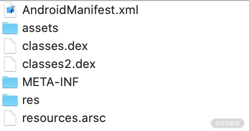
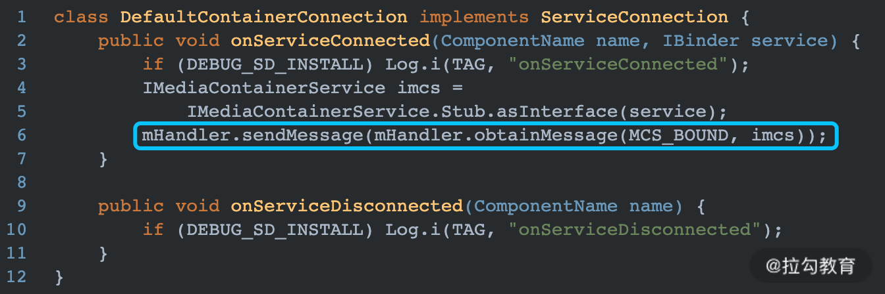
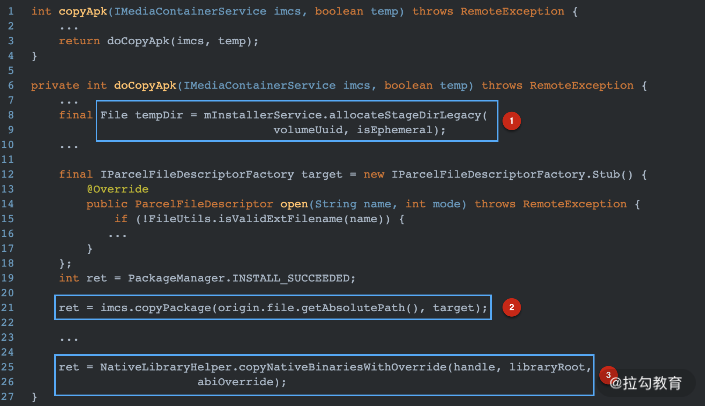

# Android App 的安装过程

之前的文章中我们了解了 Android 系统中两个比较重要的系统服务ActivityManagerService（AMS）和 WindowManagerService（WMS），本篇文章我们通过分析 apk 的安装过程来了解一下 Android 中另一个比较重要的系统服务——PackageManagerService（PMS）。

在分析安装过程之前，需要先了解一下 Android 项目是如何经过编译->打包生成最终的 .apk 格式的安装包。谷歌有一张官方图片来描述 apk 的打包流程，如下图所示。

一个完整的 Android 项目可能包含多个 module，而从宏观上看每一个 module 中的内容可以分为 2 部分：Resources 资源文件、Java 或者 Kotlin 源代码。因此整个项目的编译打包过程也是针对这 2 部分来完成。

## 编译阶段

### Resources 资源文件

资源文件包括项目中 res 目录下的各种 XML 文件、动画、drawable 图片、音视频等。AAPT 工具负责编译项目中的这些资源文件，所有资源文件会被编译处理，XML 文件（drawable 图片除外）会被编译成二进制文件，所以解压 apk 之后无法直接打开 XML 文件。`但是 assets 和 raw 目录下的资源并不会被编译，会被原封不动的打包到 apk 压缩包中`。

资源文件编译之后的产物包括两部分：resources.arsc 文件和一个 R.java。前者保存的是一个资源索引表，后者定义了各个资源 ID 常量。这两者结合就可以在代码中找到对应的资源引用。比如如下的 R.java 文件：

可以看出，R.java 中的资源 ID 是一个 4 字节的无符号整数，用 16 进制表示。其中，最高的 1 字节表示 Package ID，次高的 1 个字节表示 Type ID，最低的 2 字节表示 Entry ID。

resources.arsc 相当于一个资源索引表，也可以理解为一个 map 映射表。其中 map 的 key 就是 R.java 中的资源 ID，而 value 就是其对应的资源所在路径。实际上 resources.arsc 里面还有其他信息，关于 resource.arsc 的解析可以参考 [解析编译之后的Resource.arsc文件格式](https://www.cnblogs.com/roccheung/p/5797260.html)。

### 源码部分

项目中的源代码首先会通过 javac 编译为 .class 字节码文件，然后这些 .class 文件连同依赖的三方库中的 .class 文件一同被 dx 工具优化为 .dex 文件。如果有分包，那么也可能会生成多个 .dex 文件。

>实际上源代码文件也包括 AIDL 接口文件编译之后生成的 .java 文件，Android 项目中如果包含 .aidl 接口文件，这些 .aidl 文件会被编译成 .java 文件。

## 打包阶段

最后使用工具 APK Builder 将经过编译之后的 resource 和 .dex 文件一起打包到 apk 中，实际上被打包到 apk 中的还有一些其他资源，比如 AndroidManifest.xml 清单文件和三方库中使用的动态库 .so 文件。

apk 创建好之后，还不能直接使用。需要使用工具 jarsigner 对其进行签名，因为 Android 系统不会安装没有进行签名的程序。签名之后会生成 META_INF 文件夹，此文件夹中保存着跟签名相关的各个文件。

- CERT.SF：生成每个文件相对的密钥
- MANIFEST.MF：数字签名信息
- xxx.SF：这是 JAR 文件的签名文件
- xxx.DSA：对输出文件的签名和公钥。

PMS 在安装过程中会检查 apk 中的签名证书的合法性，具体内容稍后介绍。

常理来说，签名之后的 apk 应该是可以正常安装使用了，但是实际打包过程还会多一步 apk 优化操作。就是使用工具 zipalign 对 apk 中的未压缩资源（图片、视频等）进行对齐操作，让资源按照 4 字节的边界进行对齐。这种思想同 Java 对象内存布局中的对齐空间非常类似，主要是为了加快资源的访问速度。如果每个资源的开始位置都是上一个资源之后的 4n 字节，那么访问下一个资源就不用遍历，直接跳到 4n 字节处判断是不是一个新的资源即可。

至此一个完整的 apk 安装包就创建成功，一个完整的 apk 解压缩之后的内容如下所示：

整个编译打包流程可以用下图来描述：

接下来看一下 PMS 是如何将其安装到手机设备中的。

## PMS安装过程概览

当我们点击某一个 App 安装包进行安装时，首先会弹出一个系统界面指示我们进行安装操作。这个界面是 Android Framework 中预置的一个 Activity—PackageInstallerActivity.java。当点击安装后，PackageInstallerActivity 最终会将所安装的 apk 信息通过 PackageInstallerSession 传给 PMS，具体方法在 commitLocked 方法中，如下所示：

图中的 mPm 就是系统服务 PackageManagerService。installStage 方法就是正式开始 apk 的安装过程。

整个 apk 的安装过程可以分为两大步：

- 拷贝安装包；
- 装载代码。

### 拷贝安装包

从 installStage 方法开始看起，代码如下：

解释说明：

- 图中 1 处创建了类型为 INIT_COPY 的 Message。
- 图中 2 处创建 InstallParams，并传入安装包的相关数据。

Message 发送出去之后，由 PMS 的内部类 PackageHandler 接收并处理，如下：

解释说明：

- 图中 1 处从 Message 中取出 HandlerParams 对象，实际类型是 InstallParams 类型。
- 图中 2 处调用 connectToService 方法连接安装 apk 的 Service 服务。

### PackageHandler 的 connectToService 方法

通过隐式 Intent 绑定 Service，实际绑定的 Service 类型是 DefaultContainerService 类型。当绑定 Service 成功之后，会在 onServiceConnection 方法中发送一个绑定操作的 Message，如下所示：

MCS_BOUND 的 Message 接收者还是 PackageHandler，具体如下：

mPendingInstalls 是一个等待队列，里面保存所有需要安装的 apk 解析出来的 HandlerParams 参数，从 mPendingInstalls 中取出第一个需要安装的 HandlerParams 对象，并调用其 startCopy 方法，在 startCopy 方法中会继续调用一个抽象方法 handleStartCopy 处理安装请求。通过之前的分析，我们知道 HandlerParams 实际类型是 InstallParams 类型，因此最终调用的是 InstallParams 的 handlerStartCopy 方法，

### InstallParams 的 handlerStartCopy 方法

这个方法是整个安装包拷贝的核心方法，具体如下：

解释说明：

- 图中 1 处设置安装标志位，决定是安装在手机内部存储空间还是 sdcard 中。
- 图中 2 处判断 apk 安装位置。

如果安装位置合法，则执行图中 3 处逻辑，创建一个 InstallArgs，实际上是其子类 FileInstallArgs 类型，然后调用其 copyApk 方法进行安装包的拷贝操作。

### FileInstallArgs 的 copyApk 方法

可以看出在 copyApk 方法中调用了 doCopyApk 方法，doCopyAPk 方法中主要做了 3 件事情：

- 图中 1 处创建存储安装包的目标路径，实际上是 /data/app/ 应用包名目录；
- 图中 2 处调用服务的 copyPackage 方法将安装包 apk 拷贝到目标路径中；
- 图中 3 处将 apk 中的动态库 .so 文件也拷贝到目标路径中。

上图中的 IMediaContainerService 实际上就是在开始阶段进行连接操作的 DefaultContainerService 对象，其内部 copyPackage 方法本质上就是执行 IO 流操作，具体如下：

最终安装包在 data/app 目录下以 base.apk 的方式保存，至此安装包拷贝工作就已经完成。

### 装载代码

代码拷贝结束之后，就开始进入真正的安装步骤。

代码回到上述的 HandlerParams 中的 startCopy 方法：

可以看出当安装包拷贝操作结束之后，继续调用 handleReturnCode 方法来处理返回结果，最终调用 processPendingInstall 方法处理安装过程，代码具体如下：

解释说明：

- 图中 1 处执行预安装操作，主要是检查安装包的状态，确保安装环境正常，如果安装环境有问题会清理拷贝文件。
- 图中 2 处是真正的安装阶段，installPackageTraceLI 方法中添加跟踪 Trace，然后调用 installPackageLI 方法进行安装。
- 图中 3 处处理安装完成之后的操作。

installPackageLI 是 apk 安装阶段的核心代码，方法实现很长，部分核心代码如下：

解释说明：

- 图中 1 处调用 PackageParser 的 parsePackage 方法解析 apk 文件，主要是解析 AndroidManifest.xml 文件，将结果记录在 PackageParser.Package 中。我们在清单文件中声明的 Activity、Service 等组件就是在这一步中被记录到系统 Framework 中，后续才可以通过 startActivity 或者 startService 启动相应的活动或者服务。
- 图中 2 处对 apk 中的签名信息进行验证操作。collectCertificates 做签名验证，collectManifestDigest 主要是做包的项目清单摘要的收集，主要适合用来比较两个包的是否一样。如果我们设备上已经安装了一个 debug 版本的 apk，再次使用一个 release 版本的 apk 进行覆盖安装时，会在这一步验证失败，最终导致安装失败。
- 图中 3 处时执行 dex 优化，实际为 dex2oat 操作，用来将 apk 中的 dex 文件转换为 oat 文件。
- 图中 4 处调用 installNewPackageLI 方法执行新 apk 的安装操作

installNewPackageLI 方法负责完成最后的 apk 安装过程，具体代码如下：

解释说明：

- scanPackageLI 继续扫描解析 apk 安装包文件，保存 apk 相关信息到 PMS 中，并创建 apk 的 data 目录，具体路径为 /data/data/应用包名。
- updateSettingsLI 如果安装成功，更新系统设置中的应用信息，比如应用的权限信息。
- deletePackageLI 如果安装失败，则将安装包以及各种缓存文件删除

至此整个 apk 的安装过程结束，实际上安装成功之后，还会发送一个 App 安装成功的广播 ACTION_PACKAGE_ADDED。手机桌面应用注册了这个广播，当接收到应用安装成功之后，就将 apk 的启动 icon 显示在桌面上。

## 总结

本篇文章主要介绍了一个 Android 项目从编译成 apk 文件，然后被安装到手机设备上的简要过程。其中编译分 2 块内容：资源 + 源代码。并且生成 apk 之后还要经过签名、对齐等操作。apk 安装也分 2 块进行：安装包拷贝和代码装载。
