# Android 如何通过 View 进行渲染

在文章 [底层剖析 Window、Activity、View 三者关系](/Android/底层剖析Window、Activity、View的关系.md) 中介绍 Activity、Window 和 View 之间的关系时，我们了解了 ViewRootImpl 在整个流程中，起着承上启下的作用。

一方面 ViewRootImpl 中通过 Binder 通信机制，远程调用 WindowSession 将 View 添加到 Window 中。

另一方面，ViewRootImpl 在添加 View 之前，又需要调用 requestLayout 方法，执行完整的 View 树的渲染操作。

## 屏幕绘制

### ViewRootImpl requestLayout 流程

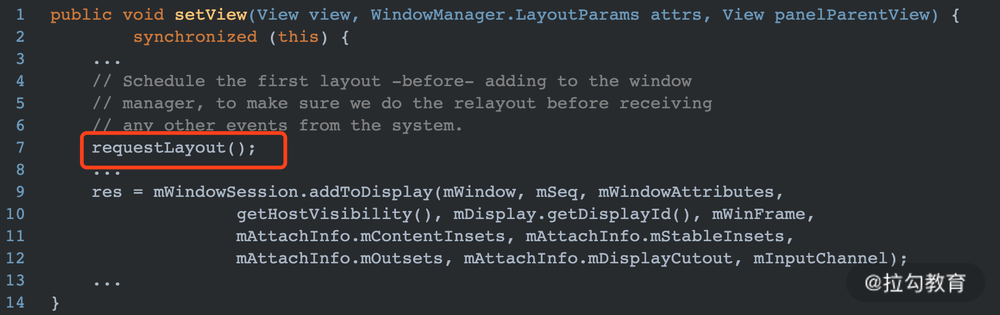
requestLayout 第一次被调用是在 setView 方法中，从名字也能看出，这个方法的主要目的就是请求布局操作，其中包括 View 的测量、布局、绘制等。具体代码如下：

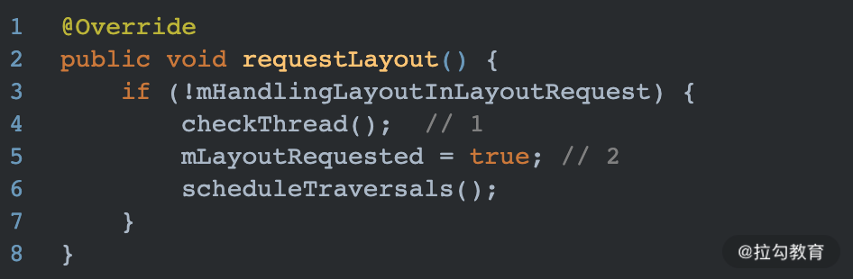

说明：

- 注释 1 处检查是否为合法线程，一般情况下就是检查是否为主线程。
- 注释 2 处将请求布局标识符设置为 true，这个参数决定了后续是否需要执行 measure 和 layout 操作。

最后执行 scheduleTraversals 方法，如下：

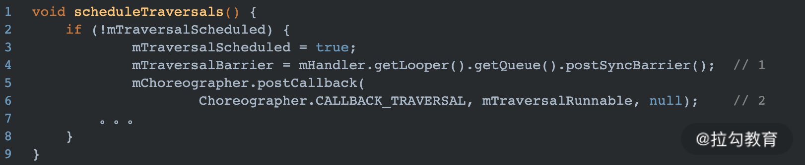

说明：

- 注释 1 处向主线程消息队列中插入 SyncBarrier Message。该方法发送了一个没有 target 的 Message 到 Queue 中，在 next 方法中获取消息时，如果发现没有 target 的 Message，则在一定的时间内跳过同步消息，优先执行异步消息。这里通过调用此方法，保证 UI 绘制操作优先执行。
- 注释 2 处调用 Choreographer 的 postCallback 方法，实际上也是发送一个 Message 到主线程消息队列。

Choreographer 的 postCallback 的执行流程如下：

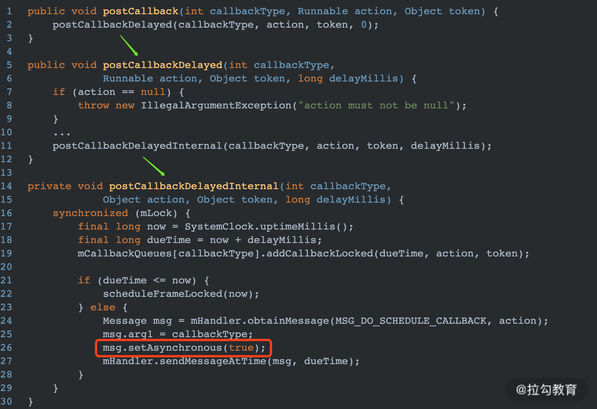

可以看出最终通过 Handler 发送到 MessageQueue 中的 Message 被设置为异步类型的消息。

mTraversalRunnable 是一个实现 Runnable 接口的 TraversalRunnable 类型对象，其 run 方法如下：

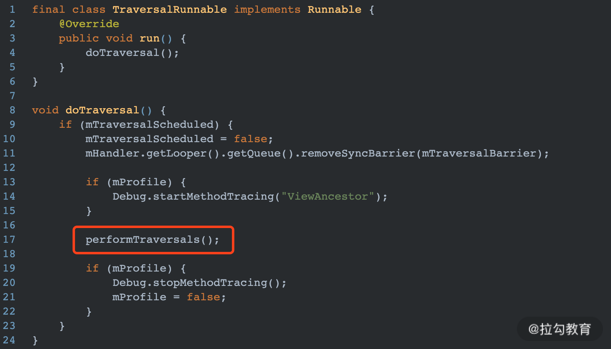

可以看出，在 run 方法中调用了 doTraversal 方法，并最终调用了 performTraversals() 方法，这个方法就是真正的开始 View 绘制流程：measure –> layout –> draw 。

### ViewRootImpl 的 performTraversals 方法

这个方法是一个比较重的方法，查看源码发现总共将近 900 行代码。但是抽取一下核心部分代码，这个方法实际上只负责做 3 件事情：

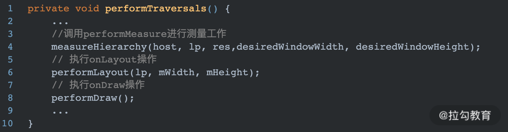

很明显，实际就是执行了我们在自定义 View 课时中学习的 3 个主要过程。

接下来以测量 performMeasure 实现举例。

### ViewRootImpl 的 measureHierarchy

我们知道 View 的测量是一层递归调用，递归执行子 View 的测量工作之后，最后决定父视图的宽和高。但是这个递归的起源是在哪里呢？答案就是 DecorView。因为在 measureHierarchy 方法中最终是调用 performMeasure 方法来进行测量工作的，所以我们直接看 performMeasure 方法的实现，如下所示：

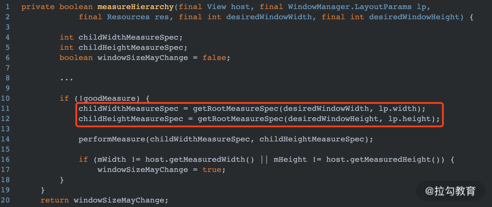

在这个方法中，通过 getRootMeasureSpec 方法获取了根 View的MeasureSpec，实际上 MeasureSpec 中的宽高此处获取的值是 Window 的宽高。关于 MeasureSpec 的介绍可以查看第15课时“自定义 View”。

### ViewRootImpl 的 performMeasure

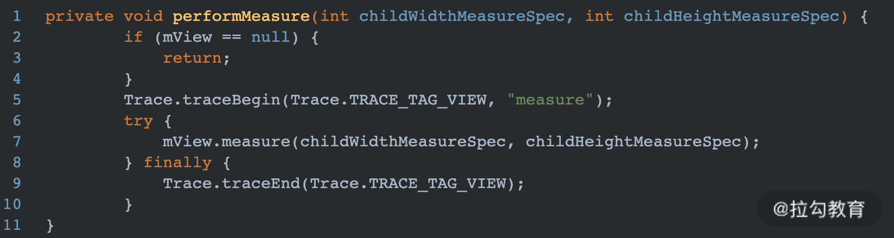

这个方法很简单，只是执行了 mView 的 measure 方法，这个 mView 就是 DecorVIew。其 DecorView 的 measure 方法中，会调用 onMeasure 方法，而 DecorView 是继承自 FrameLayout 的，因此最终会执行 FrameLayout 中的 onMeasure 方法，并递归调用子 View 的 onMeasure 方法。

>performLayout 也是类似的过程，就不再赘述。

### ViewRootImpl 的 performDraw

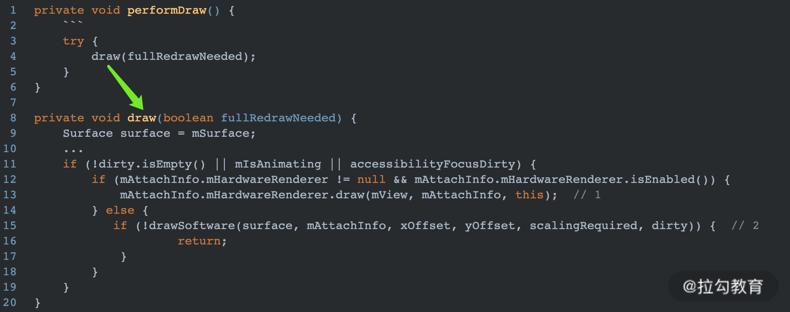

从图中可以看出，在 performDraw 方法中，调用的 ViewRootImpl 的 draw 方法。在 draw 方法中进行 UI 绘制操作，Android 系统提供了 2 种绘制方式：

- 图中 1 处表示 App 开启了硬件加速功能，所以会启动硬件加速绘制；
- 图中 2 处表示使用软件绘制。

>ViewRootImpl 中有一个非常重要的对象 Surface，之所以说 ViewRootImpl 的一个核心功能就是负责 UI 渲染，原因就在于在 ViewRootImpl 中会将我们在 draw 方法中绘制的 UI 元素，绑定到这个 Surface 上。如果说 Canvas 是画板，那么 Surface 就是画板上的画纸，Surface 中的内容最终会被传递给底层的 SurfaceFlinger，最终将 Surface 中的内容进行合成并显示的屏幕上。

### 软件绘制 drawSoftware

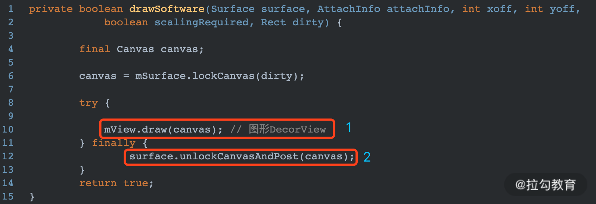

图中 1 处就是调用 DecorView 的 draw 方法将 UI 元素绘制到画布 Canvas 对象中，具体可以绘制的内容在自定义 View 课时已经介绍过了。

图中 2 处请求将 Canvas 中的内容显示到屏幕上，实际上就是将 Canvas 中的内容提交给 SurfaceFlinger 进行合成处理。

默认情况下软件绘制没有采用 GPU 渲染的方式，drawSoftware 工作完全由 CPU 来完成。

DecorView 并没有复写 draw 方法，因此实际是调用的顶层 View 的 draw 方法，如下：

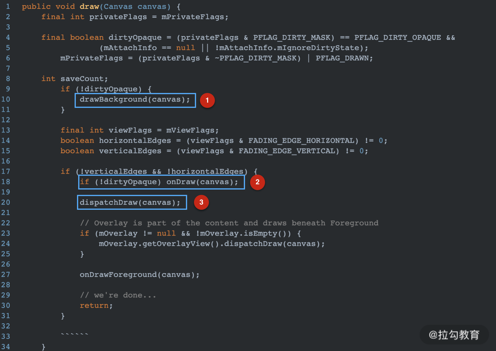

解释说明：

- 图中 1 处绘制 View 的背景；
- 图中 2 处绘制 View 自身内容；
- 图中 3 处表示对 draw 事件进行分发，在 View 中是空实现，实际调用的是 ViewGroup 中的实现，并递归调用子 View 的 draw 事件。

### 启用硬件加速

#### 是否启用硬件加速

可以在 ViewRootImpl 的 draw 方法中，通过如下方法判断是否启用硬件加速：

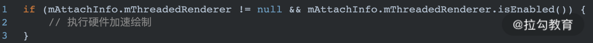

我们可以在 AndroidManifest 清单文件中，指定 Application 或者某一个 Activity 支持硬件加速，如下：

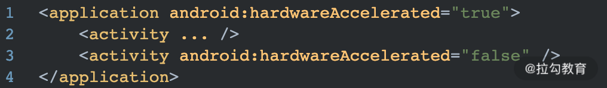

此外我们还可以进行粒度更小的硬件加速设置，比如设置某个 View 支持硬件加速：

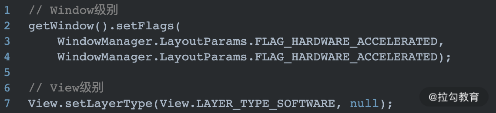

之所以会有这么多级的支持区分，主要是因为并不是所有的 2D 绘制操作都支持硬件加速，当在自定义 View 中使用了如下 API，则有可能造成程序工作不正常：

Canvas

- clipPath()
- clipRegion()
- drawPicture()
- drawPosText()
- drawTextOnPath()
- drawVertices()

Paint

- setLinearText()
- setMaskFilter()
- setRasterizer()
  
### 硬件加速优势

接下来，看下为什么硬件加速能够提高 UI 渲染的性能。再看 ViewRootImpl 的 draw 方法：

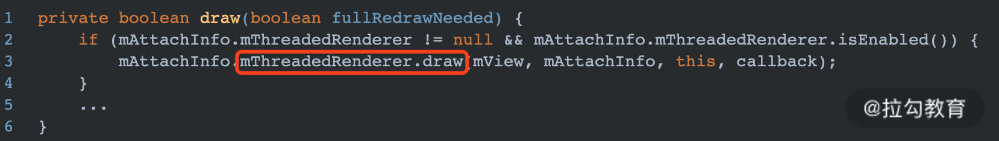

图中 mThreadRenderer 是 ThreadRenderer 类型，其 draw 方法具体如下：

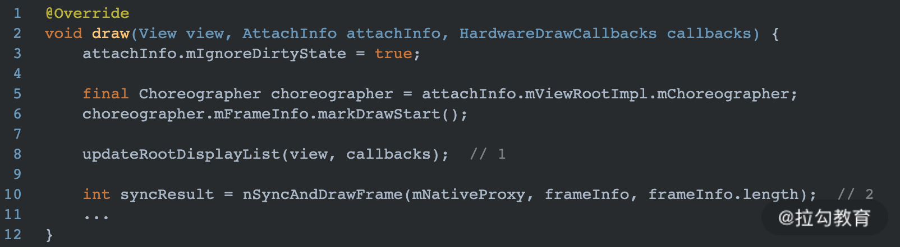

图中注释 1 处就是硬件加速的特殊之处，通过 updateRootDisplayList 方法将 View 视图抽象成一个 RenderNode 对象，并构建 View 的 DrawOp 树。

图中 2 处通知 RenderThread 进行绘制操作，RenderThread 是一个单例线程，每个进程最多只有一个硬件渲染线程，这样就不会存在多线程并发访问冲突问题。

updateRootDisplayList 具体如下：

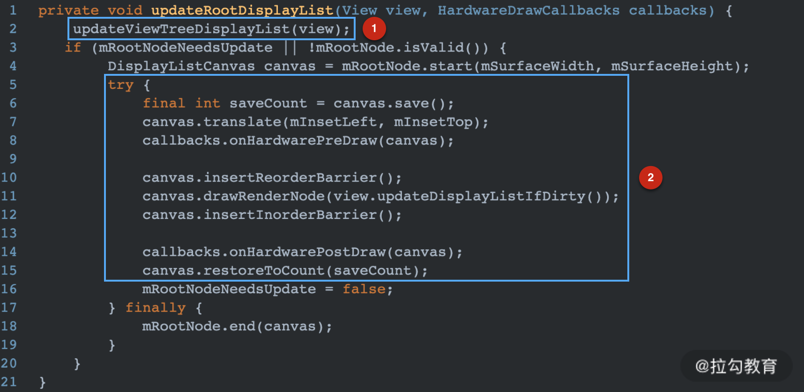

Android 硬件加速过程中，View 视图被抽象成 RenderNode 节点，View 中的绘制操作都会被抽象成一个个 DrawOp，比如 View中drawLine，构建过程中就会被抽象成一个 DrawLineOp，drawBitmap 操作会被抽象成 DrawBitmapOp。每个子 View 的绘制被抽象成 DrawRenderNodeOp，每个 DrawOp 有对应的 OpenGL 绘制命令。

上图中 1 处就是遍历 View 递归构建 DrawOp，2 处就是根据 Canvas 将所有的 DrawOp 进行缓存操作。所有的 DrawOp 对应的 OpenGL 命令构建完成之后，就需要使用 RenderProxy 向 RenderThread 发送消息，请求 OpenGL 线程进行渲染。整个渲染过程是通过 GPU 并在不同线程绘制渲染图形，因此整个流程会更加顺畅。

### Invalidate 轻量级刷新

如果你做过开发应该用过 invalidate 来刷新 View，这个方法跟 requestLayout 的区别在于，它不一定会触发 View 的 measure 和 layout 的操作，多数情况下只会执行 draw 操作。

在 View 的 measure 方法中，有如下几行代码：

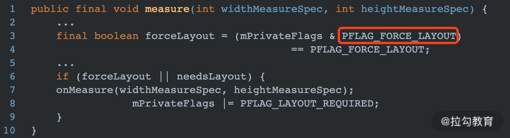

可以看出，如果要触发 onMeasure 方法，需要对 View 设置 PFLAG_FORCE_LAYOUT 标志位，而这个标志位在 requestLayout 方法中被设置，invalidate 并没有设置此标志位。

再看下 onLayout 方法：

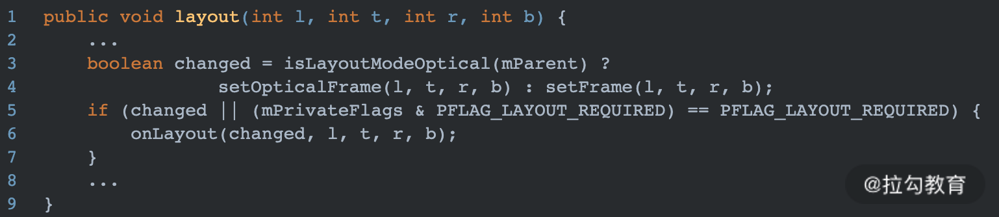

可以看出，当 View 的位置发送改变，或者添加 PFLAG_FORCE_LAYOUT 标志位后 onLayout 才会被执行。当调用 invalidate 方法时，如果 View 的位置并没有发生改变，则 View 不会触发重新布局的操作。

### postInvalidate

说到 invalidate 就不得不说一下 postInvalidate，不光是因为面试中经常被问到，实际开发中使用频率也是较高。

它们两者之间的区别就是 invalidate 是在 UI 线程调用，postInvalidate 是在非 UI 线程调用。

postInvalidate 的实现如下：

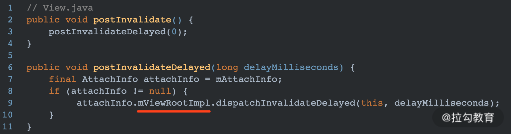

最终还是在 ViewRootImpl 中进行操作。

### ViewRootImpl 的 dispatchInvalidateDelayed

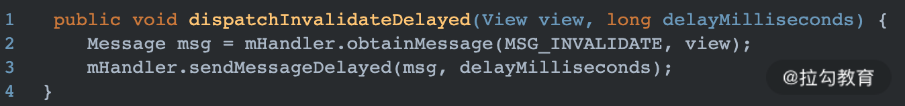

在非 UI 线程中，通过 Handler 发送了一个延时 Message，因为 Handler 是在主线程中创建的，所以最终 handlerMessage 会在主线程中被执行，方法如下：

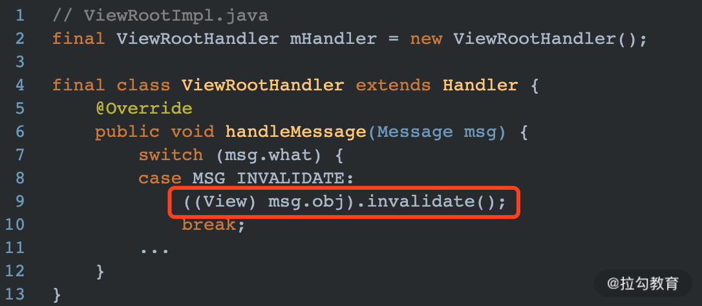

上图中的 msg.obj 就是发送 postInvalidate 的 View 对象，可以看出最终还是回到 UI 线程执行了 View 的 invalidate 方法。

个人理解：做过 Android 开发的都知道只有 UI 线程才可以刷新 View 控件，但是事实却并非如此。在 ViewRootImpl 中对 View 进行刷新时，会检查当前线程的合法性：

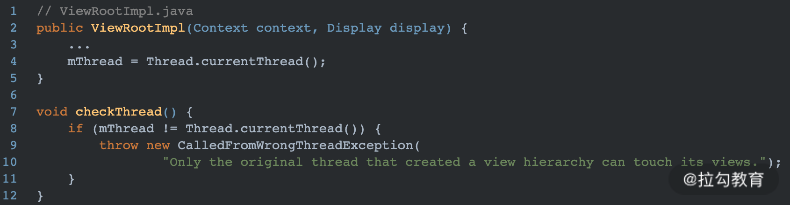

图中 mThread 是被赋值为当前线程，而 ViewRootImpl 是在 UI 线程中被创建的，因此只有 UI 线程可以进行 View 刷新。但是如果我们能在非 UI 线程中创建 ViewRootImpl，并通过这个 ViewRootImpl 进行 View 的添加和绘制操作，那么后续理论上也是可以在非 UI 线程中刷新 View 控件的，只是维护成本较高，很少有人去做这件事情。

### 总结

至此 View 的工作流程的大致整体已经描述完毕了，做一下总结。本课时主要介绍了 ViewRootImpl 是如何执行 View 的渲染操作的，其中核心方法在 performTraversals 方法中会按顺序执行 measure-layout-draw 操作。并顺带介绍了软件绘制和硬件加速的区别，最后介绍了 View 刷新的两种方式 Invalidate 和 postInvalidate。
