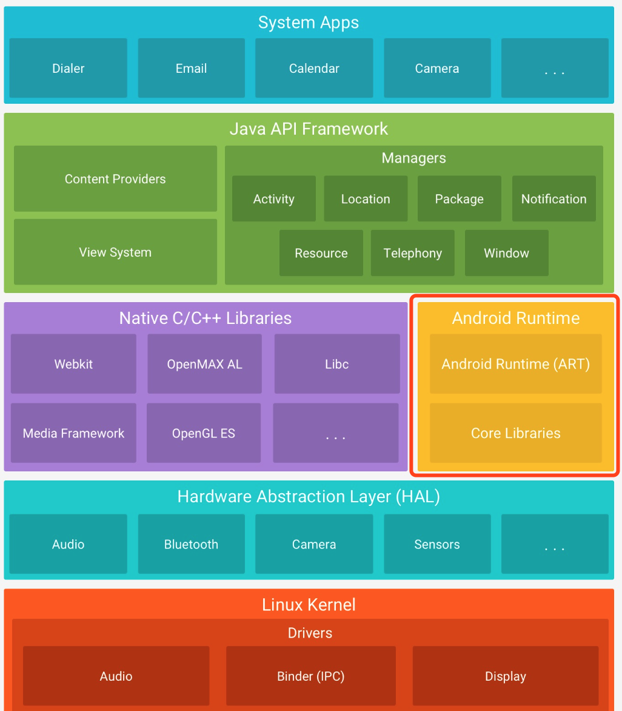
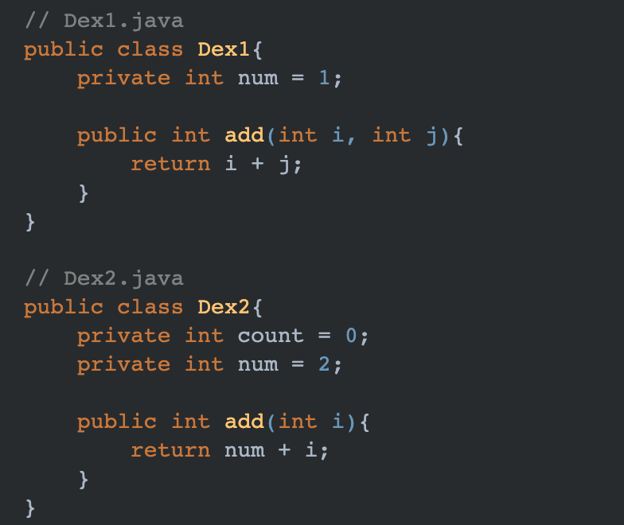
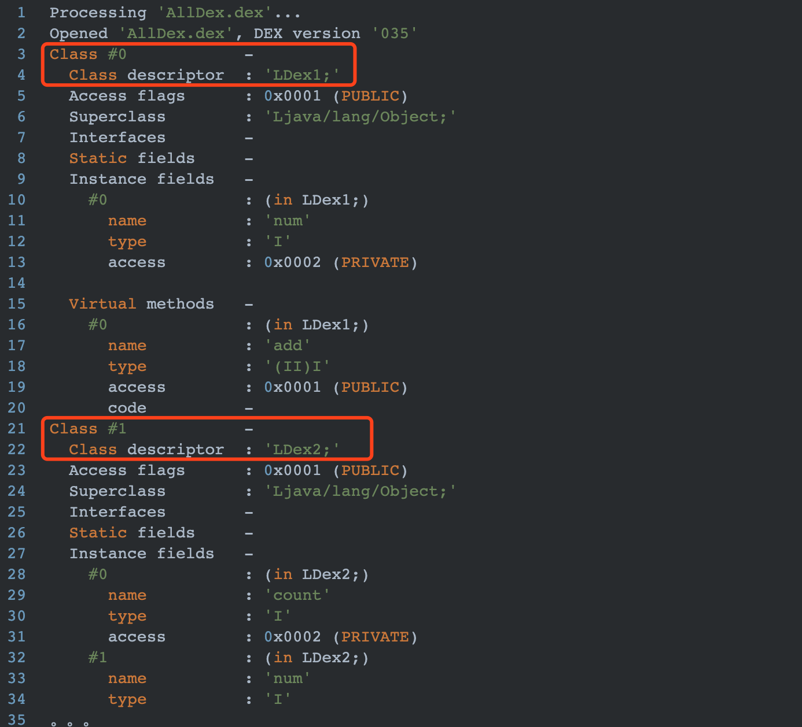
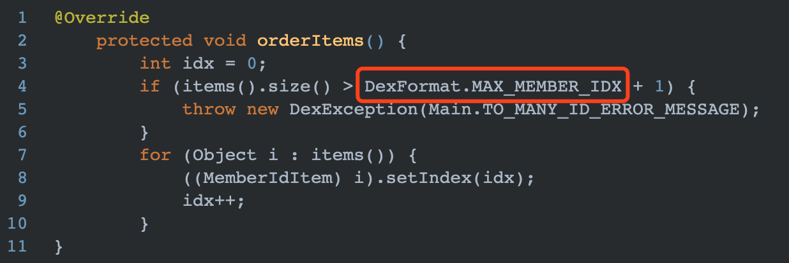
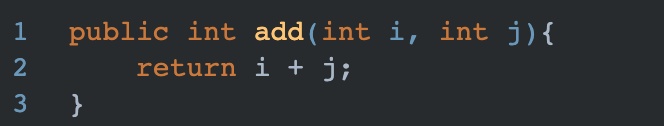
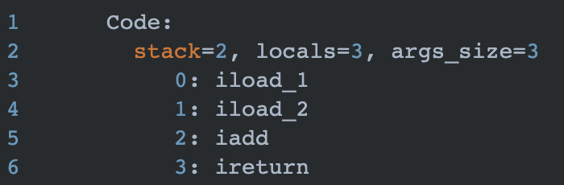
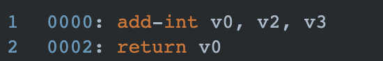
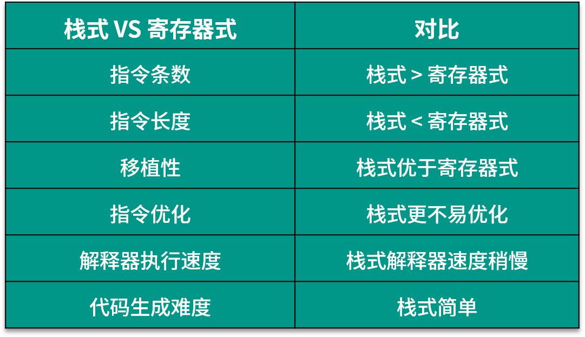
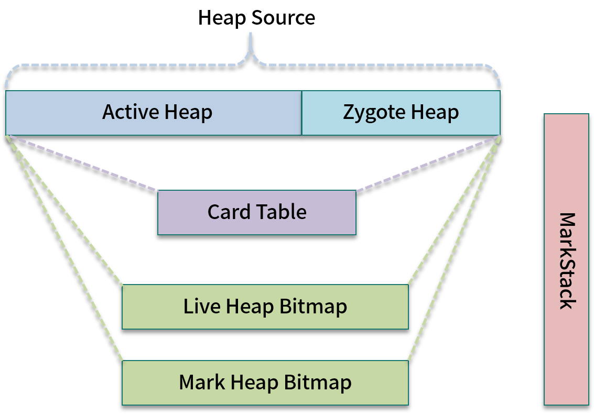
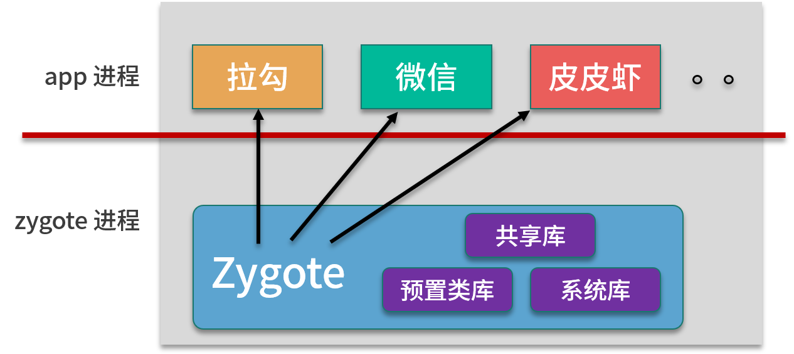

# DVM 以及 ART 是如何对 JVM 进行优化的

## 什么是 Dalvik

Dalvik 是 Google 公司自己设计用于 Android 平台的 Java 虚拟机，Android 工程师编写的 Java 或者 Kotlin 代码最终都是在这台虚拟机中被执行的。在 Android 5.0 之前叫作 DVM，5.0 之后改为 ART（Android Runtime）。

在整个 Android 操作系统体系中，ART 位于以下图中红框位置：



>其实称 DVM/ART 为 Android 版的 Java 虚拟机，这种说法并不是很准确。虚拟机必须符合 Java 虚拟机规范，也就是要通过 JCM（Java Compliance Kit）的测试并获得授权，但是 DVM/ART 并没有得到授权。

DVM 大多数实现与传统的 JVM 相同，但是因为 Android 最初是被设计用于手机端的，对内存空间要求较高，并且起初 Dalvik 目标是只运行在 ARM 架构的 CPU 上。针对这几种情况，Android DVM 有了自己独有的优化措施。

## Dex 文件

传统 Class 文件是由一个 Java 源码文件生成的 .Class 文件，而 Android 是把所有 Class 文件进行合并优化，然后生成一个最终的 class.dex 文件。dex 文件去除了 class 文件中的冗余信息（比如重复字符常量），并且结构更加紧凑，因此在 dex 解析阶段，可以减少 I/O 操作，提高了类的查找速度。

比如在 course12 目录下，分别创建 Dex1.java 和 Dex2.java，如下所示：



分别通过 javac 命令将它们编译为 .class 文件。

```java
javac Dex1.java  ->  Dex1.class
javac Dex2.java  ->  Dex2.class
```

然后通过以下命令将 Dex1.class 和 Dex2.class 打包到一个 jar 文件中。

```java
jar cvf AllDex.jar Dex1.class Dex2.class
```

上述命令会在当前目录生成一个 AllDex.jar 文件。

最后使用 dx 命令将 AllDex.jar 进行优化，并生成 AllDex.dex 文件。

```java
dx --dex --output AllDex.dex AllDex.jars
```

命令结束后，会在当前目录生成 AllDex.dex 文件。

正常情况下，我们无法通过反编译工具查看其源码，但是可以通过 Android SDK 中的工具 dexdump 查看其字节码：

```java
dexdump -d -l plain AllDex.dex
```

上述命令会将 Dex1 和 Dex2 优化后的字节码显示到控制台，内容较多，部分结果如下：



可以看出 Dex1 和 Dex2 的信息都在此 .dex 文件中。

>实际上，dex 文件在 App 安装过程中还会被进一步优化为 odex(optimized dex)，此过程还会在后续介绍安装过程时再次提到。

注意：这一优化过程也会伴随着一些副作用，最经典的就是 Android 65535 问题。出现这个问题的根本原因是在 DVM 源码中的 MemberIdsSection.java 类中，有如下一段代码：



如果 items 个数超过 DexFormat.MAX_MEMBER_IDX 则会报错，DexFormat.MAX_MEMBER_IDX 的值为 65535，items 代表 dex 文件中的方法个数、属性个数、以及类的个数。也就是说理论上不止方法数，我们在 java 文件中声明的变量，或者创建的类个数如果也超过 65535 个，同样会编译失败，Android 提供了 MultiDex 来解决这个问题。很多网上的文章说 65535 问题是因为解析 dex 文件到数据结构 DexFile 时，使用了 short 来存储方法的个数，其实这种说法是错误的！

## 架构基于寄存器&基于栈堆结构

在之前的文章中，我已经介绍过 JVM 的指令集是基于栈结构来执行的；而 Android 却是基于寄存器的，不过这里不是直接操作硬件的寄存器，而是在内存中模拟一组寄存器。Android 字节码和 Java 字节码完全不同，Android 的字节码（smali）更多的是二地址指令和三地址指令，具体Dalvik 指令可以参考官网 Dalvik 字节码。

具体看一下 Dalvik 和 JVM 字节码的区别，在上文中提到的 Dex1.java，在 Dex1 中有 add 方法如下：



经过编译为 Dex1.class 之后，查看其字节码为下图所示：



add 方法会使用 4 行指令来完成。而通过 dx 将其优化为 .dex 文件后，再次查看它的 Dalvik 字节码为如下：



解释说明：

- add-int 指令需要 3 个寄存器参数：v0、v2、v3。这个指令会将 v2 和 v3 进行相加运算，然后将结果保存在寄存器 v0 中。
- return 指令将结果返回。

可以看出， Dalvik 字节码只需要 2 行指令。基于寄存器的指令明显会比基于栈的指令少，虽然增加了指令长度但却缩减了指令的数量，执行也更为快速。用一张表格来对比基于栈和基于寄存器的实现方式如下：



## 内存管理与回收

DVM 与 JVM 另一个比较显著的不同就是内存结构的区别，主要体现在对”堆”内存的的管理。
Dalvik 虚拟机中的堆被划分为了 2 部分：Active Heap 和 Zygote Heap。如下所示：



上图取自老罗的 Android 源码分析，图中的 Card Table 以及两个 Heap Bitmap 主要是用来记录垃圾收集过程中对象的引用情况，以便实现 Concurrent GC。

## 为什么要分 Zygote 和 Active 两部分

Android 系统的第一个 Dalvik 虚拟机是由 Zygote 进程创建的，而应用程序进程是由 Zygote 进程 fork 出来的。

Zygote 进程是在系统启动时产生的，它会完成虚拟机的初始化，库的加载，预置类库的加载和初始化等操作，而在系统需要一个新的虚拟机实例时，Zygote 通过复制自身，最快速的提供一个进程；另外，对于一些只读的系统库，所有虚拟机实例都和 Zygote 共享一块内存区域，大大节省了内存开销。如下图所示：



解释说明：

当启动一个应用时，Android 操作系统需要为应用程序创建新的进程，而这一步操作是通过一种写时拷贝技术（COW）直接复制 Zygote 进程而来。这意味着在开始的时候，应用程序进程和 Zygote 进程共享了同一个用来分配对象的堆。然而，当 Zygote 进程或者应用程序进程对该堆进行写操作时，内核就会执行真正的拷贝操作，使得 Zygote 进程和应用程序进程分别拥有自己的一份拷贝。拷贝是一件费时费力的事情。因此，为了尽量地避免拷贝，Dalvik 虚拟机将自己的堆划分为两部分。

事实上，Dalvik 虚拟机的堆最初只有一个，也就是 Zygote 进程在启动过程中创建 Dalvik 虚拟机时，只有一个堆。但是当 Zygote 进程在 fork 第一个应用程序进程之前，会将已经使用的那部分堆内存划分为一部分，把还没有使用的堆内存划分为另外一部分。前者就称为 Zygote 堆，后者就称为 Active 堆。以后无论是 Zygote 进程，还是应用程序进程，当它们需要分配对象的时候，都在 Active 堆上进行。这样就可以使得 Zygote 堆尽可能少地被执行写操作，因而就可以减少执行写时拷贝的操作时间。

## Dalvik 虚拟机堆

在 Dalvik 虚拟机中，堆实际上就是一块匿名共享内存。Dalvik 虚拟机并不是直接管理这块匿名共享内存，而是将它封装成一个 mspace，交给 C 库来管理。为什么要这样做呢？因为内存碎片问题其实是一个通用的问题，不只是 Dalvik 虚拟机在 Java 堆为对象分配内存时会遇到，C 库的 malloc 函数在分配内存时也会遇到。

Android 系统使用的 C 库 bionic 使用了 Doug Lea 写的 dlmalloc 内存分配器，也就是说，我们调用函数 malloc 的时候，使用的是 dlmalloc 内存分配器来分配内存。这是一个成熟的内存分配器，可以很好地解决内存碎片问题。

关于 dlmalloc 内存分配器的设计，可以参考Doug Lea写的这篇文章：[A Memory Allocator](http://gee.cs.oswego.edu/dl/html/malloc.html)。

## 总结

本文章主要从 3 个方面介绍 DVM 的一些显著特点。但是实际上 DVM 这个话题很大，有很多细节不能通过一个文章就能讲清楚。需要读者结合整套源码实现才能对 DVM 有更深的理解。

因此我整理了一些对 DVM 源码分析的资料与链接，希望对你的学习有所帮助。

- [Android Dalvik官方文档](https://source.android.com/devices/tech/dalvik/dalvik-bytecode.html)
- [Dalvik虚拟机字节码和指令集对照表](http://www.zhangchuany.com/dalvik/dalvik-bytecode-instructionset-comparedtab/)
- [Dalvik虚拟机Java堆创建过程分析](https://blog.csdn.net/luoshengyang/article/details/41581063)
