# 底层剖析 Window、Activity、View 三者关系

不管工作几年的 Android 工程师，或多或少都听说过 Window 的概念，并且隐隐约约感觉它在 Activity 与 View 之间应该发挥着某种连接的作用。但是如果需要说出这 3 者之间的关系，多数工程师不知道从何下手。

## Activity 的 setContentView

Activity 是 Android 开发人员使用最频繁的 API 之一，最初在接触 Android 开发时，我始终认为它就是负责将 layout 布局中的控件渲染绘制出来的。原因很简单，每当我们想显示一个新的界面时，都是通过 start 一个新的 Activity 方式；对于想显示的内容或者布局，也只需要在 Activity 中添加一行 setContentView 即可，剩下的 Activity 都自动帮我们搞定。但是我们从来没有去创建一个 Window 来绑定 UI 或者 View 元素。

直到我点开 setContentView 源码的那一刻：

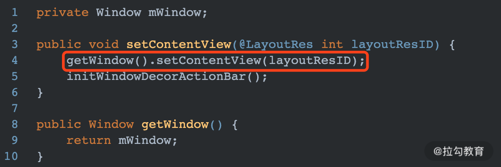

显然 Activity 几乎什么都没做，将操作直接交给了一个 Window 来处理。getWindow 返回的是 Activity 中的全局变量 mWindow，它是 Window 窗口类型。那么它是什么时候赋值的呢？

记得文章[startActivivty启动过程分析](/Android/startActivivty启动过程分析.md)，最终代码会调用到 ActivityThread 中的 performLaunchActivity 方法，通过反射创建 Activity 对象，并执行其 attach 方法。Window 就是在这个方法中被创建，详细代码如下：

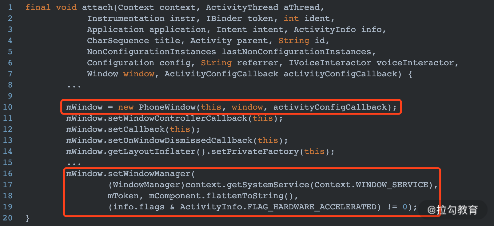

在 Activity 的 attach 方法中将 mWindow 赋值给一个 PhoneWindow 对象，实际上整个 Android 系统中 Window 只有一个实现类，就是 PhoneWindow。

接下来调用 setWindowManager 方法，将系统 WindowManager 传给 PhoneWindow，如下所示：

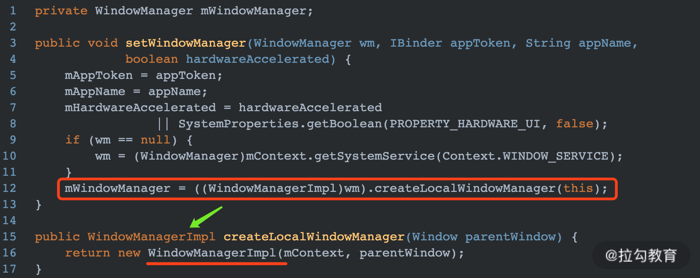

最终，在 PhoneWindow 中持有了一个 WindowManagerImpl 的引用。

## PhoneWindow 的 setContentView

Activity 将 setContentView 的操作交给了 PhoneWindow，接下来看下其实现过程：

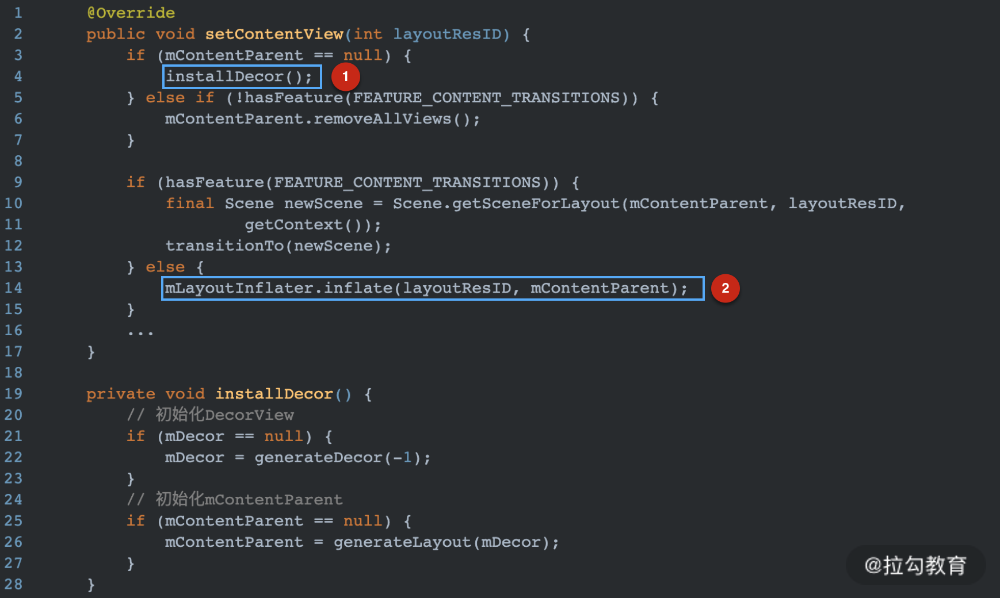

解释说明：

- 图中 1 处调用如果 mContentParent 为 null，则调用 installDecor 初始化 DecorView 和 mContentParent。
- 图中 2 处将我们调用 setContentView 传入的布局添加到 mContentParent 中。

可以看出在 PhoneWindow 中默认有一个 DecorView（实际上是一个 FrameLayout），在 DecorView 中默认自带一个 mContentParent（实际上是一个 ViewGroup）。我们自己实现的布局是被添加到 mContentParent 中的，因此经过 setContentView 之后，PhoneWindow 内部的 View 关系如下所示：

目前为止 PhoneWindow 中只是创建出了一个 DecorView，并在 DecorView 中填充了我们在 Activity 中传入的 layoutId 布局，可是 DecorView 还没有跟 Activity 建立任何联系，也没有被绘制到界面上显示。那 DecorView 是何时被绘制到屏幕上的呢？

刚接触 Android，学习生命周期时，经常会看到相关文档介绍 Activity 执行到 onCreate 时并不可见，只有执行完 onResume 之后 Activity 中的内容才是屏幕可见状态。造成这种现象的原因就是，onCreate 阶段只是初始化了 Activity 需要显示的内容，而在 onResume 阶段才会将 PhoneWindow 中的 DecorView 真正的绘制到屏幕上。

在 ActivityThread 的 handleResumeActivity 中，会调用 WindowManager 的 addView 方法将 DecorView 添加到 WMS(WindowManagerService) 上，如下所示：

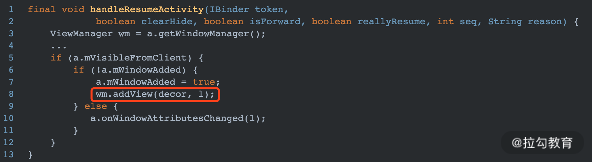

 WindowManger 的 addView 结果有两个:

DecorView 被渲染绘制到屏幕上显示；
DecorView 可以接收屏幕触摸事件。

## WindowManager 的 addView

PhoneWindow 只是负责处理一些应用窗口通用的逻辑（设置标题栏，导航栏等）。但是真正完成把一个 View 作为窗口添加到 WMS 的过程是由 WindowManager 来完成的。

WindowManager 是接口类型，上文中我们也了解到它真正的实现者是 WindowManagerImpl 类，看一下它的 addView 方法如下：

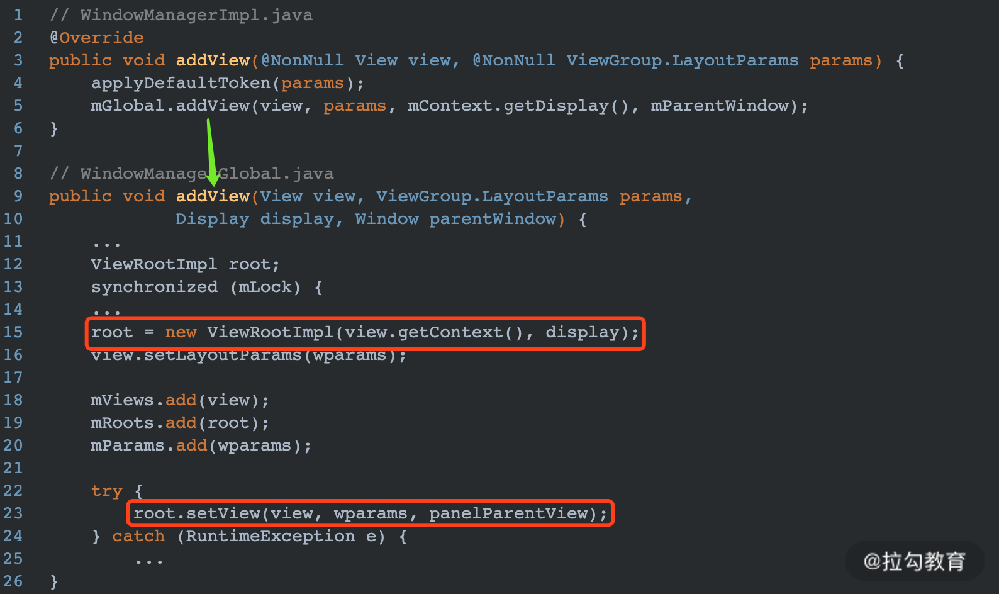

WindowManagerImpl 也是一个空壳，它调用了 WindowManagerGlobal 的 addView 方法。

WindowMangerGlobal 是一个单例，每一个进程中只有一个实例对象。如上图红框中所示，在其 addView 方法中，创建了一个最关键的 ViewRootImpl 对象，然后通过 ViewRootImpl 的 setView 方法将 view 添加到 WMS 中。

## ViewRootImpl 的 setView

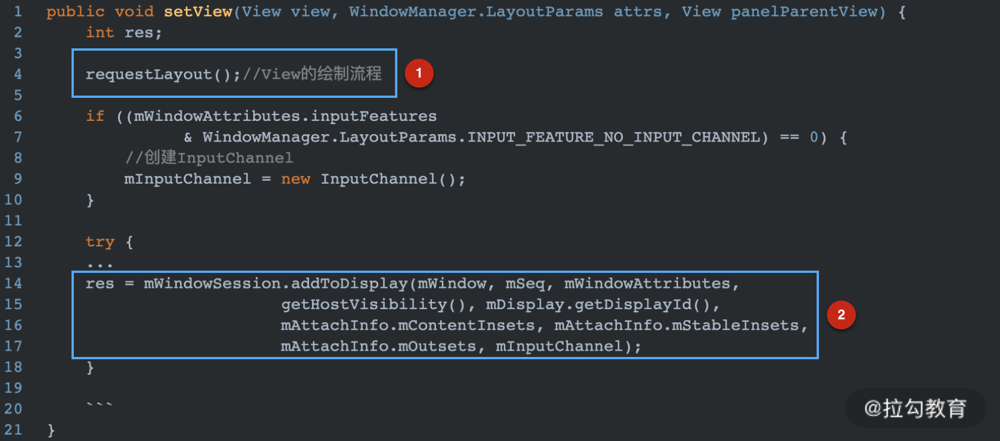

解释说明：

- 图中 1 处的 requestLayout 是刷新布局的操作，调用此方法后 ViewRootImpl 所关联的 View 也执行 measure - layout - draw 操作，确保在 View 被添加到 Window 上显示到屏幕之前，已经完成测量和绘制操作。
- 图中 2 处调用 mWindowSession 的 addToDisplay 方法将 View 添加到 WMS 中。

WindowSession 是 WindowManagerGlobal 中的单例对象，初始化代码如下：

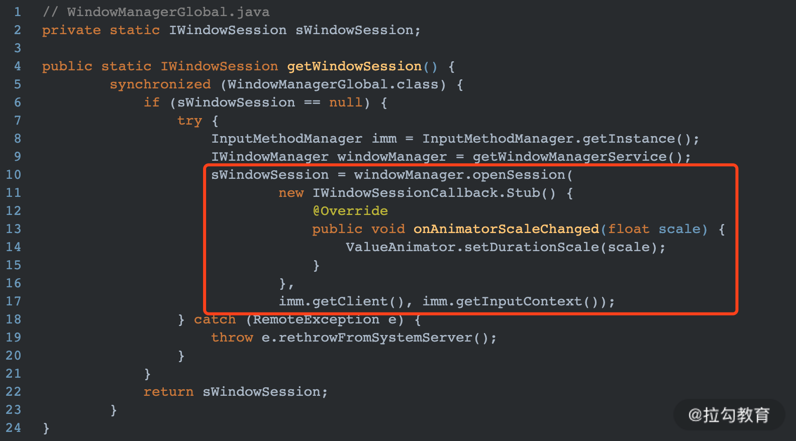

sWindowSession 实际上是 IWindowSession 类型，是一个 Binder 类型，真正的实现类是 System 进程中的 Session。上图中红框中就是用 AIDL 获取 System 进程中 Session 的对象。其 addToDisplay 方法如下：

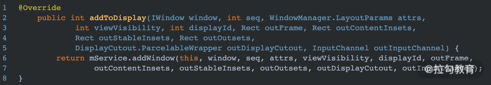

图中的 mService 就是 WMS。至此，Window 已经成功的被传递给了 WMS。剩下的工作就全部转移到系统进程中的 WMS 来完成最终的添加操作。

## 再看 Activity

上文中我提到 addView 成功有一个标志就是能够接收触屏事件，通过对 setContentView 流程的分析，可以看出添加 View 的操作实质上是 PhoneWindow 在全盘操作，背后负责人是 WMS，反之 Activity 自始至终没什么参与感。但是我们也知道当触屏事件发生之后，Touch 事件首先是被传入到 Activity，然后才被下发到布局中的 ViewGroup 或者 View。那么 Touch 事件是如何传递到 Activity 上的呢？

ViewRootImpl 中的 setView 方法中，除了调用 IWindowSession 执行跨进程添加 View 之外，还有一项重要的操作就是设置输入事件的处理：

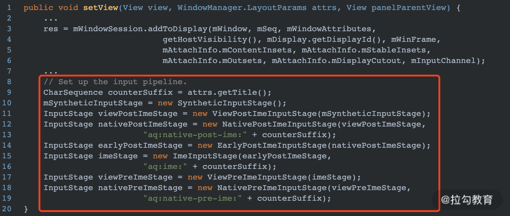

如上图红框中所示，设置了一系列的输入通道。一个触屏事件的发生是由屏幕发起，然后经过驱动层一系列的优化计算通过 Socket 跨进程通知 Android Framework 层（实际上就是 WMS），最终屏幕的触摸事件会被发送到上图中的输入管道中。

这些输入管道实际上是一个链表结构，当某一个屏幕触摸事件到达其中的 ViewPostImeInputState 时，会经过 onProcess 来处理，如下所示：

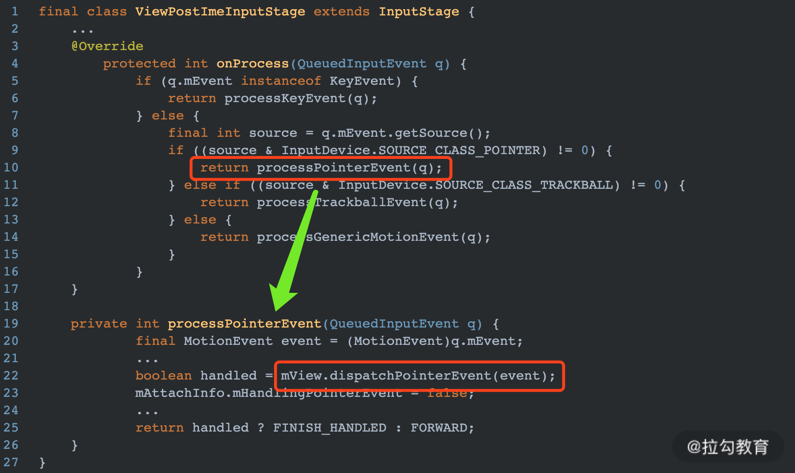

可以看到在 onProcess 中最终调用了一个 mView的dispatchPointerEvent 方法，mView 实际上就是 PhoneWindow 中的 DecorView，而 dispatchPointerEvent 是被 View.java 实现的，如下所示：

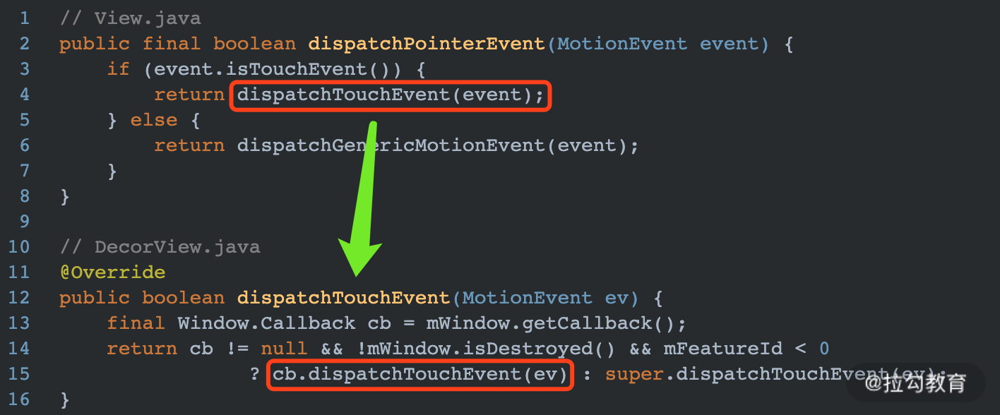

最终调用了 PhoneWindow 中 Callback的dispatchTouchEvent 方法，那这个 Callback 是不是 Activity 呢？

在启动 Activity 阶段，创建 Activity 对象并调用 attach 方法时，有如下一段代码：

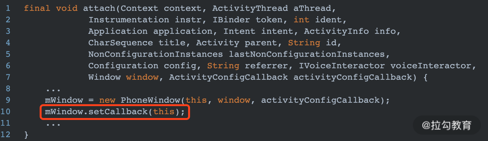

果然将 Activity 自身传递给了 PhoneWindow，再接着看 Activity的dispatchTouchEvent 方法：

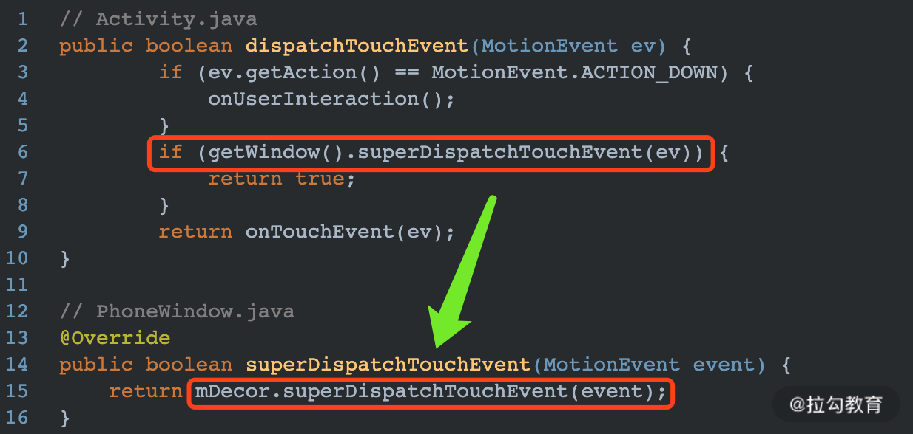

Touch 事件在 Activity 中只是绕了一圈最后还是回到了 PhoneWindow 中的 DecorView 来处理。剩下的就是从 DecorView 开始将事件层层传递给内部的子 View 中了。

## 总结

这节课主要通过 setContentView 的流程，分析了 Activity、Window、View 之间的关系。整个过程 Activity 表面上参与度比较低，大部分 View 的添加操作都被封装到 Window 中实现。而 Activity 就相当于 Android 提供给开发人员的一个管理类，通过它能够更简单的实现 Window 和 View 的操作逻辑。

最后再简单列一下整个流程需要注意的点：

- 一个 Activity 中有一个 window，也就是 PhoneWindow 对象，在 PhoneWindow 中有一个 DecorView，在 setContentView 中会将 layout 填充到此 DecorView 中。
- 一个应用进程中只有一个 WindowManagerGlobal 对象，因为在 ViewRootImpl 中它是 static 静态类型。
- 每一个 PhoneWindow 对应一个 ViewRootImple 对象。
- WindowMangerGlobal 通过调用 ViewRootImpl 的 setView 方法，完成 window 的添加过程。
- ViewRootImpl 的 setView 方法中主要完成两件事情：View 渲染（requestLayout）以及接收触屏事件。
