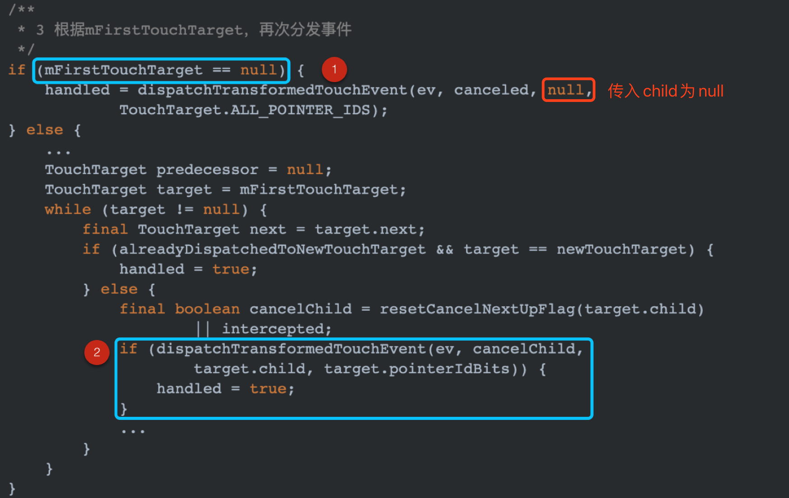
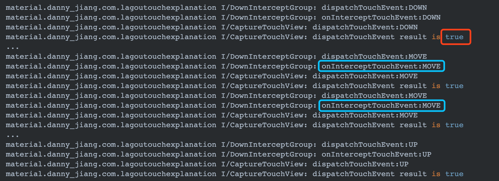

# 彻底掌握Android事件分发机制

Android touch 事件的分发是 Android 工程师必备技能之一。关于事件分发主要有几个方向可以展开深入分析：

- touch 事件是如何从驱动层传递给 Framework 层的 InputManagerService；
- WMS 是如何通过 ViewRootImpl 将事件传递到目标窗口；
- touch 事件到达 DecorView 后，是如何一步步传递到内部的子 View 中的。

其中与上层软件开发息息相关的就是第 3 条，也是本篇文章的重点关注内容。

>注意：不同版本间的代码会有区别，本文是基于 Android-28 的源码上进行分析。

## 思路梳理

在深入分析事件分发源码之前，需要先弄清楚 2 个概念。

### ViewGroup

ViewGroup 是一组 View 的组合，在其内部有可能包含多个子 View，当手指触摸屏幕上时，手指所在的区域既能在 ViewGroup 显示范围内，也可能在其内部 View 控件上。

因此它内部的事件分发的重心是处理当前 Group 和子 View 之间的逻辑关系：

- 当前 Group 是否需要拦截 touch 事件；
- 是否需要将 touch 事件继续分发给子 View；
- 如何将 touch 事件分发给子 View。

### View

View 是一个单纯的控件，不能再被细分，内部也并不会存在子 View，所以它的事件分发的重点在于当前 View 如何去处理 touch 事件，并根据相应的手势逻辑进行一些列的效果展示（比如滑动，放大，点击，长按等）。

- 是否存在 TouchListener；
- 是否自己接收处理 touch 事件（主要逻辑在 onTouchEvent 方法中）。

### 事件分发核心 dispatchTouchEvent

整个 View 之间的事件分发，实质上就是一个大的递归函数，而这个递归函数就是 dispatchTouchEvent 方法。在这个递归的过程中会适时调用 onInterceptTouchEvent 来拦截事件，或者调用 onTouchEvent 方法来处理事件。

先从宏观角度，纵览整个 dispatch 的源码如下：

如代码中的注释，dispatch 主要分为 3 大步骤：

- 步骤 1：判断当前 ViewGroup 是否需要拦截此 touch 事件，如果拦截则此次 touch 事件不再会传递给子 View（或者以 CANCEL 的方式通知子 View）。
- 步骤 2：如果没有拦截，则将事件分发给子 View 继续处理，如果子 View 将此次事件捕获，则将 mFirstTouchTarget 赋值给捕获 touch 事件的 View。
- 步骤 3：根据 mFirstTouchTarget 重新分发事件。

接下来详细的看下每一个步骤：

#### 步骤 1 的具体代码如下

图中红框标出了是否需要拦截的条件：

- 如果事件为 DOWN 事件，则调用 onInterceptTouchEvent 进行拦截判断；

- 或者 mFirstTouchTarget 不为 null，代表已经有子 View 捕获了这个事件，子 View 的 dispatchTouchEvent 返回 true 就是代表捕获 touch 事件。

如果在上面步骤 1 中，当前 ViewGroup 并没有对事件进行拦截，则执行步骤 2。

#### 步骤 2 具体代码如下

仔细看上述的代码可以看出：

- 图中 ① 处表明事件主动分发的前提是事件为 DOWN 事件；
- 图中 ② 处遍历所有子 View；
- 图中 ③ 处判断事件坐标是否在子 View 坐标范围内，并且子 View 并没有处在动画状态；
- 图中 ④ 处调用 dispatchTransformedTouchEvent 方法将事件分发给子 View，如果子 View 捕获事件成功，则将 mFirstTouchTarget 赋值给子 View。

#### 步骤 3 具体代码如下

步骤 3 有 2 个分支判断。

- 分支 1：如果此时 mFirstTouchTarget 为 null，说明在上述的事件分发中并没有子 View 对事件进行了捕获操作。这种情况下，直接调用 dispatchTransformedTouchEvent 方法，并传入 child 为 null，最终会调用 super.dispatchTouchEvent 方法。实际上最终会调用自身的 onTouchEvent 方法，进行处理 touch 事件。也就是说：`如果没有子 View 捕获处理 touch 事件，ViewGroup 会通过自身的 onTouchEvent 方法进行处理`。

- 分支 2：mFirstTouchTarget 不为 null，说明在上面步骤 2 中有子 View 对 touch 事件进行了捕获，则直接将当前以及后续的事件交给 mFirstTouchTarget 指向的 View 进行处理。

### 事件分发流程代码演示

定义如下布局文件：

DownInterceptedGroup 和 CaptureTouchView 是两个自定义 View，它们的源码分别如下：

手指触摸 CaptureTouchView 并滑动一段距离后抬起，最终打印 log 如下：

上图中在 DOWN 事件中，DownInterceptGroup 的 onInterceptTouchEvent 被触发一次；然后在子 View CaptureTouchView 的 dispatchTouchEvent 中返回 true，代表它捕获消费了这个 DOWN 事件。这种情况下 CaptureTouchView 会被添加到父视图（DownInterceptGroup）中的 mFirstTouchTarget 中。因此后续的 MOVE 和 UP 事件都会经过 DownInterceptGroup 的 onInterceptTouchEvent 进行拦截判断。

### 为什么 DOWN 事件特殊

所有 touch 事件都是从 DOWN 事件开始的，这是 DOWN 事件比较特殊的原因之一。另一个原因是 DOWN 事件的处理结果会直接影响后续 MOVE、UP 事件的逻辑。

在步骤 2 中，只有 DOWN 事件会传递给子 View 进行捕获判断，一旦子 View 捕获成功，后续的 MOVE 和 UP 事件是通过遍历 mFirstTouchTarget 链表，查找之前接受 ACTION_DOWN 的子 View，并将触摸事件分配给这些子 View。也就是说后续的 MOVE、UP 等事件的分发交给谁，取决于它们的起始事件 Down 是由谁捕获的。

### mFirstTouchTarget 有什么作用

mFirstTouchTarget 的部分源码如下：

可以看出其实 mFirstTouchTarget 是一个 TouchTarget 类型的`链表`结构。而这个 TouchTarget 的作用就是用来记录捕获了 DOWN 事件的 View，具体保存在上图中的 child 变量。可是为什么是链表类型的结构呢？因为 Android 设备是支持多指操作的，每一个手指的 DOWN 事件都可以当做一个 TouchTarget 保存起来。在步骤 3 中判断如果 mFirstTouchTarget 不为 null，则再次将事件分发给相应的 TouchTarget。

### 容易被遗漏的 CANCEL 事件

在上面的步骤 3 中，继续向子 View 分发事件的代码中，有一段比较有趣的逻辑：

上图红框中表明已经有子 View 捕获了 touch 事件，但是蓝色框中的 intercepted boolean 变量又是 true。这种情况下，事件主导权会重新回到父视图 ViewGroup 中，并传递给子 View 的分发事件中传入一个 cancelChild == true。

看一下 dispatchTransformedTouchEvent 方法的部分源码如下：

因为之前传入参数 cancel 为 true，并且 child 不为 null，最终这个事件会被包装为一个 ACTION_CANCEL 事件传给 child。

**什么情况下会触发这段逻辑呢?**

>总结一下就是：当父视图的 onInterceptTouchEvent 先返回 false，然后在子 View 的 dispatchTouchEvent 中返回 true（表示子 View 捕获事件），关键步骤就是在接下来的 MOVE 的过程中，父视图的 onInterceptTouchEvent 又返回 true，intercepted 被重新置为 true，此时上述逻辑就会被触发，子控件就会收到 ACTION_CANCEL 的 touch 事件。

**实际上有个很经典的例子可以用来演示这种情况：**

当在 Scrollview 中添加自定义 View 时，ScrollView 默认在 DOWN 事件中并不会进行拦截，事件会被传递给 ScrollView 内的子控件。只有当手指进行滑动并到达一定的距离之后，onInterceptTouchEvent 方法返回 true，并触发 ScrollView 的滚动效果。当 ScrollView 进行滚动的瞬间，内部的子 View 会接收到一个 CANCEL 事件，并丢失touch焦点。

比如以下代码：

CaptureTouchView 是一个自定义的 View，其源码如下：

CaptureTouchView 的 onTouchEvent 返回 true，表示它会将接收到的 touch 事件进行捕获消费。

上述代码执行后，当手指点击屏幕时 DOWN 事件会被传递给 CaptureTouchView，手指滑动屏幕将 ScrollView 上下滚动，刚开始 MOVE 事件还是由 CaptureTouchView 来消费处理，但是当 ScrollView 开始滚动时，CaptureTouchView 会接收一个 CANCEL 事件，并不再接收后续的 touch 事件。具体打印 log 如下：

因此，我们平时自定义View时，尤其是有可能被ScrollView或者ViewPager嵌套使用的控件，不要遗漏对CANCEL事件的处理，否则有可能引起UI显示异常。

## 总结

dispatchTouchEvent 的事件的流程机制，这一过程主要分 3 部分：

- 判断是否需要拦截 —> 主要是根据 onInterceptTouchEvent 方法的返回值来决定是否拦截；
- 在 DOWN 事件中将 touch 事件分发给子 View —> 这一过程如果有子 View 捕获消费了 touch 事件，会对 mFirstTouchTarget 进行赋值；
- 最后一步，DOWN、MOVE、UP 事件都会根据 mFirstTouchTarget 是否为 null，决定是自己处理 touch 事件，还是再次分发给子 View。

整个事件分发中的几个特殊的点。

- DOWN 事件的特殊之处：事件的起点；决定后续事件由谁来消费处理；
- mFirstTouchTarget 的作用：记录捕获消费 touch 事件的 View，是一个链表结构；
- CANCEL 事件的触发场景：当父视图先不拦截，然后在 MOVE 事件中重新拦截，此时子 View 会接收到一个 CANCEL 事件。
