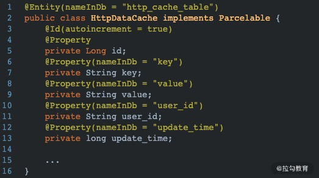

# 网络编程，做过哪些优化

我们知道网络请求操作是一个 App 的重要组成部分，程序大多数问题都和网络请求有关。这节课我们就来聊聊我在平时开发过程中对于网络优化所做的一些尝试。

使用 OkHttp 框架后，我们可以通过 EventListener 来查看一次网络请求的详细情况，一次完整的网络请求会包含以下几个步骤：

```java
0,000 callStart
0,027 dnsStart
5,189 dnsEnd
5,359 secureConnectStart
5,907 secureConnectEnd
5,910 connectEnd
5,921 connectionAcquired
5,925 requestHeadersStart
5,930 requestHeadersEnd
5,938 responseHeadersStart
6,181 responseHeadersEnd
6,189 responseBodyEnd
6,233 connectionReleased
```

也就是说一次网络请求的操作是从 DNS 解析开始的，然后建立连接并发送数据到服务端，随后读取从服务端返回的数据，最后将连接释放，一次网络请求操作也就结束了。接下来我们就从 DNS 解析开始分析都有哪些方面可以做进一步的优化。

## DNS 解析优化

### 安全方面

首先是防劫持，我们可以考虑使用 HttpDns。这里需要注意 HttpDns 只是一个概念，并不是一个现有的开源库。它与传统的 DNS 解析的区别在于 HttpDns 会绕过运营商的 DNS 服务器，直接与 DNS 服务器的 80 端口进行交互，有效地防止了域名劫持。

目前业内主要由第三方厂商提供实现了 HttpDns 的 SDK，比较普及的是阿里云和腾讯云的 HttpDns Service。但是这两者的使用具有一定的成本：开发者需要在它们的平台注册并获取开发者 key，并且部分服务是收费的。比如关于阿里提供的 SDK 的详细集成步骤可以参考官方介绍：[阿里云HttpDns Demo APP Android版](https://github.com/aliyun/alicloud-android-demo/tree/master/httpdns_android_demo)。

对于普通开发者而言，可以考虑使用七牛云提供的免费的 happy-dns。实现也比较简单，因为 OkHttp 已经预留了设置 Dns 的接口，如下所示：


在接口 Dns 中只有一个方法需要实现——lookup，这个方法返回查找到的服务器地址集合。并且 OkHttp 已经实现了一个默认的 DNS 解析器，也就是图中红框标识的 SYSTEM，它使用 java net 包中的 InetAddress 获取某域名的 IP 地址集合。

我们可以实现 Dns 接口，使用 Http 的请求方式实现自己的域名解析器，具体实现就是使用七牛云提供的 happy-dns SDK。首先需要添加依赖库：


然后在自己实现的 Dns 类中，使用如下方式实现：


这样我们就可以在安全方面做到防劫持的功能了。

### 速度方面

关于 DNS 解析的速度优化方面，我们可以从以下几个方面进行突破：

- IP 直连方式

IP 直连方式经常会针对不同的开发环境使用，比如针对在 qa、staging 测试环境下，可以直接配置 IP 白名单，跳过 DNS 解析流程，但这样同样需要实现 OkHttp 的 Dns 接口，如下所示：


听说有的一线互联网公司也会在线上版本采用这种方式，但是这种方式开发成本较高。因为 IP 列表是维护在本地，因此需要建立一套 IP 地址的更新机制。另外 IP 直连方式摒弃了 HTTPS 的安全机制，由于 HTTPS 要求证书绑定域名，因此客户端需要增加额外的代码改造，具体参考：https信任证书的三种方式。

- DNS 解析超时

当我们在做网络请求时，如果网络设备切换路由，访问网络出现长时间无响应，很久之后会抛出 UnknownHostException，并且我们在 OkHttp 中设置的 connectTimeout 属性对 DNS 的解析不起作用。这种情况我们可以在自定义的 Dns 类中做超时判断，如下所示：


更具体的分析可以参考：[Android笔记之解决OkHttp解析dns超时时间无法设置的问题](https://blog.csdn.net/quwei3930921/article/details/85336552)。

### 网络请求缓存优化

实际上有时在做网络请求数据可达优化的时候，经常会不可避免地与本地持久化绑定在一起。比如当一次网络请求失败时，我们需要将这次请求保存在本地，并尝试重新发送；或者请求数据成功，我们需要将数据缓存在本地，当下一次请求数据展示 UI 之前，先将缓存中的数据展示到页面，只有当新的请求返回数据之后，再次刷新页面。

一般的做法是创建一个数据库 Entity 类，并根据自家公司的业务逻辑设置公共参数，通常都会有 user_id、更新时间 update_time 等，如下所示：



上图中 key 表示缓存的标识，插入请求都是根据 key 操作；value 字段用来保存网络请求的数据，当网络请求成功后，将数据以 JSON 字符串的格式缓存到数据库中，如下所示：


解释说明：

- 图中 1 处构建 HttpDataCache 类，并设置公共参数；
- 图中 2 处将网络请求数据转化为 JSON 字符串格式；
- 图中 3 处执行数据库操作，将网络请求数据缓存到本地数据库中。

后续当我们再次执行相同 key 的网络请求时，就可以先将本地数据库中的数据展示到页面，并进行异步请求操作刷新页面。


### 幂等性

HTTP 方法的幂等性是指一次和多次请求某一个资源应该具有同样的副作用。举一个例子：当我们点外卖付款时，服务端扣款成功后发送给客户端一条扣款成功的消息，但是如果此时由于网络问题，客户端并没有成功接收到此消息，用户就有可能认为没有付款成功，甚至是尝试再次付款。

幂等性就是为了解决这种问题，但是它属于代码设计层面的技巧，并不是一个实体方法或者开源库。实现幂等性需要客户端和服务端协同合作实现。比如原始的付款方法如下：

```java
boolean pay(user_id, amount)
```

上述方法代表从账户 user_id 中扣除 amount 数量的金额，多次操作就会造成同一个 user_id 账户被扣款多次。可以通过以下方式将付款方式实现幂等：

```java
int create_pay_ticker()
boolean idempotent_pay(ticket_id, account_id, amount)
```

create_pay_ticket 的语义是获取一个服务器端生成的唯一的处理号 ticket_id，它将用于标识后续的操作。idempotent_pay 和 pay 的区别在于关联了一个 ticket_id，一个 ticket_id 表示的操作至多只会被处理一次，这样库款的操作就符合幂等性了，客户端就可以放心地多次调用。

实际上很多 HTTP 请求方法自身就符合幂等性，具体可以参考：理解HTTP幂等性。

## 总结

主要介绍了平时我在项目中关于网络优化的几个方向，主要包含以下几点：

- DNS 解析优化，分安全性和速度提升两方面。
- 网络请求数据缓存，对于请求返回的数据需要缓存到本地数据库中。实际上，在某些场景中对于请求对象 Request 自身也需要做缓存操作。比如“发送埋点”的请求，这样请求失败就将其保存到本地数据库中，当 App 重启或者重新接收到连接网络的时候，重新尝试发送之前失败的请求。
- 介绍了幂等性，幂等性并不是一个非常大众化的概念，很多开发者甚至没有听说过这个概念。但是在网络架构设计中却是一个比较重要的原则。
