# 面对UI卡顿，如何入手分析解决问题

在本篇文章中我们开始学习面对 UI 卡顿时，应该如何入手分析解决问题。

对于 UI 性能分析，Systrace 是目前使用最广的工具。它能够帮助开发者分析多个模块的运行状态以及详细信息。比如 SurfaceFlinger、View 刷机机制等。通过 Android 提供的脚本 systrace.py，可以设置数据采集方式并收集相关程序运行数据，最终生成一个网页文件提供程序开发者分析程序性能问题。

## Systrace 简单使用

在 Android SDK 中提供了运行 Systrace 的脚本，具体路径在 android-sdk/platform-tools/systrace/ 文件夹中。

在此目录下执行以下命令，就可以抓取 Systrace 日志：

```bash
python systrace.py --time=10 -o my_systrace.html
```

Systrace 生成的是 html 文件，需要使用 Chrome 打开 my_systrace.html，显示效果如下：

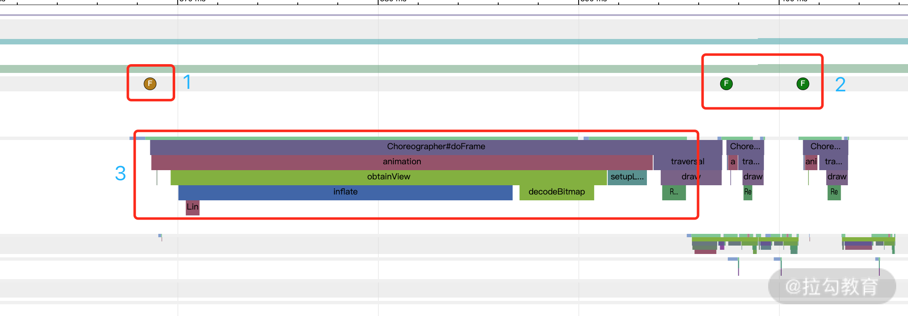

但是 Systrace 的使用有一定的难度，技术门槛比较高。了解屏幕刷新的机制能够更好地理解 Systrace 中的各个部分代表的含义。

## CPU & GPU

在之前的章节也已经介绍过 View 的绘制会经过 Measure、Layout、Draw 这 3 个阶段，而这 3 个阶段的工作都是由 CPU 来负责完成。另外 CPU 还会负责一些用户输入、View 动画等事件，这部分工作都是在 UI 线程中完成。

当 CPU 绘制完成之后，会在 RederThread 线程中将这部分数据提交给 GPU。GPU 负责对这些数据进行栅格化（Rasterization）操作，并将数据缓存的一个 Buffer 中。

最后手机屏幕再从这个 Buffer 中读取数据显示到屏幕上。实际上真正对 Buffer 中的数据进行合成显示到屏幕上的是 SurfaceFlinger。

具体流程如下图所示：

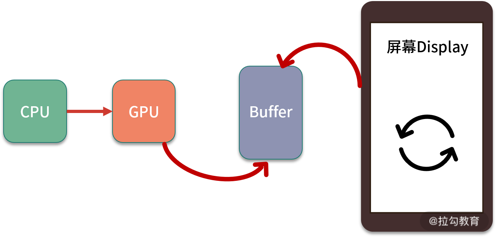

很明显这个过程有一个阶段是互相矛盾的，就是 GPU 向 Buffer 缓存数据，而屏幕从 Buffer 中取出数据。这就会存在并发问题，如果 GPU 正在向 Buffer 中做缓存，而此时屏幕也正好在从 Buffer 中取数据。这时就会造成 Buffer 中数据污染，屏幕有可能显示错乱。

为了避免这种情况发生，Android 又引入了双缓冲机制，意思就是有 2 个 Buffer：Back Buffer 和 Frame Buffer。CPU 提交的数据被缓存到 Back Buffer 中，然后 GPU 对 Back Buffer 中的数据做栅格化操作，完成之后将其交换（swap）到 Frame Buffer 中，最后屏幕从 Frame Buffer 中取数据显示。如下图所示：

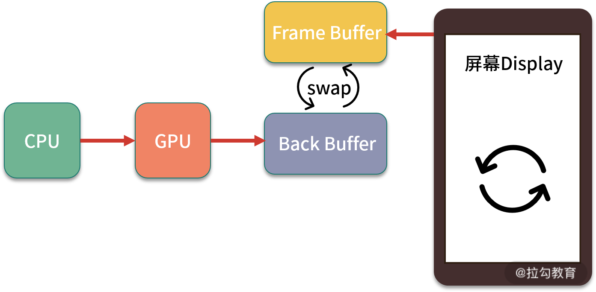

注意：

因为 GPU 合成的数据会经常更新，所以它会负责定期的交换 Back Buffer 和 Frame Buffer 的数据，从而保证屏幕上显示最新内容。如果当 CPU 正在向 Back Buffer 中写入数据时，GPU 会将 Back Buffer 锁定。如果此时正好到了交换两个 Buffer 的时间节点，那么这次 swap 会被忽略放弃。直接导致的结果就是 Frame Buffer 中还是保存着上一帧的数据，最终屏幕上也显示之前的内容，这也就是我们常说的丢帧。因此为了保证 App 能够流畅工作，我们需要在每帧 16ms 以内处理完所有的 CPU 与 GPU 的计算，绘制，渲染等等操作。完美的屏幕绘制过程应当如下图所示：

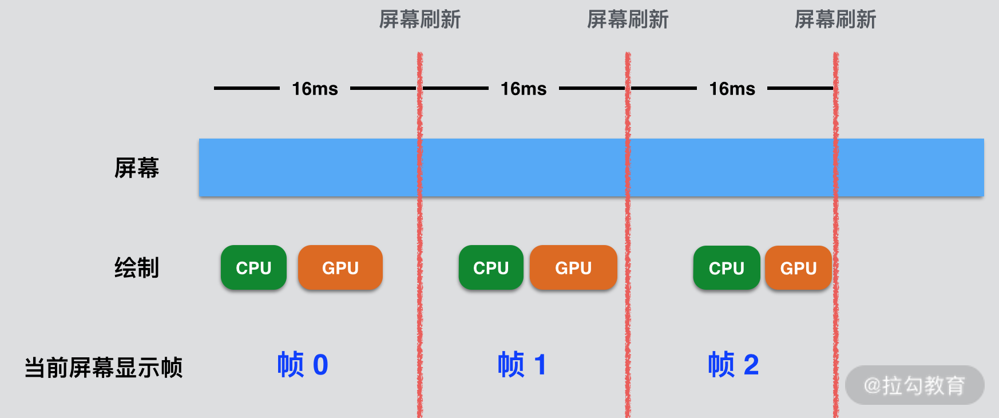

## Vsync

通过双缓冲技术再加上在应用层的优化，大多情况下已经完全能满足程序流程运行。但是有时还是会发生“丢帧”现象。这是因为屏幕刷新率和 GPU 绘制帧率并不一定是一致的。

screen refresh rate--屏幕刷新率。指的是手机屏幕每秒钟可以刷新多少次。目前在大多数的厂商手机上的屏幕刷新率是 60HZ，也就是以 16.6ms 进行一次刷新。
frame rate -- GPU 绘制帧率，指的是 GPU 每秒能够合成绘制多少帧。

屏幕刷新率是一个硬件指标，当手机出厂设置之后，屏幕刷新率就已经确定，软件层并没有办法对其进行修改。可是软件层触发 View 绘制的时机是随机的（代码里可以在任意时间调用 Invalidate 或者 requestLayout 刷新），因此我们无法控制 View 绘制的起始时间。比如之前图中的绘制过程也有可能会发生以下情况：

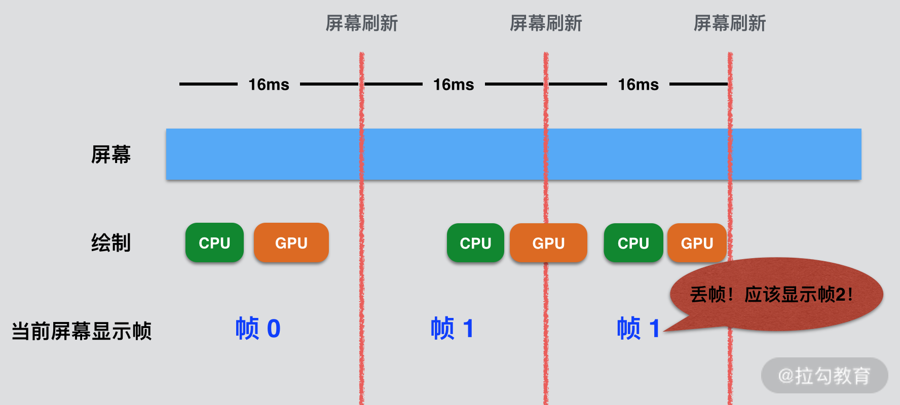

可以看出在“帧 1”阶段，虽然 CPU 和 GPU 所消耗时间小于 16ms，但是它们开始的时间太晚，距离下一次屏幕刷新太近。所以当下一次屏幕刷新时，屏幕从 Frame Buffer 中拿到的数据还是“帧1”的数据，还是会“丢帧”。

为了解决这个问题，Android 系统引入了 Vsync 机制。每隔 16ms 硬件层发出 vsync 信号，应用层接收到此信号后会触发 UI 的渲染流程，同时 vsync 信号也会触发 SurfaceFlinger 读取 Buffer 中的数据，进行合成显示到屏幕上。简单来讲就是将上面 CPU 和 GPU 的开始时间与屏幕刷新强行拖拽到同一起跑线。实现下图效果：

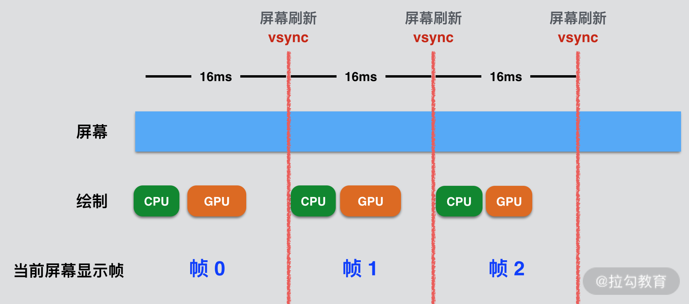

可以看出 vsync 的频率同屏幕刷新频率是一致的，因此 View 的渲染和 SurfaceFlinger 的合成也都按照 vsync 的信号的频率有条不紊地进行着。

## Choreographer 编舞者

那么软件层是如何接受硬件发出的 vsync 信号，并进行 View 绘制操作的呢？答案就是 Choreographer。

在之前的文章中，我们了解了 View 的渲染流程，这里再回顾一遍着整个流程。每次调用 View 的 invalidate 时，流程都会执行到 ViewRootImpl 的 requestLayout 方法，如下：

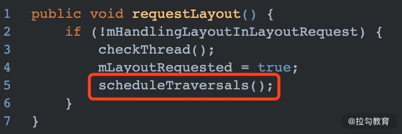

在 requestLayout 中调用 scheduleTraversals，此方法具体如下：

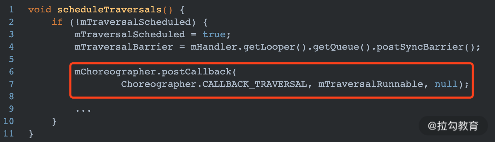

这个方法最核心的就是红框中所示的 mChoreographer.postCallback 方法，这个方法将 TraversalRunnable 以参数的形式传递给 Choreographer，方法实现具体如下：

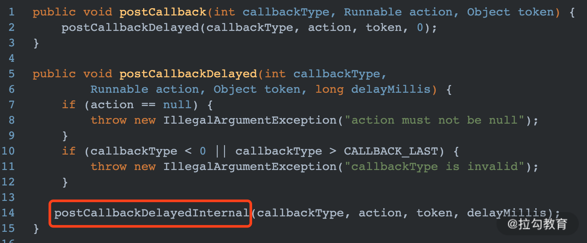

通过一系列调用，最终代码执行到了以下方法：

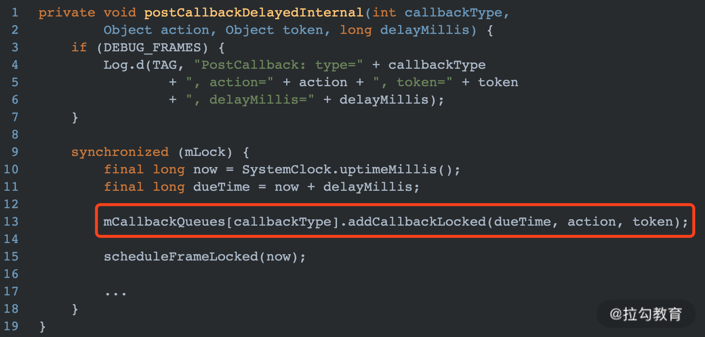

图中红框中代码表示在 ViewRootImpl 中传入的 TraversalRunnable 插入到一个 CallbackQueue 中。后续当 Choreographer 接收到 vsync 信号时，会将此 TraversalRunnable 从队列中取出执行，具体稍后介绍。

### 何时注册 vsync 信号

Choreographer 是何时注册 vsync 信号的呢？还是要重新看一下上图中的 postCallbackDelayedInternal 方法，此方法中在将 TraversalRunnabl 插入队列 CallbackQueue 之后，还有一个比较重要的操作—sheduleFrameLocked，方法具体如下：

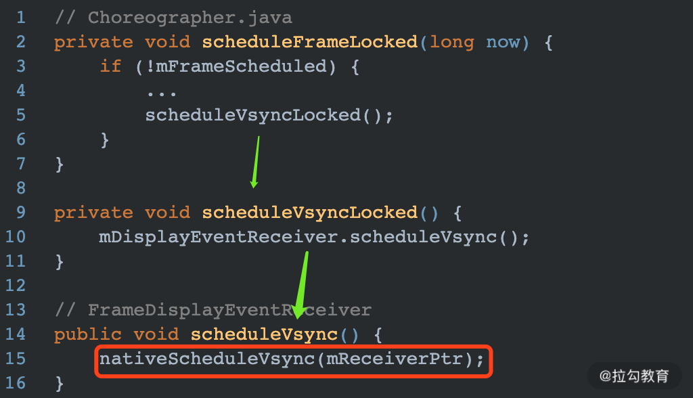

可以看出，最终调用了一个 native 的本地方法 nativeScheduleVsync，这个方法实际上就是向系统订阅一次 vsync 信号。Android 系统每过 16.6ms 会发送一个 vsync 信号。但这个信号并不是所有 App 都能收到的，只有订阅的才能收到。这样设计的合理之处在于，当 UI 没有变化的时候就不会去调用 nativeScheduleVsync 去订阅，也就不会收到 vsync 信号，减少了不必要的绘制操作。

注意：

每次订阅只能收到一次 vsync 信号，如果需要收到下次信号需要重新订阅。比如 Animation 的实现就是在订阅一次信号之后，紧接着再次调用 nativeScheduleVsync 方法订阅下次 vsync 信号，因此会不断地刷新 UI。

### 何时接收 vsync 信号

注册 vsync 信号的操作是由 FrameDisplayEventReceiver 中的 nativeScheduleVsync 方法实现的，而 vsync 信号实际上也是由 FrameDisplayEventReceiver 来接收。当它接收到 vsync 信号后，会调用其内部的 onVsync 方法，如下所示：

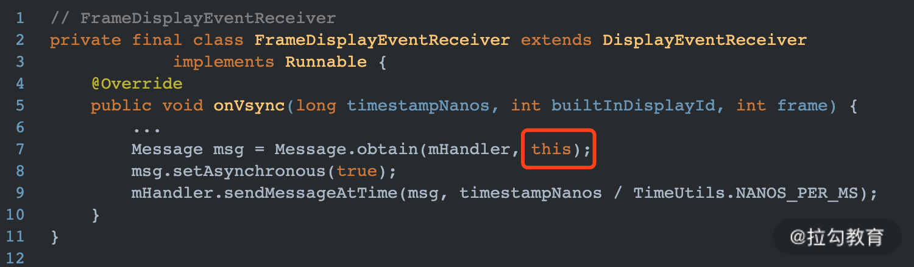

在 onVsync 方法中，会将 FrameDisplayEventReceiver 自身发送到 MessageQueue，所以需要查看其 run 方法，如下：

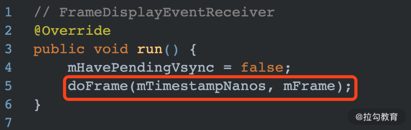

最终调用了 Choreographer 的 doFrame 方法，这是一个非常重要的方法。就是在这个方法中将之前插入到 CallbackQueue 中的 Runnable 取出来执行。部分核心代码如下所示：

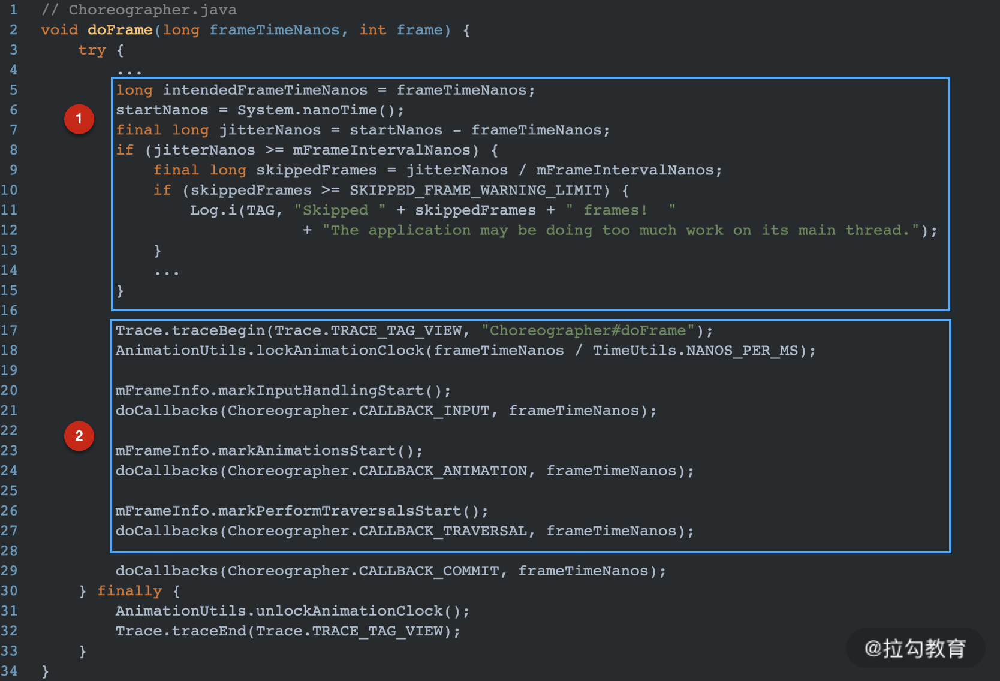

可以看出在 doFrame 方法中主要完成 2 大操作：

- 图中 1 处进行掉帧逻辑计算，并添加用于性能分析的 Trace 日志；
- 图中 2 处执行各种 Callbacks，其实这就是一帧内真正做的事情。可以看出其实 Android 屏幕绘制一帧主要就是做处理 Input、animation、traversal 这 3 件事情。

### Choreographer小结

Choreographer 是一个承上启下的角色。

- 承上：接收应用层的各种 callback 输入，包括 input、animation、traversal 绘制。但是这些 callback 并不会被立即执行。而是会缓存在 Choreographer 中的 CallbackQueue 中。
- 启下：内部的 FrameDisplayEventReceiver 负责接收硬件层发成的 vsync 信号。当接收到 vsync 信号之后，会调用 onVsync 方法 -> doFrame -> doCallbacks，在 doCallbacks 中从 CallbackQueue 中取出进行绘制的 TraversalRunnable，并调用其 run 方法进行绘制。

通过这样一套机制，保证软件层和屏幕刷新处于同一频率，使 Android App 可以以一个比较稳定的帧率运行，减少因为频率波动造成“丢帧”的概率。

## 利用 Choreographer 实现帧渲染监控

现在我们已经了解在 UI 渲染的过程中，Choreographer 会在 doFrame 方法中回调各种 callback，其中包括绘制 View 的 TraversalRunnable。

Choreographer 向外部提供了 FrameCallback 接口，来监听 doFrame 方法的执行过程。接口具体定义如下：

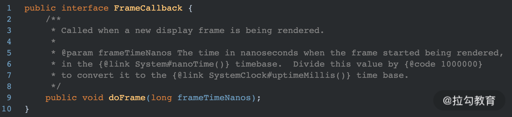

可以看出这个接口中的 doFrame 方法会在绘制每一帧时被调用，所以我们可以在 App 层主动向 Choreographer 中添加 Callback，然后通过检测两次 doFrame 方法执行的时间间隔来判断是否发生“丢帧”。简单实现如下：

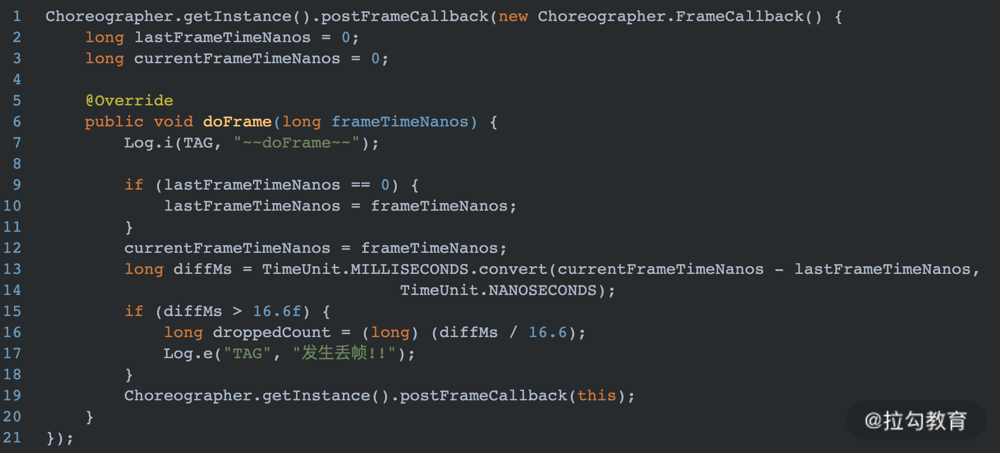

postFrameCallback 方法实际上同 requestLayout 是平级关系，都会往 Choreographer 中的 CallbackQueues 中插入 Callback，只是 postFrameCallback 插入 Callback 的类型是 CALLBACK_ANIMATION。 正常情况下上述代码只会打印出“doFrame”日志，但是如果 doFrame 的执行时间超过 16.6ms，则会打印“发生丢帧!”。

>注意： 上文中已经介绍过，每一次订阅都只会接收一次 vsync 信号，而我们需要一直监听 doFrame 的回调，因此在方法最后需要递归的执行 postFrameCallback 方法。

### 特殊优化--同步屏障消息

在 requestLayout 刷新 View 时，会调用 scheduleTraversals 方法，有一个小细节还没有介绍，如下：

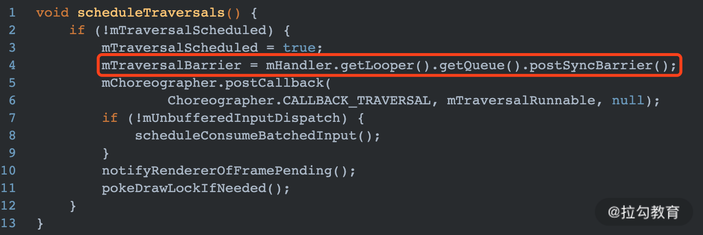

在向 Choreographer 插入 TraversalRunnable 之前，调用了 postSyncBarrier() 方法设置同步屏障。

Handler 中的 Message 分 2 类，同步消息和异步消息。可以通过以下代码进行设置：

```java
Message msg = Message.obtain();
msg.setAsynchronous(true);
```

一般情况下，Looper 从 MessageQueue 取消息时对这两者并不会做区别对待。但是如果 MessageQueue 设置了同步屏障就会出现差异。

当 MessageQueue 设置同步屏障之后，在 next 方法获取消息时会忽略所有的同步消息，只取异步消息，也就是说异步消息在此时的优先级更高。而 TraversalRunnable 会被封装到一个异步的 Message 中，因此 View 绘制的一系列操作会被优先执行，这也是提高渲染性能的一种手段。

## 再看 Systrace

掌握了基本的屏幕刷新原理，再来看 Systrace 的分析日志文件，就简单多了。再次看一下文章开头的 Systrace 内容：


很明显，在 Choreographer 调用 doFrame 的过程中，在处理 animation callback 的时候，执行了耗时的 inflate 和 decodeBitmap 方法，最终导致系统无法在 16ms 内完成一帧的绘制。再联系实际测试场景应该就能想到上述 trace 是在执行一系列 animation 的过程中抓取的，事实上也确实如此，我是在一个 ListView 的滑动过程中抓取的 trace 日志，再查看一下自定义 Adapter 的实现如下：

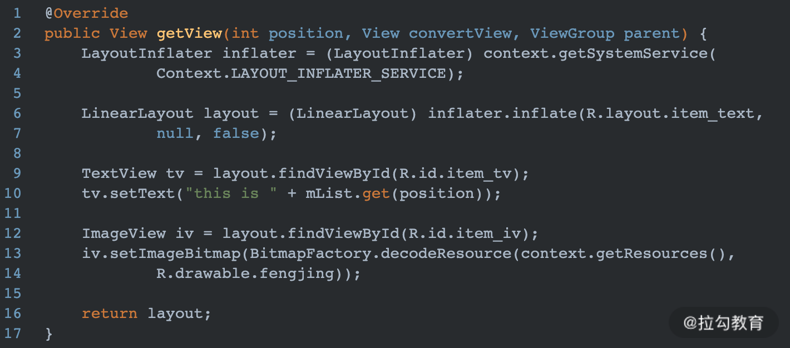

很明显，问题的原因就是滑动过程中，每当有新的 Item 在界面上显示时，都会调用 inflate 创建 Layout，然后通过 findViewById 初始化，这种写法造成丢帧是不可避免的。

除了 animation 造成卡顿之外，还有以下几种常见的卡顿现象：

自定义 View 的 draw 方法耗时太长：

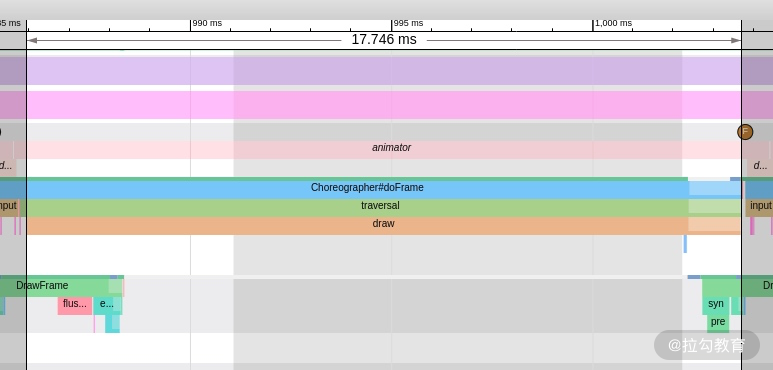

自定义 View 的 measure 和 layout 方法耗时太长：

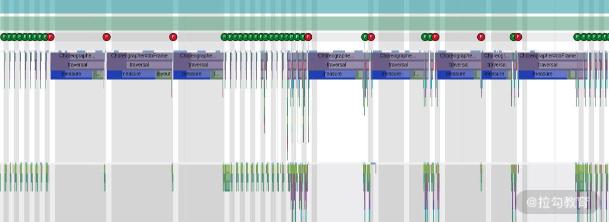

decodeBitmap 转换图片耗时太长：

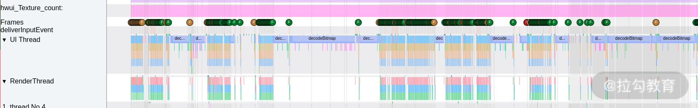

## 总结

本篇文章从介绍 Systrace 的使用开始，要彻底掌握 Systrace 的使用，就必须理解系统中屏幕是如何刷新的。

- 首先我们了解了 CPU 和 GPU 是如何协同工作，将 View 绘制的数据保存在缓存 Buffer 中；
- 然后为了解决 Buffer 的读取并发问题，Android 引入了双缓冲机制；
- 但是双缓冲机制也并不是完美的，因为软件层刷新是随机的，为此 Android 又引入了 vsync 机制，vsync 机制的实现主要依赖 Choreographer 来实现。

了解了这整个过程之后，再通过 Systrace 日志，就可以分析出具体是哪一部分耗费性能较高，并针对性地做出优化。
