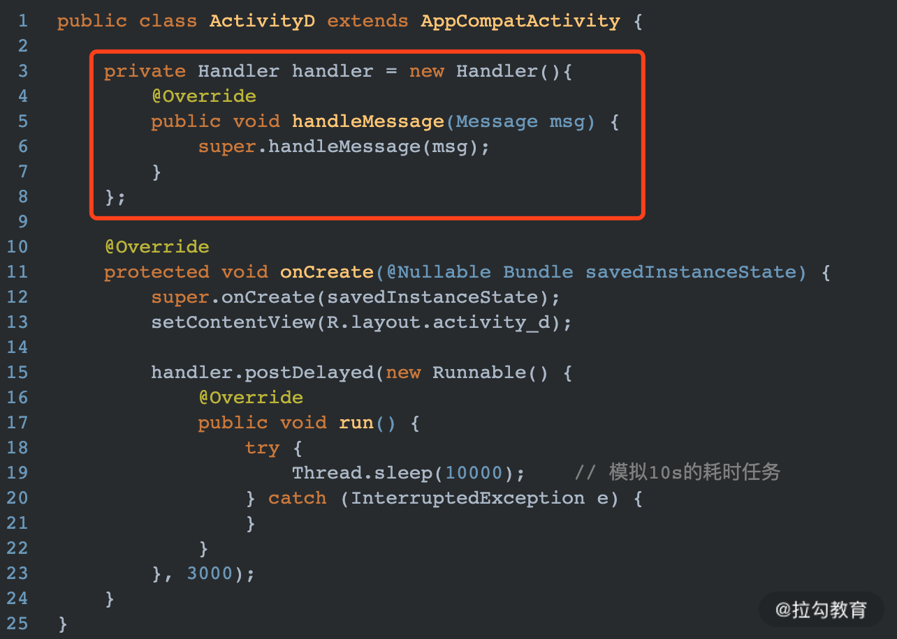

# 面对内存泄漏，如何进行优化

内存泄漏是一个隐形炸弹，其本身并不会造成程序异常，但是随着量的增长会导致其他各种并发症：OOM，UI 卡顿等。

## Activity 内存泄漏预防

为什么要单独将 Activity 单独做预防，是因为 Activity 承担了与用户交互的职责，因此内部需要持有大量的资源引用以及与系统交互的 Context，这会导致一个 Activity 对象的 retained size 特别大。一旦 Activity 因为被外部系统所持有而导致发生内存泄漏，被牵连导致其他对象的内存泄漏也会非常多。

造成 Activity 内存泄漏的场景主要有以下几种情况。

### 将 Context 或者 View 置为 static

View 默认会持有一个 Context 的引用，如果将其置为 static 将会造成 View 在方法区中无法被快速回收，最终导致 Activity 内存泄漏。


图中的 imageView 会造成 ActivityB 无法被 GC 回收。

### 未解注册各种 Listener

在 Activity 中可能会注册各种系统监听器，比如广播。


运行上述 ActivityC，然后按下返回键。控制台将会显示如下 log，提示有内存泄漏发生：


### 非静态 Handler 导致 Activity 泄漏



上述代码中的Handler也会造成ActivityD内存泄漏，一般需要将其置为static，然后内部持有一个Activity的弱引用来避免内存泄漏。如下所示：

### 三方库使用 Context

在项目中经常会使用各种三方库，有些三方库的初始化需要我们传入一个 Context 对象。但是三方库中很有可能一直持有此 Context 引用，比如以下代码：


上述代码中将 ActivityE 本身当作一个 Context 传递给了一个模拟的三方库 ThirdParty 中，但是在三方库中将传入的 context 重新置为一个静态 static 类型。这种情况是一种隐形的 Activity 泄漏，在我们自己的项目中很难察觉出，所以平时开发过程中，尽量使用 Context.getApplicationContext，不要直接将 Activity 传递给其他组件。

>提示：这也提醒我们自己在实现 SDK 时，也尽量避免造成外部 Context 的泄漏。比如下图是 JPush 中初始化的部分混淆代码：


虽然是经过混淆之后的代码，但是也能大概猜出 checkContext 方法内部会使用 context.getApplicationContext 给内部 Context 赋值，因此即使我们传给 JPush 的是 Activity，也不会造成 Activity 泄漏。

## 内存泄漏检测

在开发阶段安卓工程师可以直接使用 Android Studio 来查看 Activity 是否存在内存泄漏，并结合 MAT 来查看发生内存泄漏的具体对象。这部分内容相信大多数安卓工程师都信手拈来，这节内容不展开详细介绍，详细使用过程可以参考：[Android Studio和MAT结合使用来分析内存问题](https://blog.csdn.net/zxm317122667/article/details/52162764)。

除了 Android Studio 之外，另一个检查内存泄漏的神器就是 LeakCanary，也是本节重点介绍内容。

LeakCanary 是 Square 公司的一个开源库。通过它可以在 App 运行过程中检测内存泄漏，当内存泄漏发生时会生成发生泄漏对象的引用链，并通知程序开发人员。

可以看出 LeakCanary 主要分 2 大核心部分：

- 如何检测内存泄漏；
- 分析内存泄漏对象的引用链。

### 如何检测内存泄漏

#### JVM 理论知识

Java 中的 WeakReference 是弱引用类型，每当发生 GC 时，它所持有的对象如果没有被其他强引用所持有，那么它所引用的对象就会被回收。比如以下代码：


上述代码运行之后，打印结果如下：

```bash
before gc, reference.get is com.danny.lagoumemoryleak.WeakRefDemo$BigObject@7852e922
after gc, reference.get is null
```

WeakReference 的构造函数可以传入 ReferenceQueue，当 WeakReference 指向的对象被垃圾回收器回收时，会把 WeakReference 放入 ReferenceQueue 中。比如我在上述代码中，调用 WeakReference 的构造器时，传入一个自定义的 ReferenceQueue，如下所示：


那么打印结果如下：

```bash
before gc, reference.get is com.danny.lagoumemoryleak.WeakRefDemo$BigObject@7852e922
before gc, queue is null
after gc, reference.get is null
after gc, queue is java.lang.ref.WeakReference@4e25154f
```

可以看出，当 BigObject 被回收之后，WeakReference 会被添加到所传入的 ReferenceQueue 中。
再修改一下上述代码，模拟一个内存泄漏，如下所示：


birObject 是一个强引用，导致 new BigObject() 的内存空间不会被 GC 回收。最终打印结果如下：

```bash
before gc, reference.get is com.danny.lagoumemoryleak.WeakRefDemo$BigObject@7852e922
before gc, queue is null
after gc, reference.get is com.danny.lagoumemoryleak.WeakRefDemo$BigObject@7852e922
after gc, queue is null
```

### 实现思路

LeakCanary 中对内存泄漏检测的核心原理就是基于 WeakReference 和 ReferenceQueue 实现的。

- 当一个 Activity 需要被回收时，就将其包装到一个 WeakReference 中，并且在 WeakReference 的构造器中传入自定义的 ReferenceQueue。
- 然后给包装后的 WeakReference 做一个标记 Key，并且在一个强引用 Set 中添加相应的 Key 记录
- 最后主动触发 GC，遍历自定义 ReferenceQueue 中所有的记录，并根据获取的 Reference 对象将 Set 中的记录也删除

经过上面 3 步之后，还保留在 Set 中的就是：应当被 GC 回收，但是实际还保留在内存中的对象，也就是发生泄漏了的对象。

### 源码分析

在上面原理介绍的例子里，我们知道一个可回收对象在 System.gc() 之后就应该被 GC 回收。可是在 Android App 中，我们并不清楚何时系统会回收 Activity。但是，按照正常流程，当 Activity 调用 onDestroy 方法时就说明这个 Activity 就已经处于无用状态了。因此我们需要监听到每一个 Activity 的 onDestroy 方法的调用。

#### ActivityRefWatch

LeakCanary 中监听 Activity 生命周期是由 ActivityRefWatch 来负责的，主要是通过注册 Android 系统提供的 ActivityLifecycleCallbacks，来监听 Activity 的生命周期方法的调用，如下所示：


lifecycleCallbacks 的具体代码如下：


可以看出当监听到 Activity 的 onDestroy 方法后，会将其传给 RefWatcher 的 watch 方法。

#### RefWatcher

它是 LeakCanary 的一个核心类，用来检测一个对象是否会发生内存泄漏。主要实现是在 watch 方法中，如下所示：


解释说明：

- 图中 1 处生成一个随机的字符串 key，这个 key 就是用来标识 WeakReference 的，就相当于给 WeakReference 打了个标签；
- 图中 2 处将被检测对象包装到一个 WeakReference 中，并将其标识为步骤 1 中生成 key；
- 图中 3 处调用 ensureGoneAsync 开始执行检测操作。

因此关键代码就是在 ensureGoneAsync 方法中，代码如下：


通过 WatchExecutor 执行了一个重载的方法 ensureGone。

ensureGone 中实现了内存泄漏的检测，方法具体实现如下：


解释说明：

- 图中 1 处会遍历 ReferenceQueue 中所有的元素，并根据每个元素中的 key，相应的将集合 retainedKeys 中的元素也删除。
- 图中 2 处判断集合 retainedKeys 是否还包含被检测对象的弱引用，如果包含说明被检测对象并没有被回收，也就是发生了内存泄漏。
- 图中 3 处生成 Heap “堆”信息，并生成内存泄漏的分析报告，上报给程序开发人员。

removeWeaklyReachableReferences() 方法如下：


可以看出这个方法的主要目的就是从 retainedKeys 中移除已经被回收的 WeakReference 的标志。

gone(reference) 方法判断 reference 是否被回收了，如下：


实现很简单，只要在 retainedKeys 中不包含此 reference，就说明 WeakReference 引用的对象已经被回收。

LeakCanary 的实现原理其实比较简单，但是内部实现还有一些其他的细节值得我们注意。

### 内存泄漏的检测时机

很显然这种内存泄漏的检测与分析是比较消耗性能的，因此为了尽量不影响 UI 线程的渲染，LeakCanary 也做了些优化操作。在 ensureGoneAsync 方法中调用了 WatchExecutor 的 execute 方法来执行检测操作，如下：


可以看出实际是向主线程 MessageQueue 中插入了一个 IdleHandler，IdleHandler 只会在主线程空闲时才会被 Looper 从队列中取出并执行。因此能够有效避免内存检测工作占用 UI 渲染时间。

通过 addIdleHandler 也经常用来做 App 的启动优化，比如在 Application 的 onCreate 方法中经常做 3 方库的初始化工作。可以将优先级较低、暂时使用不到的 3 方库的初始化操作放到 IdleHandler 中，从而加快 Application 的启动过程。不过个人感觉方法名叫 addIdleMessage 更合适一些，因为向 MessageQueue 插入的都是 Message 对象。

### 特殊机型适配

因为有些特殊机型的系统本身就存在一些内存泄漏的情况，导致 Activity 不被回收，所以在检测内存泄漏时，需要将这些情况排除在外。在 LeakCanary 的初始化方法 install 中，通过 excludedRefs 方法指定了一系列需要忽略的场景。


这些场景都被枚举在 AndroidExcludedRefs 中，这种统一规避特殊机型的方式，也值得我们借鉴，因为国内的手机厂商实在是太多了。

### LeakCanary 如何检测其他类

LeakCanary 默认只能机检测 Activity 的泄漏，但是 RefWatcher 的 watch 方法传入的参数实际是 Object，所以理论上是可以检测任何类的。LeakCanary 的 install 方法会返回一个 RefWatcher 对象，我们只需要在 Application 中保存此 RefWatch 对象，然后将需要被检测的对象传给 watch 方法即可，具体如下所示：


testedObj 就是一个需要被检测内存泄漏的对象。

## 总结

要介绍了 Android 内存泄漏优化的相关知识。主要分两部分：

- 内存泄漏预防

这需要我们了解 JVM 发生内存泄漏的原因，并在平时开发阶段养成良好的编码规范，避免引入会发生内存泄漏的代码。针对编码规范 Android Studio 可以安装一个阿里代码规范的插件，能够起到一定的代码检查效果。

- 内存泄漏检测

内存泄漏检测工具有很多 Android Studio 自带的 Profiler，以及 MAT 都是不错的选择。但是相比较而言，使用这些工具排查内存泄漏门槛稍高，并且全部是手动操作，略显麻烦。除了这两个工具之外，我还介绍了一个自动检测内存泄漏的开源库—LeakCanary。主要包括它的实现原理以及部分源码实现细节。
