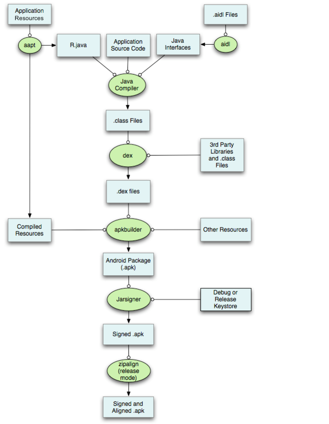
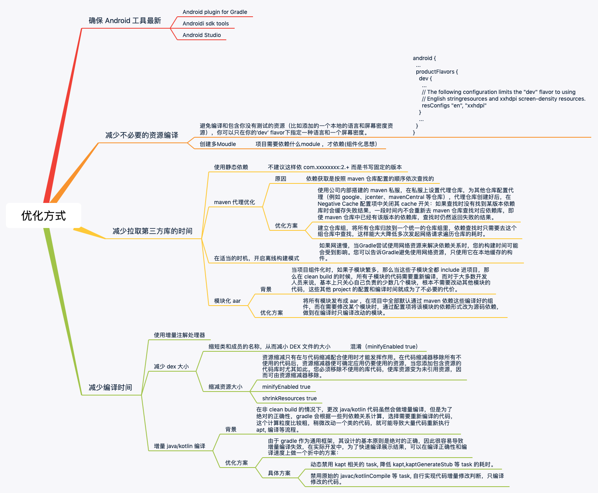

# Android 项目构建速度优化

随着项目的不断扩大，最影响我们的 Code 效率的是项目的编译。下面我就带着大家从 Android 构建流程中去分析如何提高项目的构建效率。

## 一切从项目编译过程说起

Android 项是从编译到打包流程如下所示：

为了方便大家理解这里对其中主要的构建过程进行描述(上图中绿色椭圆部分)：

- aapt：`aapt(Android Asset Packaging Tool)` 工具会打包应用中的资源文件，如 `AndroidManifest.xml、layout` 布局中的 `xml` 等，并将 xml 文件编译为二进制形式，当然 assets 文件夹中的文件不会被编译，图片及 raw 文件夹中的资源也会保持原来的形态，(需要注意的是 raw 文件夹中的资源也会生成资源 id。AAPT 编译完成之后会生成 `R.java 文件`)。
- aidl：AIDL 工具会将所有的 aidl 接口转化为 java 接口。
- Java Compiler(Java编译器)：当 AAPT 与 AIDL 工具将需要处理的数据处理好后，Java 编译器会将所有的java代码，包括R.java与 aidl 文件编译成 .class 文件。
- dex：`dex` 工具会将上述产生的 .class 文件及第三库及其他 .class 文件编译成 .dex 文件（dex文件是Dalvik虚拟机可以执行的格式），dex文件最终会被打包进APK文件。
- apkbuilder：`apkbuilder` 工具会将编译过的资源及未编译过的资源（如图片等）以及 .dex 文件打包成APK文件。
- Jarsingner：生成 APK 文件后，需要对其签名才可安装到设备，平时测试时会使用 debug keystore，当正式发布应用时必须使用 release 版的 keystore 对应用进行签名。Jarsigner工具会根据相应的keystore生成相应的签名APK文件。
- zipalign(release mode)：`zipalign` 工具，它能够对打包的应用程序进行优化。在你的应用程序上运行 `zipalign` ，使得在运行时 Android 与应用程序间的交互更加有效率。

### 优化的思路

到了这里有可能有小伙伴会说 "MD,你说了这么说多，那具体优化思路是什么呢？“ 不急，不急，慢慢道来。

从 Android 项目编译的过程中，我们能从几个维度来减少编译的时间：

- 减少不必要的资源编译
- 减少拉取第三方库的时间
- 减少编译时间
- 减少 apbuilder 的打包时间

除了以上维度，还有一个重要的维度，**工欲善其事必先利其器**。 Android Studio、Android Gradle 插件、 工具的每次更新，都会获得构建方面的优化和新功能。那么从以上几个维度：我们能引入如下的优化方式：

### 参考资料

- [Google官方优化构建速度文档](https://developer.android.google.cn/studio/build/optimize-your-build)
- [字节跳动](https://juejin.im/post/6854573211548385294#heading-9)
- [gradle 官方构建速度优化](https://guides.gradle.org/performance/)
- [有赞优化方案](https://tech.youzan.com/you-zan-android-bian-yi-jin-jie-zhi-lu-zeng-liang-bian-yi-ti-xiao-fang-an-savitar/)
- [Gradle 并行项目构建](https://docs.gradle.org/4.10.3/userguide/multi_project_builds.html#sec:parallel_execution)