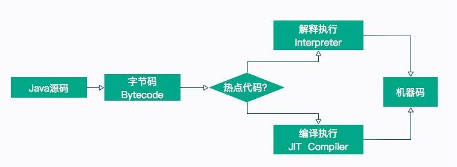

# JIT 参数配置如何影响程序运行

本文章我们主要分享一个实践案例，JIT 参数配置是如何影响程序运行的。

我们在前面的文章中介绍了很多字节码指令，这也是 Java 能够跨平台的保证。程序在运行的时候，这些指令会按照顺序解释执行，但是，这种解释执行的方式是非常低效的，它需要把字节码先翻译成机器码，才能往下执行。另外，字节码是 Java 编译器做的一次初级优化，许多代码可以满足语法分析，但还有很大的优化空间。

所以，为了提高热点代码的执行效率，在运行时，虚拟机将会把这些代码编译成与本地平台相关的机器码，并进行各种层次的优化。完成这个任务的编译器，就称为`即时编译器（Just In Time Compiler`），简称 `JIT` 编译器。

热点代码，就是那些被频繁调用的代码，比如调用次数很高或者在 for 循环里的那些代码。这些再次编译后的机器码会被缓存起来，以备下次使用，但对于那些执行次数很少的代码来说，这种编译动作就纯属浪费。

>参数“-XX:ReservedCodeCacheSize”，用来限制 CodeCache 的大小。也就是说，JIT 编译后的代码都会放在 CodeCache 里。

如果这个空间不足，JIT 就无法继续编译，编译执行会变成解释执行，性能会降低一个数量级。同时，JIT 编译器会一直尝试去优化代码，从而造成了 CPU 占用上升。



## JITWatch

在开始之前，我们首先介绍一个观察 JIT 执行过程的图形化工具：JITWatch，这个工具非常好用，可以解析 JIT 的日志并友好地展示出来。[项目地址请点击这里查看](https://github.com/AdoptOpenJDK/jitwatch)。

下载之后，进入解压目录，执行 ant 即可编译出执行文件。

## 产生 JIT 日志

我们观察下面的一段代码，这段代码没有什么意义，而且写得很烂。在 test 函数中循环 cal 函数 1 千万次，在 cal 函数中，还有一些冗余的上锁操作和赋值操作，这些操作在解释执行的时候，会加重 JVM 的负担。

```java
public class JITDemo {
    Integer a = 1000;

    public void setA(Integer a) {
        this.a = a;    }

    public Integer getA() {
        return this.a;
    }

    public Integer cal(int num) {
        synchronized (new Object()) {
            Integer a = getA();
            int b = a * 10;
            b = a * 100;
            return b + num;
        }
    }

    public int test() {
        synchronized (new Object()) {
            int total = 0;
            int count = 100_000_00;
            for (int i = 0; i < count; i++) {
                total += cal(i);
                if (i % 1000 == 0) {
                    System.out.println(i * 1000);
                }
            }
            return total;
        }
    }

    public static void main(String[] args) {
        JITDemo demo = new JITDemo();
        int total = demo.test();
```

在方法执行的时候，我们加上一系列参数，用来打印 JIT 最终生成的机器码，执行命令如下所示：

```bash
$JAVA_HOME_13/bin/java -server -XX:+UnlockDiagnosticVMOptions -XX:+TraceClassLoading  -XX:+PrintAssembly -XX:+LogCompilation -XX:LogFile=jitdemo.log JITDemo
```

执行的过程，会输入到 jitdemo.log 文件里，接下来我们分析这个文件。

### 使用


单击 open log 按钮，打开我们生成的日志文件。


单击 config 按钮，加入要分析的源代码目录和字节码目录。确认后，单击 start 按钮进行分析。

在右侧找到我们的 test 方法，聚焦光标后，将弹出我们要分析的主要界面。


在同一个界面上，我们能够看到源代码、字节码、机器码的对应关系。在右上角，还有 C2/OSR/Level4 这样的字样，可以单击切换。

单击上图中的 Chain 按钮，还会弹出一个依赖链界面，该界面显示了哪些方法已经被编译了、哪些被内联、哪些是通过普通的方法调用运行的。


使用 JITWatch 可以看到，调用了 1 千万次的 for 循环代码，已经被 C2 进行编译了。


## 编译层次

HotSpot 虚拟机包含多个即时编译器，有 C1、C2 和 Graal，采用的是分层编译的模式。使用 jstack 获得的线程信息，经常能看到它们的身影。

实验性质的 Graal 可以通过追加 JVM 参数进行开启，命令行如下：

```bash
$JAVA_HOME_13/bin/java -server -XX:+UnlockDiagnosticVMOptions -XX:+TraceClassLoading
  -XX:+PrintAssembly -XX:+LogCompilation -XX:+UnlockExperimentalVMOptions
   -XX:+UseJVMCICompiler -XX:LogFile=jitdemo.log JITDemo
```

不同层次的编译器会产生不一样的效果，机器码也会不同，我们仅看 C1、C2 的一些特点。

JIT 编译方式有两种：一种是编译方法，另一种是编译循环。分层编译将 JVM 的执行状态分为了五个层次：

- 字节码的解释执行；
- 执行不带 profiling 的 C1 代码；
- 执行仅带方法调用次数，以及循环执行次数 profiling 的 C1 代码；
- 执行带所有 profiling 的 C1 代码；
- 执行 C2 代码;

其中，profiling 指的是运行时的程序执行状态数据，比如循环调用的次数、方法调用的次数、分支跳转次数、类型转换次数等。JDK 中的 hprof 工具就是一种 profiler。

在不启用分层编译的情况下，当方法的调用次数和循环回边的次数总和，超过由参数 -XX:CompileThreshold 指定的阈值时，便会触发即时编译；当启用分层编译时，这个参数将会失效，会采用动态调整的方式进行。

常见的优化方法有以下几种：

- 公共子表达式消除
- 数组范围检查消除
- 方法内联
- 逃逸分析

我们重点看一下方法内联和逃逸分析。

### 方法内联

方法调用的开销是比较大的，尤其是在调用量非常大的情况下。拿简单的 getter/setter 方法来说，这种方法在 Java 代码中大量存在，我们在访问的时候，需要创建相应的栈帧，访问到需要的字段后，再弹出栈帧，恢复原程序的执行。

如果能够把这些对象的访问和操作，纳入到目标方法的调用范围之内，就少了一次方法调用，速度就能得到提升，这就是方法内联的概念。

C2 编译器会在解析字节码的过程中完成方法内联。内联后的代码和调用方法的代码，会组成新的机器码，存放在 CodeCache 区域里。

在 JDK 的源码里，有很多被 `@ForceInline` 注解的方法，这些方法会在执行的时候被强制进行内联；而被 `@DontInline` 注解的方法，则始终不会被内联，比如下面的一段代码。

java.lang.ClassLoader 的 getClassLoader 方法将会被强制内联。

```java
@CallerSensitive
    @ForceInline // to ensure Reflection.getCallerClass optimization
    public ClassLoader getClassLoader() {
        ClassLoader cl = getClassLoader0();
        if (cl == null)
            return null;
        SecurityManager sm = System.getSecurityManager();
        if (sm != null) {
            ClassLoader.checkClassLoaderPermission(cl, Reflection.getCallerClass());
        }
        return cl;
}
```

方法内联的过程是非常智能的，内联后的代码，会按照一定规则进行再次优化。最终的机器码，在保证逻辑正确的前提下，可能和我们推理的完全不一样。在非常小的概率下，JIT 会出现 Bug，这时候可以关闭问题方法的内联，或者直接关闭 JIT 的优化，保持解释执行。实际上，这种 Bug 我从来没碰到过。

```bash
-XX:CompileCommand=exclude,com/lagou/Test,test
```

上面的参数，表示 com.lagou.Test 的 test 方法将不会进行 JIT 编译，一直解释执行。

另外，C2 支持的内联层次不超过 9 层，太高的话，CodeCache 区域会被挤爆，这个阈值可以通过 -XX:MaxInlineLevel 进行调整。相似的，编译后的代码超过一定大小也不会再内联，这个参数由 -XX:InlineSmallCode 进行调整。

有非常多的参数，被用来控制对内联方法的选择，整体来说，短小精悍的小方法更容易被优化。

这和我们在日常中的编码要求是一致的：代码块精简，逻辑清晰的代码，更容易获得优化的空间。


我们使用 JITWatch 再看一下对于 getA() 方法的调用，将鼠标悬浮在字节码指令上，可以看到方法已经被内联了。

### 逃逸分析

逃逸分析（Escape Analysis）是目前 JVM 中比较前沿的优化技术。通过逃逸分析，JVM 能够分析出一个新的对象使用范围，从而决定是否要将这个对象分配到堆上。

使用 -XX:+DoEscapeAnalysis 参数可以开启逃逸分析，逃逸分析现在是 JVM 的默认行为，这个参数可以忽略。

JVM 判断新创建的对象是否逃逸的依据有：

- 对象被赋值给堆中对象的字段和类的静态变量；
- 对象被传进了不确定的代码中去运行。

举个例子，在代码 1 中，虽然 map 是一个局部变量，但是它通过 return 语句返回，其他外部方法可能会使用它，这就是方法逃逸。另外，如果被其他线程引用或者赋值，则成为线程逃逸。

代码 2，用完 Map 之后就直接销毁了，我们就可以说 map 对象没有逃逸。

代码1：

```java
public Map fig(){
    Map map = new HashMap();
    ...
    return map;
}
```

代码2：

```java
public void fig(){
    Map map = new HashMap();
    ...
}
```

那逃逸分析有什么好处呢？

- 同步省略，如果一个对象被发现只能从一个线程被访问到，那么对于这个对象的操作可以不考虑同步。
- 栈上分配，如果一个对象在子程序中被分配，那么指向该对象的指针永远不会逃逸，对象有可能会被优化为栈分配。
- 分离对象或标量替换，有的对象可能不需要作为一个连续的内存结构存在也可以被访问到，那么对象的部分（或全部）可以不存储在内存，而是存储在 CPU 寄存器中。标量是指无法再分解的数据类型，比如原始数据类型及 reference 类型。


再来看一下 JITWatch 对 synchronized 代码块的分析。根据提示，由于逃逸分析了解到新建的锁对象 Object 并没有逃逸出方法 cal，它将会在栈上直接分配。

查看 C2 编译后的机器码，发现并没有同步代码相关的生成。这是因为 JIT 在分析之后，发现针对 new Object() 这个对象并没有发生线程竞争的情况，则会把这部分的同步直接给优化掉。我们在代码层次做了一些无用功，字节码无法发现它，而 JIT 智能地找到了它并进行了优化。

因此，并不是所有的对象或者数组都会在堆上分配。由于 JIT 的存在，如果发现某些对象没有逃逸出方法，那么就有可能被优化成栈分配。

### intrinsic

另外一个不得不提的技术点那就是 intrinsic，这来源于一道面试题：为什么 String 类的 indexOf 方法，比我们使用相同代码实现的方法，执行效率要高得多？

在翻看 JDK 的源码时，能够看到很多地方使用了 HotSpotIntrinsicCandidate 注解。比如 StringBuffer 的 append 方法：

```java
 @Override
@HotSpotIntrinsicCandidate
public synchronized StringBuffer append(char c) {
        toStringCache = null;
        super.append(c);
        return this;
}
```

被 @HotSpotIntrinsicCandidate 标注的方法，在 HotSpot 中都有一套高效的实现，该高效实现基于 CPU 指令，运行时，HotSpot 维护的高效实现会替代 JDK 的源码实现，从而获得更高的效率。

上面的问题中，我们往下跟踪实现，可以发现 StringLatin1 类中的 indexOf 方法，同样适用了 HotSpotIntrinsicCandidate 注解，原因也就在于此。

```java
@HotSpotIntrinsicCandidate
    public static int indexOf(byte[] value, byte[] str) {
        if (str.length == 0) {
            return 0;
        }
        if (value.length == 0) {
            return -1;
        }
        return indexOf(value, value.length, str, str.length, 0);
    }

    @HotSpotIntrinsicCandidate
    public static int indexOf(byte[] value, int valueCount, byte[] str, int strCount, int fromIndex){
        byte first = str[0];
        ...
}
```

JDK 中这种方法有接近 400 个，可以在 IDEA 中使用 Find Usages 找到它们。

## 小结

JIT 是现代 JVM 主要的优化点，能够显著地增加程序的执行效率，从解释执行到最高层次的 C2，一个数量级的性能提升也是有可能的。但即时编译的过程是非常缓慢的，耗时间也费空间，所以这些优化操作会和解释执行同时进行。

一般，方法首先会被解释执行，然后被 3 层的 C1 编译，最后被 4 层的 C2 编译，这个过程也不是一蹴而就的。

常用的优化手段，有公共子表达式消除、数组范围检查消除、方法内联、逃逸分析等。

其中，方法内联通过将短小精悍的代码融入到调用方法的执行逻辑里，来减少方法调用上的开支；逃逸分析通过分析变量的引用范围，对象可能会使用栈上分配的方式来减少 GC 的压力，或者使用标量替换来获取更多的优化。

这个过程的执行细节并不是那么“确定”，在不同的 JVM 中，甚至在不同的 HotSpot 版本中，效果也不尽相同。

使用 JITWatch 工具，能够看到字节码和机器码的对应关系，以及执行过程中的一系列优化操作。若想要了解这个工具的更多功能，[可以点击这里参考](https://github.com/AdoptOpenJDK/jitwatch/wiki)
