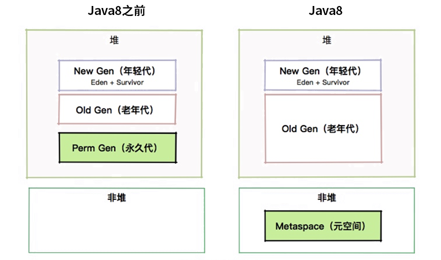

# JVM 内存管理

本篇文章我们主要讲解 JVM 的内存划分以及栈上的执行过程。这块内容在面试中主要涉及以下这 3 个面试题：

- JVM 是如何进行内存区域划分的？

- JVM 如何高效进行内存管理？

- 为什么需要有元空间，它又涉及什么问题？

带着这 3 个问题，我们开始今天的学习，关于内存划分的知识我希望在本文章你能够理解就可以，不需要死记硬背，因为在后面的文章我们会经常使用到本文章学习的内容，也会结合工作中的场景具体问题具体分析，这样你可以对 JVM 的内存获得更深刻的认识。

首先，第一个问题：JVM的内存区域是怎么高效划分的？这也是一个高频的面试题。很多同学可能通过死记硬背的方式来应对这个问题，这样不仅对知识没有融会贯通在面试中还很容易忘记答案。

为什么要问到 JVM 的内存区域划分呢？因为 Java 引以为豪的就是它的自动内存管理机制。相比于 C++的手动内存管理、复杂难以理解的指针等，Java 程序写起来就方便的多。

然而这种呼之即来挥之即去的内存申请和释放方式，自然也有它的代价。为了管理这些快速的内存申请释放操作，就必须引入一个池子来延迟这些内存区域的回收操作。

我们常说的内存回收，就是针对这个池子的操作。我们把上面说的这个池子，叫作堆，可以暂时把它看成一个整体。

## JVM 内存布局

程序想要运行，就需要数据。有了数据，就需要在内存上存储。那你可以回想一下，我们的 C++ 程序是怎么运行的？是不是也是这样？

Java 程序的数据结构是非常丰富的。其中的内容，举一些例子：

- 静态成员变量
- 动态成员变量
- 区域变量
- 短小紧凑的对象声明
- 庞大复杂的内存申请

这么多不同的数据结构，到底是在什么地方存储的，它们之间又是怎么进行交互的呢？是不是经常在面试的时候被问到这些问题？

我们先看一下 JVM 的内存布局。随着 Java 的发展，内存布局一直在调整之中。比如，Java 8 及之后的版本，彻底移除了持久代，而使用 Metaspace 来进行替代。这也表示着 -XX:PermSize 和 -XX:MaxPermSize 等参数调优，已经没有了意义。但大体上，比较重要的内存区域是固定的。

JVM 内存区域划分如图所示，从图中我们可以看出：

- JVM 堆中的数据是共享的，是占用内存最大的一块区域。

- 可以执行字节码的模块叫作执行引擎。

- 执行引擎在线程切换时怎么恢复？依靠的就是程序计数器。

- JVM 的内存划分与多线程是息息相关的。像我们程序中运行时用到的栈，以及本地方法栈，它们的维度都是线程。

- 本地内存包含元数据区和一些直接内存。

一般情况下，只要你能答出上面这些主要的区域，面试官都会满意的点头。但如果深挖下去，可能就有同学就比较头疼了。下面我们就详细看下这个过程。

## 虚拟机栈

栈是什么样的数据结构？你可以想象一下子弹上膛的这个过程，后进的子弹最先射出，最上面的子弹就相当于栈顶。

我们在上面提到，Java 虚拟机栈是基于线程的。哪怕你只有一个 main() 方法，也是以线程的方式运行的。在线程的生命周期中，参与计算的数据会频繁地入栈和出栈，栈的生命周期是和线程一样的。

栈里的每条数据，就是栈帧。在每个 Java 方法被调用的时候，都会创建一个栈帧，并入栈。一旦完成相应的调用，则出栈。所有的栈帧都出栈后，线程也就结束了。每个栈帧，都包含四个区域：

- 局部变量表
- 操作数栈
- 动态连接
- 返回地址

我们的应用程序，就是在不断操作这些内存空间中完成的。

本地方法栈是和虚拟机栈非常相似的一个区域，它服务的对象是 native 方法。你甚至可以认为虚拟机栈和本地方法栈是同一个区域，这并不影响我们对 JVM 的了解。

>动态链接：每个栈帧内部都包含一个指向当前方法所在类型的运行时常量池的引用，以便对当前方法实施动态链接，在 Class 文件里，一个方法若要调用其他方法，或者方法成员变量，则需要通过符号引用来表示，动态链接的作用就是将这些以符号引用所表示的方法转换为对实际方法的直接引用，类加载的过程中，需要解析尚未被解析的符号引用，并将对变量的访问转化为变量在程序运行时，位于存储结构中的正确偏移量。

这里有一个比较特殊的数据类型叫作 returnAdress。因为这种类型只存在于字节码层面，所以我们平常打交道的比较少。对于 JVM 来说，程序就是存储在方法区的字节码指令，而 returnAddress 类型的值就是指向特定指令内存地址的指针。

这部分有两个比较有意思的内容，面试中说出来会让面试官眼前一亮。

- 这里有一个两层的栈。第一层是栈帧，对应着方法；第二层是方法的执行，对应着操作数。注意千万不要搞混了。
- 你可以看到，所有的字节码指令，其实都会抽象成对栈的入栈出栈操作。执行引擎只需要傻瓜式的按顺序执行，就可以保证它的正确性。

这一点很神奇，也是基础。我们接下来从线程角度看一下里面的内容。

## 程序计数器

那么你设想一下，如果我们的程序在线程之间进行切换，凭什么能够知道这个线程已经执行到什么地方呢？

既然是线程，就代表它在获取 CPU 时间片上，是不可预知的，需要有一个地方，对线程正在运行的点位进行缓冲记录，以便在获取 CPU 时间片时能够快速恢复。

就好比你停下手中的工作，倒了杯茶，然后如何继续之前的工作？

程序计数器是一块较小的内存空间，它的作用可以看作是当前线程所执行的字节码的行号指示器。这里面存的，就是当前线程执行的进度。下面这张图，能够加深大家对这个过程的理解。

可以看到，程序计数器也是因为线程而产生的，与虚拟机栈配合完成计算操作。程序计数器还存储了当前正在运行的流程，包括正在执行的指令、跳转、分支、循环、异常处理等。

我们可以看一下程序计数器里面的具体内容。下面这张图，就是使用 javap 命令输出的字节码。大家可以看到在每个 opcode 前面，都有一个序号。就是图中红框中的偏移地址，你可以认为它们是程序计数器的内容。

## 堆

堆是 JVM 上最大的内存区域，我们申请的几乎所有的对象，都是在这里存储的。我们常说的垃圾回收，操作的对象就是堆。

堆空间一般是程序启动时，就申请了，但是并不一定会全部使用。

随着对象的频繁创建，堆空间占用的越来越多，就需要不定期的对不再使用的对象进行回收。这个在 Java 中，就叫作 GC（Garbage Collection）。

由于对象的大小不一，在长时间运行后，堆空间会被许多细小的碎片占满，造成空间浪费。所以，仅仅销毁对象是不够的，还需要堆空间整理。这个过程非常的复杂，我们会在后面有专门的文章进行介绍。

那一个对象创建的时候，到底是在堆上分配，还是在栈上分配呢？这和两个方面有关：对象的类型和在 Java 类中存在的位置。

Java 的对象可以分为基本数据类型和普通对象。

对于普通对象来说，JVM 会首先在堆上创建对象，然后在其他地方使用的其实是它的引用。比如，把这个引用保存在虚拟机栈的局部变量表中。

对于基本数据类型来说（byte、short、int、long、float、double、char)，有两种情况。

我们上面提到，每个线程拥有一个虚拟机栈。当你在方法体内声明了基本数据类型的对象，它就会在栈上直接分配。其他情况，都是在堆上分配。

注意，像 int[] 数组这样的内容，是在堆上分配的。数组并不是基本数据类型。

这就是 JVM 的基本的内存分配策略。而堆是所有线程共享的，如果是多个线程访问，会涉及数据同步问题。这同样是个大话题，我们在这里先留下一个悬念。

## 元空间

关于元空间，我们还是以一个非常高频的面试题开始：“为什么有 Metaspace 区域？它有什么问题？”

说到这里，你应该回想一下类与对象的区别。对象是一个活生生的个体，可以参与到程序的运行中；类更像是一个模版，定义了一系列属性和操作。那么你可以设想一下。我们前面生成的 A.class，是放在 JVM 的哪个区域的？

想要问答这个问题，就不得不提下 Java 的历史。在 Java 8 之前，这些类的信息是放在一个叫 Perm 区的内存里面的。更早版本，甚至 String.intern 相关的运行时常量池也放在这里。这个区域有大小限制，很容易造成 JVM 内存溢出，从而造成 JVM 崩溃。

Perm 区在 Java 8 中已经被彻底废除，取而代之的是 Metaspace。原来的 Perm 区是在堆上的，现在的元空间是在非堆上的，这是背景。关于它们的对比，可以看下这张图。

然后，元空间的好处也是它的坏处。使用非堆可以使用操作系统的内存，JVM 不会再出现方法区的内存溢出；但是，无限制的使用会造成操作系统的死亡。所以，一般也会使用参数 -XX:MaxMetaspaceSize 来控制大小。

方法区，作为一个概念，依然存在。它的物理存储的容器，就是 Metaspace。我们将在后面的文章中，再次遇到它。现在，你只需要了解到，这个区域存储的内容，包括：类的信息、常量池、方法数据、方法代码就可以了。

## 小结

好了，到这里基本内容就讲完了，针对这块的内容在面试中还经常会遇到下面这两个问题。

- 我们常说的字符串常量，存放在哪呢？

由于常量池，在 Java 7 之后，放到了堆中，我们创建的字符串，将会在堆上分配。

- 堆、非堆、本地内存，有什么关系？

关于它们的关系，我们可以看一张图。在我的感觉里，堆是软绵绵的，松散而有弹性；而非堆是冰冷生硬的，内存非常紧凑。

大家都知道，JVM 在运行时，会从操作系统申请大块的堆内内存，进行数据的存储。但是，堆外内存也就是申请后操作系统剩余的内存，也会有部分受到 JVM 的控制。比较典型的就是一些 native 关键词修饰的方法，以及对内存的申请和处理。

在 Linux 机器上，使用 top 或者 ps 命令，在大多数情况下，能够看到 RSS 段（实际的内存占用），是大于给 JVM 分配的堆内存的。

如果你申请了一台系统内存为 2GB 的主机，可能 JVM 能用的就只有 1GB，这便是一个限制。

## 总结

JVM 的运行时区域是栈，而存储区域是堆。很多变量，其实在编译期就已经固定了。.class 文件的字节码，由于助记符的作用，理解起来并不是那么吃力，我们将在最后几篇文章中，从字节码层面看一下多线程的特性。

JVM 的运行时特性，以及字节码，是比较偏底层的知识。本文章属于初步介绍，有些部分并未深入讲解。希望你应该能够在脑海里建立一个 Java 程序怎么运行的概念，以便我们在后面的学习中，提到相应的内存区域时，有个整体的印象。
