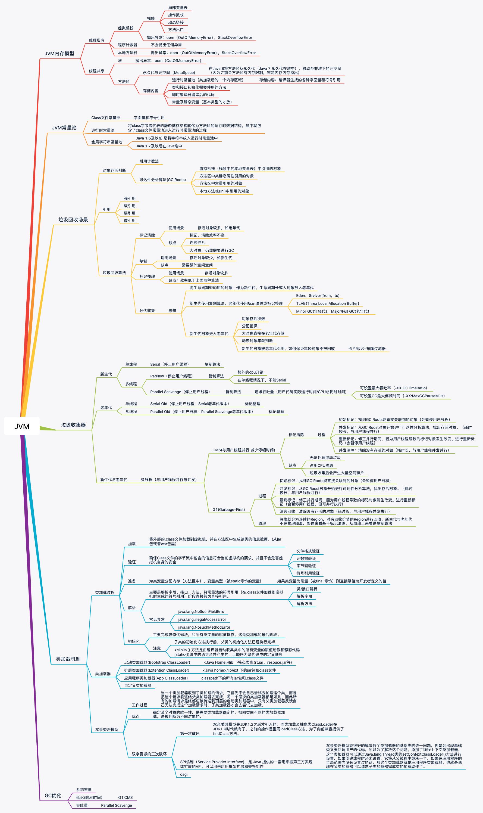

# JVM 面试知识总结

## 基础原理

- [为什么需要JVM,它处在什么位置](/JVM/为什么需要JVM,它处在什么位置.md)
- [JVM 内存管理](/JVM/JVM内存管理.md)
- [类的加载机制](/JVM/类的加载机制.md)
- [从栈帧看字节码是如何在JVM中进行流转的](/JVM/从栈帧看字节码如何在JVM中进行流转的.md)

## 垃圾回收

- [得心应手应对 OOM 的疑难杂症](/JVM/得心应手应对OOM的疑难杂症.md)
- [垃圾回收你真的了解吗（上）](/JVM/垃圾回收你真的了解吗(上).md)
- [垃圾回收你真的了解吗（下）](/JVM/垃圾回收你真的了解吗(下).md)
- [有了G1,还需要其他垃圾回收器吗](/JVM/有了G1,还需要其他垃圾回收器吗.md)

## 进阶部分

- [从字节码看方法调用的底层实现](/JVM/从字节码看方法的调用的底层实现.md)
- [从字节码看并发编程的底层实现](/JVM/从字节码看并发编程底层实现.md)
- [不为人知的字节码指令](/JVM/不为人知的字节码指令.md)
- [如何利用 Java Agent 技术对 字节码进行修改](/JVM/如何利用Java%20Agent%20技术对字节码进行修改.md)
- [JIT 参数配置如何影响程序运行](/JVM/JIT参数配置如何影响程序运行.md)

## 补充

- [常见 JVM 面试题补充](/JVM/常见JVM面试题补充.md)
