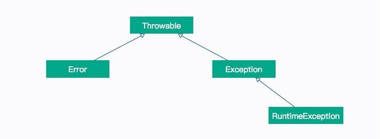

# 不为人知的字节码指令

本文章我们主要分享一个实践案例：不为人熟知的字节码指令。

下面将通过介绍 Java 语言中的一些常见特性，来看一下字节码的应用，由于 Java 特性非常多，这里我们仅介绍一些经常遇到的特性。javap 是手中的利器，复杂的概念都可以在这里现出原形，并且能让你对此产生深刻的印象。

本文章代码比较多，相关代码示例都可以在仓库中找到，建议实际操作一下。

## 异常处理

在上一文章中，细心的你可能注意到了，在 synchronized 生成的字节码中，其实包含两条 monitorexit 指令，是为了保证所有的异常条件，都能够退出。

这就涉及到了 Java 字节码的异常处理机制，如下图所示。



如果你熟悉 Java 语言，那么对上面的异常继承体系一定不会陌生，其中，Error 和 RuntimeException 是非检查型异常（Unchecked Exception），也就是不需要 catch 语句去捕获的异常；而其他异常，则需要程序员手动去处理。

### 异常表

在发生异常的时候，Java 就可以通过 Java 执行栈，来构造异常栈。回想一下第 02 文章中的栈帧，获取这个异常栈只需要遍历一下它们就可以了。

但是这种操作，比起常规操作，要昂贵的多。Java 的 Log 日志框架，通常会把所有错误信息打印到日志中，在异常非常多的情况下，会显著影响性能。

我们还是看一下上一文章生成的字节码：

```bash
void doLock();
    descriptor: ()V
    flags:
    Code:
      stack=2, locals=3, args_size=1
         0: aload_0
         1: getfield      #3                  // Field lock:Ljava/lang/Object;
         4: dup
         5: astore_1
         6: monitorenter
         7: getstatic     #4                  // Field java/lang/System.out:Ljava/io/PrintStream;
        10: ldc           #8                  // String lock
        12: invokevirtual #6                  // Method java/io/PrintStream.println:(Ljava/lang/String;)V
        15: aload_1
        16: monitorexit
        17: goto          25
        20: astore_2
        21: aload_1
        22: monitorexit
        23: aload_2
        24: athrow
        25: return
      Exception table:
         from    to  target type
             7    17    20   any
            20    23    20   any
```

可以看到，编译后的字节码，带有一个叫 Exception table 的异常表，里面的每一行数据，都是一个异常处理器：

- from 指定字节码索引的开始位置
- to 指定字节码索引的结束位置
- target 异常处理的起始位置
- type 异常类型

也就是说，只要在 from 和 to 之间发生了异常，就会跳转到 target 所指定的位置。

### finally

通常我们在做一些文件读取的时候，都会在 finally 代码块中关闭流，以避免内存的溢出。关于这个场景，我们再分析一下下面这段代码的异常表。

```java
import java.io.FileInputStream;
import java.io.FileNotFoundException;
import java.io.IOException;
import java.io.InputStream;

public class A {
    public void read() {
        InputStream in = null;
        try {
            in = new FileInputStream("A.java");
        } catch (FileNotFoundException e) {
            e.printStackTrace();
        } finally {
            if (null != in) {
                try {
                    in.close();
                } catch (IOException e) {
                    e.printStackTrace();
                }
            }
        }
    }
}
```

上面的代码，捕获了一个 FileNotFoundException 异常，然后在 finally 中捕获了 IOException 异常。当我们分析字节码的时候，却发现了一个有意思的地方：IOException 足足出现了三次。

```bash
Exception table:
    from    to  target type
    17    21    24   Class java/io/IOException
    2    12    32   Class java/io/FileNotFoundException
    42    46    49   Class java/io/IOException
     2    12    57   any
    32    37    57   any
    63    67    70   Class java/io/IOException
```

Java 编译器使用了一种比较傻的方式来组织 finally 的字节码，它分别在 try、catch 的正常执行路径上，复制一份 finally 代码，追加在 正常执行逻辑的后面；同时，再复制一份到其他异常执行逻辑的出口处。

这也是下面这段方法不报错的原因，都可以在字节码中找到答案。

```java
//B.java
public int read() {
        try {
            int a = 1 / 0;
            return a;
        } finally {
            return 1;
        }
}
```

下面是上面程序的字节码，可以看到，异常之后，直接跳转到序号 8 了。

```bash
stack=2, locals=4, args_size=1
         0: iconst_1
         1: iconst_0
         2: idiv
         3: istore_1
         4: iload_1
         5: istore_2
         6: iconst_1
         7: ireturn
         8: astore_3
         9: iconst_1
        10: ireturn
      Exception table:
         from    to  target type
             0     6     8   any

```

## 装箱拆箱

在刚开始学习 Java 语言的你，可能会被自动装箱和拆箱搞得晕头转向。Java 中有 8 种基本类型，但鉴于 Java 面向对象的特点，它们同样有着对应的 8 个包装类型，比如 int 和 Integer，包装类型的值可以为 null，很多时候，它们都能够相互赋值。

我们使用下面的代码从字节码层面上来观察一下：

```java
public class Box {
    public Integer cal() {
        Integer a = 1000;
        int b = a * 10;
        return b;
    }
}
```

上面是一段简单的代码，首先使用包装类型，构造了一个值为 1000 的数字，然后乘以 10 后返回，但是中间的计算过程，使用了普通类型 int。

```java
public java.lang.Integer read();
    descriptor: ()Ljava/lang/Integer;
    flags: ACC_PUBLIC
    Code:
      stack=2, locals=3, args_size=1
         0: sipush        1000
         3: invokestatic  #2                  // Method java/lang/Integer.valueOf:(I)Ljava/lang/Integer;
         6: astore_1
         7: aload_1
         8: invokevirtual #3                  // Method java/lang/Integer.intValue:()I
        11: bipush        10
        13: imul
        14: istore_2
        15: iload_2
        16: invokestatic  #2                  // Method java/lang/Integer.valueOf:(I)Ljava/lang/Integer;
        19: areturn
```

通过观察字节码，我们发现赋值操作使用的是 Integer.valueOf 方法，在进行乘法运算的时候，调用了 Integer.intValue 方法来获取基本类型的值。在方法返回的时候，再次使用了 Integer.valueOf 方法对结果进行了包装。

这就是 Java 中的自动装箱拆箱的底层实现。

但这里有一个 Java 层面的陷阱问题，我们继续跟踪 Integer.valueOf 方法。

```java
@HotSpotIntrinsicCandidate
    public static Integer valueOf(int i) {
        if (i >= IntegerCache.low && i <= IntegerCache.high)
            return IntegerCache.cache[i + (-IntegerCache.low)];
        return new Integer(i);
    }
```

这个 IntegerCache，缓存了 low 和 high 之间的 Integer 对象，可以通过 -XX:AutoBoxCacheMax 来修改上限。

下面是一道经典的面试题，请考虑一下运行代码后，会输出什么结果？

```java
public class BoxCacheError{
    public static void main(String[] args) {

        Integer n1 = 123;
        Integer n2 = 123;
        Integer n3 = 128;
        Integer n4 = 128;

        System.out.println(n1 == n2);
        System.out.println(n3 == n4);
    }
```

当我使用 java BoxCacheError 执行时，是 true,false；当我加上参数 java -XX:AutoBoxCacheMax=256 BoxCacheError 执行时，结果是 true,ture，原因就在于此。

## 数组访问

我们都知道，在访问一个数组长度的时候，直接使用它的属性 .length 就能获取，而在 Java 中却无法找到对于数组的定义。

比如 int[] 这种类型，通过 getClass（getClass 是 Object 类中的方法）可以获取它的具体类型是 [I。

其实，数组是 JVM 内置的一种对象类型，这个对象同样是继承的 Object 类。

我们使用下面一段代码来观察一下数组的生成和访问。

```java
public class ArrayDemo {
    int getValue() {
        int[] arr = new int[]{
                1111, 2222, 3333, 4444
        };
        return arr[2];
    }

    int getLength(int[] arr) {
        return arr.length;
    }
}
```

首先看一下 getValue 方法的字节码。

```bash
int getValue();
    descriptor: ()I
    flags:
    Code:
      stack=4, locals=2, args_size=1
         0: iconst_4
         1: newarray       int
         3: dup
         4: iconst_0
         5: sipush        1111
         8: iastorae
         9: dup
        10: iconst_1
        11: sipush        2222
        14: iastore
        15: dup
        16: iconst_2
        17: sipush        3333
        20: iastore
        21: dup
        22: iconst_3
        23: sipush        4444
        26: iastore
        27: astore_1
        28: aload_1
        29: iconst_2
        30: iaload
        31: ireturn
```

可以看到，新建数组的代码，被编译成了 newarray 指令。数组里的初始内容，被顺序编译成了一系列指令放入：

- sipush 将一个短整型常量值推送至栈顶；
- iastore 将栈顶 int 型数值存入指定数组的指定索引位置。

>为了支持多种类型，从操作数栈存储到数组，有更多的指令：bastore、castore、sastore、iastore、lastore、fastore、dastore、aastore。

数组元素的访问，是通过第 28 ~ 30 行代码来实现的：

- aload_1 将第二个引用类型本地变量推送至栈顶，这里是生成的数组；
- iconst_2 将 int 型 2 推送至栈顶；
- iaload 将 int 型数组指定索引的值推送至栈顶。

值得注意的是，在这段代码运行期间，有可能会产生 ArrayIndexOutOfBoundsException，但由于它是一种非捕获型异常，我们不必为这种异常提供异常处理器。

我们再看一下 getLength 的字节码，字节码如下：

```bash
int getLength(int[]);
    descriptor: ([I)I
    flags:
    Code:
      stack=1, locals=2, args_size=2
         0: aload_1
         1: arraylength
         2: ireturn
```

可以看到，获取数组的长度，是由字节码指令 arraylength 来完成的。

## foreach

无论是 Java 的数组，还是 List，都可以使用 foreach 语句进行遍历，比较典型的代码如下：

```java
import java.util.List;

public class ForDemo {
    void loop(int[] arr) {
        for (int i : arr) {
            System.out.println(i);
        }
    }

    void loop(List<Integer> arr) {
        for (int i : arr) {
            System.out.println(i);
        }
    }
```

虽然在语言层面它们的表现形式是一致的，但实际实现的方法并不同。我们先看一下遍历数组的字节码：

```bash
void loop(int[]);
    descriptor: ([I)V
    flags:
    Code:
      stack=2, locals=6, args_size=2
         0: aload_1
         1: astore_2
         2: aload_2
         3: arraylength
         4: istore_3
         5: iconst_0
         6: istore        4
         8: iload         4
        10: iload_3
        11: if_icmpge     34
        14: aload_2
        15: iload         4
        17: iaload
        18: istore        5
        20: getstatic     #2                  // Field java/lang/System.out:Ljava/io/PrintStream;
        23: iload         5
        25: invokevirtual #3                  // Method java/io/PrintStream.println:(I)V
        28: iinc          4, 1
        31: goto          8
        34: return
```

可以很容易看到，它将代码解释成了传统的变量方式，即 `for(int i;i<length;i++)` 的形式。

而 List 的字节码如下：

```bash
void loop(java.util.List<java.lang.Integer>);
    Code:
       0: aload_1
       1: invokeinterface #4,  1            // InterfaceMethod java/util/List.iterator:()Ljava/util/Iterator;
       6: astore_2-
       7: aload_2
       8: invokeinterface #5,  1            // InterfaceMethod java/util/Iterator.hasNext:()Z
      13: ifeq          39
      16: aload_2
      17: invokeinterface #6,  1            // InterfaceMethod java/util/Iterator.next:()Ljava/lang/Object;
      22: checkcast     #7                  // class java/lang/Integer
      25: invokevirtual #8                  // Method java/lang/Integer.intValue:()I
      28: istore_3
      29: getstatic     #2                  // Field java/lang/System.out:Ljava/io/PrintStream;
      32: iload_3
      33: invokevirtual #3                  // Method java/io/PrintStream.println:(I)V
      36: goto          7
      39: return
```

它实际是把 list 对象进行迭代并遍历的，在循环中，使用了 Iterator.next() 方法。

使用 jd-gui 等反编译工具，可以看到实际生成的代码：

```java
void loop(List<Integer> paramList) {
    for (Iterator<Integer> iterator = paramList.iterator(); iterator.hasNext(); ) {
      int i = ((Integer)iterator.next()).intValue();
      System.out.println(i);
    }
  }
```

## 注解

注解在 Java 中得到了广泛的应用，Spring 框架更是由于注解的存在而起死回生。注解在开发中的作用就是做数据约束和标准定义，可以将其理解成代码的规范标准，并帮助我们写出方便、快捷、简洁的代码。

那么注解信息是存放在哪里的呢？我们使用两个 Java 文件来看一下其中的一种情况。

- MyAnnotation.java

```java
public @interface MyAnnotation {
}
```

- AnnotationDemo

```java
@MyAnnotation
public class AnnotationDemo {
    @MyAnnotation
    public void test(@MyAnnotation  int a){

    }
}
```

下面我们来看一下字节码信息。

```bash
{
  public AnnotationDemo();
    descriptor: ()V
    flags: ACC_PUBLIC
    Code:
      stack=1, locals=1, args_size=1
         0: aload_0
         1: invokespecial #1                  // Method java/lang/Object."<init>":()V
         4: return
      LineNumberTable:
        line 2: 0

  public void test(int);
    descriptor: (I)V
    flags: ACC_PUBLIC
    Code:
      stack=0, locals=2, args_size=2
         0: return
      LineNumberTable:
        line 6: 0
    RuntimeInvisibleAnnotations:
      0: #11()
    RuntimeInvisibleParameterAnnotations:
      0:
        0: #11()
}
SourceFile: "AnnotationDemo.java"
RuntimeInvisibleAnnotations:
  0: #11()
 ```

可以看到，无论是类的注解，还是方法注解，都是由一个叫做 RuntimeInvisibleAnnotations 的结构来存储的，而参数的存储，是由 RuntimeInvisibleParameterAnotations 来保证的。

## 小结

本文章我们简单介绍了一下工作中常见的一些问题，并从字节码层面分析了它的原理，包括异常的处理、finally 块的执行顺序；以及隐藏的装箱拆箱和 foreach 语法糖的底层实现。

由于 Java 的特性非常多，这里不再一一列出，但都可以使用这种简单的方式，一窥究竟。可以认为本文章属于抛砖引玉，给出了一种学习思路。

另外，也可以对其中的性能和复杂度进行思考。可以注意到，在隐藏的装箱拆箱操作中，会造成很多冗余的字节码指令生成。那么，这个东西会耗性能吗？答案是肯定的，但是也不必纠结于此。

你所看到的字节码指令，可能洋洋洒洒几千行，看起来很吓人，但执行速度几乎都是纳秒级别的。Java 的无数框架，包括 JDK，也不会为了优化这种性能对代码进行限制。了解其原理，但不要舍本逐末，比如减少一次 Java 线程的上下文切换，就比你优化几千个装箱拆箱动作，来的更快捷一些。
