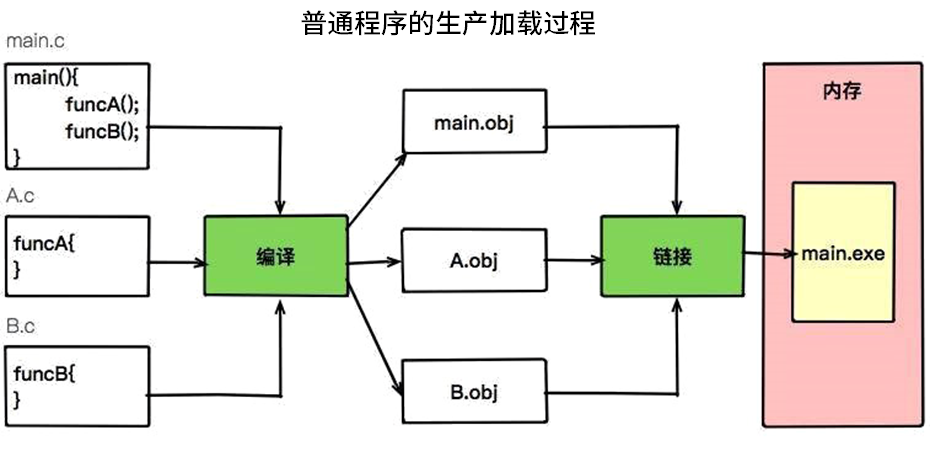

# 为什么需要JVM,它处在什么位置

从本篇文章开始我们就正式进入 JVM 的学习，如果你是一名软件开发工程师，在日常工作中除了 Java 这个关键词外，还有一个名词也一定经常被提及，那就是 JVM。提到 JVM 我们经常会在面试中遇到这样的问题：

- 为什么 Java 研发系统需要 JVM？
- 对你 JVM 的运行原理了解多少？
- 我们写的 Java 代码到底是如何运行起来的？

想要在面试中完美地回答这三个问题，就需要首先了解 JVM 是什么？它和 Java 有什么关系？又与 JDK 有什么渊源？接下来，我就带你拨开这些问题的层层迷雾，想要弄清楚这些问题，我们首先需要从这三个维度去思考：

- JVM 和操作系统的关系？
- JVM、JRE、JDK 的关系？
- Java 虚拟机规范和 Java 语言规范的关系？

弄清楚这几者的关系后，我们再以一个简单代码示例来看一下一个 Java 程序到底是如何执行的。

## JVM 和操作系统的关系

在武侠小说中，想要炼制一把睥睨天下的宝剑，是需要下一番功夫的。除了要有上等的铸剑技术，还需要一鼎经百炼的剑炉，而工程师就相当于铸剑的剑师，JVM 便是剑炉。

JVM 全称 Java Virtual Machine，也就是我们耳熟能详的 Java 虚拟机。它能识别 .class后缀的文件，并且能够解析它的指令，最终调用操作系统上的函数，完成我们想要的操作。

一般情况下，使用 C++ 开发的程序，编译成二进制文件后，就可以直接执行了，操作系统能够识别它；但是 Java 程序不一样，使用 javac 编译成 .class 文件之后，还需要使用 Java 命令去主动执行它，操作系统并不认识这些 .class 文件。

你可能会想，我们为什么不能像 C++ 一样，直接在操作系统上运行编译后的二进制文件呢？而非要搞一个处于程序与操作系统中间层的虚拟机呢？

这就是 JVM 的过人之处了。大家都知道，Java 是一门抽象程度特别高的语言，提供了自动内存管理等一系列的特性。这些特性直接在操作系统上实现是不太可能的，所以就需要 JVM 进行一番转换。

有了上面的介绍，我们就可以做如下的类比。

- JVM：等同于操作系统；
- Java 字节码：等同于汇编语言。

Java 字节码一般都比较容易读懂，这从侧面上证明 Java 语言的抽象程度比较高。你可以把 JVM 认为是一个翻译器，会持续不断的翻译执行 Java 字节码，然后调用真正的操作系统函数，这些操作系统函数是与平台息息相关的。

如果你还是对上面的介绍有点模糊，可以参考下图：


从图中可以看到，有了 JVM 这个抽象层之后，Java 就可以实现跨平台了。JVM 只需要保证能够正确执行 .class 文件，就可以运行在诸如 Linux、Windows、MacOS 等平台上了。

而 Java 跨平台的意义在于一次编译，处处运行，能够做到这一点 JVM 功不可没。比如我们在 Maven 仓库下载同一版本的 jar 包就可以到处运行，不需要在每个平台上再编译一次。

现在的一些 JVM 的扩展语言，比如 Clojure、JRuby、Groovy 等，编译到最后都是 .class 文件，Java 语言的维护者，只需要控制好 JVM 这个解析器，就可以将这些扩展语言无缝的运行在 JVM 之上了。

我们用一句话概括 JVM 与操作系统之间的关系：JVM 上承开发语言，下接操作系统，它的中间接口就是字节码。

而 Java 程序和我们通常使用的 C++ 程序有什么不同呢？这里用两张图进行说明。




对比这两张图可以看到 C++ 程序是编译成操作系统能够识别的 .exe 文件，而 Java 程序是编译成 JVM 能够识别的 .class 文件，然后由 JVM 负责调用系统函数执行程序。

## JVM、JRE、JDK的关系

通过上面的学习我们了解到 JVM 是 Java 程序能够运行的核心。但是需要注意，JVM 自己什么也干不了，你需要给它提供生产原料（.class 文件）。俗语说的好，巧妇难为无米之炊。它虽然功能强大，但仍需要为它提供 .class 文件。

仅仅是 JVM，是无法完成一次编译，处处运行的。它需要一个基本的类库，比如怎么操作文件、怎么连接网络等。而 Java 体系很慷慨，会一次性将 JVM 运行所需的类库都传递给它。JVM 标准加上实现的一大堆基础类库，就组成了 Java 的运行时环境，也就是我们常说的 JRE（Java Runtime Environment）。

有了 JRE 之后，我们的 Java 程序便可以在浏览器中运行了。大家可以看一下自己安装的 Java 目录，如果是只需要执行一些 Java 程序，只需要一个 JRE 就足够了。

对于 JDK 来说，就更庞大了一些。除了 JRE，JDK 还提供了一些非常好用的小工具，比如 javac、java、jar 等。它是 Java 开发的核心，让外行也可以炼剑！

我们也可以看下 JDK 的全拼，Java Development Kit。我非常怕 kit（装备）这个单词，它就像一个无底洞，预示着你永无休止的对它进行研究。JVM、JRE、JDK 它们三者之间的关系，可以用一个包含关系表示。

- JDK>JRE>JVM


## Java 虚拟机规范和 Java 语言规范的关系

我们通常谈到 JVM，首先会想到它的垃圾回收器，其实它还有很多部分，比如对字节码进行解析的执行引擎等。广义上来讲，JVM 是一种规范，它是最为官方、最为准确的文档；狭义上来讲，由于我们使用 Hotspot 更多一些，我们一般在谈到这个概念时，会将它们等同起来。

如果再加上我们平常使用的 Java 语言的话，可以得出下面这样一张图。这是 Java 开发人员必须要搞懂的两个规范。


左半部分是 Java 虚拟机规范，其实就是为输入和执行字节码提供一个运行环境。右半部分是我们常说的 Java 语法规范，比如 switch、for、泛型、lambda 等相关的程序，最终都会编译成字节码。而连接左右两部分的桥梁依然是 Java 的字节码。

如果 .class 文件的规格是不变的，这两部分是可以独立进行优化的。但 Java 也会偶尔扩充一下 .class 文件的格式，增加一些字节码指令，以便支持更多的特性。

我们可以把 Java 虚拟机可以看作是一台抽象的计算机，它有自己的指令集以及各种运行时内存区域，学过《计算机组成结构》的同学会在课程的后面看到非常多的相似性。

你可能会有疑问，如果我不学习 JVM，会影响我写 Java 代码么？理论上，这两者没有什么必然的联系。它们之间通过 .class 文件进行交互，即使你不了解 JVM，也能够写大多数的 Java 代码。就像是你写 C++ 代码一样，并不需要特别深入的了解操作系统的底层是如何实现的。

但是，如果你想要写一些比较精巧、效率比较高的代码，就需要了解一些执行层面的知识了。了解 JVM，主要用在调优以及故障排查上面，你会对运行中的各种资源分配，有一个比较全面的掌控。

## 我们写的 Java 代码到底是如何运行起来的

最后，我们简单看一下一个 Java 程序的执行过程，它到底是如何运行起来的。

这里的 Java 程序是文本格式的。比如下面这段 HelloWorld.java，它遵循的就是 Java 语言规范。其中，我们调用了 System.out 等模块，也就是 JRE 里提供的类库。

```java
public class HelloWorld {
    public static void main(String[] args) {
        System.out.println("Hello World");
    }
}
```

使用 JDK 的工具 javac 进行编译后，会产生 HelloWorld 的字节码。

我们一直在说 Java 字节码是沟通 JVM 与 Java 程序的桥梁，下面使用 javap 来稍微看一下字节码到底长什么样子。

```java
0 getstatic #2 <java/lang/System.out>
3 ldc #3 <Hello World>
5 invokevirtual #4 <java/io/PrintStream.println>
8 return
```

Java 虚拟机采用基于栈的架构，其指令由操作码和操作数组成。这些字节码指令，就叫作 opcode。其中，getstatic、ldc、invokevirtual、return 等，就是 opcode，可以看到是比较容易理解的。

我们继续使用 hexdump 看一下字节码的二进制内容。与以上字节码对应的二进制，就是下面这几个数字（可以搜索一下）。

```java
b2 00 02 12 03 b6 00 04 b1
```

我们可以看一下它们的对应关系。

```java
0xb2   getstatic       获取静态字段的值
0x12   ldc             常量池中的常量值入栈
0xb6   invokevirtual   运行时方法绑定调用方法
0xb1   return          void 函数返回
```

opcode 有一个字节的长度(0~255)，意味着指令集的操作码个数不能操作 256 条。而紧跟在 opcode 后面的是被操作数。比如 b2 00 02，就代表了 getstatic #2 <java/lang/System.out>。

JVM 就是靠解析这些 opcode 和操作数来完成程序的执行的。当我们使用 Java 命令运行 .class 文件的时候，实际上就相当于启动了一个 JVM 进程。

然后 JVM 会翻译这些字节码，它有两种执行方式。常见的就是解释执行，将 opcode + 操作数翻译成机器代码；另外一种执行方式就是 JIT，也就是我们常说的即时编译，它会在一定条件下将字节码编译成机器码之后再执行。

这些 .class 文件会被加载、存放到 metaspace 中，等待被调用，这里会有一个类加载器的概念。

而 JVM 的程序运行，都是在栈上完成的，这和其他普通程序的执行是类似的，同样分为堆和栈。比如我们现在运行到了 main 方法，就会给它分配一个栈帧。当退出方法体时，会弹出相应的栈帧。你会发现，大多数字节码指令，就是不断的对栈帧进行操作。

而其他大块数据，是存放在堆上的。Java 在内存划分上会更为细致，关于这些概念，我们会在接下来的文章中进行详细介绍。

最后大家看下面的图，其中 JVM 部分，就是学习的要点。


## 选用的版本

既然 JVM 只是一个虚拟机规范，那肯定有非常多的实现。其中，最流行的要数 Oracle 的 HotSpot。

目前，最新的版本是 Java13（注意最新的LTS版本是11）。学技术当然要学最新的，我们以后的课时就以 13 版本的 Java 为基准，来讲解发生在 JVM 上的那些事儿。

为了完成这个过程，你可以打开浏览器，输入[下载网址](https://www.oracle.com/technetwork/java/ javase/downloads/jdk13-downloads-5672538.html)并安装软件。当然你也可以用稍低点的版本，但是有些知识点会有些许差异。相信对于聪明的你来说，这写都不算问题，因为整个 JVM，包括我们的调优，就是在不断试错中完成的。

## 小结

我们再回头看看上面的三个问题。

- 为什么 Java 研发系统需要 JVM？

JVM 解释的是类似于汇编语言的字节码，需要一个抽象的运行时环境。同时，这个虚拟环境也需要解决字节码加载、自动垃圾回收、并发等一系列问题。JVM 其实是一个规范，定义了 .class 文件的结构、加载机制、数据存储、运行时栈等诸多内容，最常用的 JVM 实现就是 Hotspot。

- 对你 JVM 的运行原理了解多少？

JVM 的生命周期是和 Java 程序的运行一样的，当程序运行结束，JVM 实例也跟着消失了。JVM 处于整个体系中的核心位置。

- 我们写的 Java 代码到底是如何运行起来的？

一个 Java 程序，首先经过 javac 编译成 .class 文件，然后 JVM 将其加载到`元数据`区，执行引擎将会通过`混合模式`执行这些字节码。执行时，会翻译成操作系统相关的函数。JVM 作为 .class 文件的黑盒存在，输入字节码，调用操作系统函数。

过程如下：Java 文件->编译器>字节码->JVM->机器码。

## 总结

到这里本篇文章的内容就全部讲完了，今天我们分别从三个角度，了解了 JVM 在 Java 研发体系中的位置，并以一个简单的程序，看了下一个 Java 程序基本的执行过程。

我们所说的 JVM，狭义上指的就 HotSpot。如非特殊说明，我们都以 HotSpot 为准。我们了解到，Java 之所以成为跨平台，就是由于 JVM 的存在。Java 的字节码，是沟通 Java 语言与 JVM 的桥梁，同时也是沟通 JVM 与操作系统的桥梁。

JVM 是一个非常小的集合，我们常说的 Java 运行时环境，就包含 JVM 和一部分基础类库。如果加上我们常用的一些开发工具，就构成了整个 JDK。我们讲解 JVM 就聚焦在字节码的执行上面。

Java 虚拟机采用基于栈的架构，有比较丰富的 opcode。这些字节码可以解释执行，也可以编译成机器码，运行在底层硬件上，可以说 JVM 是一种混合执行的策略。

那么你可以思考一下，既然 JVM 的运行在栈上，那栈上都会有哪些数据？垃圾回收又发生在什么地方呢？同时，你也可以搜索一下 Java 的字节码指令，看一下 opcode 的大体分类。
