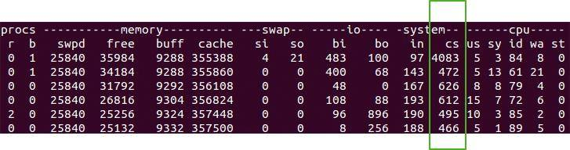
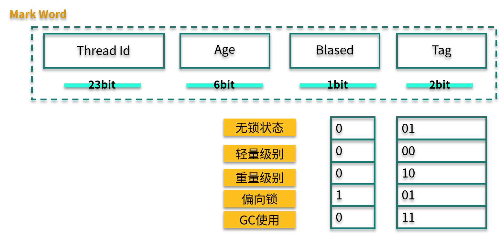

# 从字节码看并发编程的底层实现

本文章我们主要分享一个实践案例：从字节码看并发编程的底层实现。

Java 中的多线程，第一类是 Thread 类。它有三种实现方式：第 1 种是通过继承 Thread 覆盖它的 run 方法；第 2 种是通过 Runnable 接口，实现它的 run 方法；而第 3 种是通过创建线程，就是通过线程池的方法去创建。

多线程除了增加任务的执行速度，同样也有共享变量的同步问题。传统的线程同步方式，是使用 synchronized 关键字，或者 wait、notify 方法等，在目前的并发编程中，使用 concurrent 包里的工具更多一些。

## 线程模型

我们首先来看一下 JVM 的线程模型，以及它和操作系统进程之间的关系。

如下图所示，对于 Hotspot 来说，每一个 Java 线程，都会映射到一条轻量级进程中（LWP，Light Weight Process）。轻量级进程是用户进程调用系统内核所提供的一套接口，实际上它还需要调用更加底层的内核线程（KLT，Kernel-Level Thread）。而具体的功能，比如创建、同步等，则需要进行系统调用。


这些系统调用的操作，代价都比较高，需要在用户态（User Mode）和内核态（Kernel Mode）中来回切换，也就是我们常说的线程上下文切换（ CS，Context Switch）。

使用 vmstat 命令能够方便地观测到这个数值。



Java 在保证正确的前提下，要想高效并发，就要尽量减少上下文的切换。

一般有下面几种做法来减少上下文的切换：

- CAS 算法，比如 Java 的 Atomic 类，如果使用 CAS 来更新数据，则不需要加锁；
- 减少锁粒度，多线程竞争会引起上下文的频繁切换，如果在处理数据的时候，能够将数据分段，即可减少竞争，Java 的 ConcurrentHashMap、LongAddr 等就是这样的思路；
- 协程，在单线程里实现多任务调度，并在单线程里支持多个任务之间的切换；
- 对加锁的对象进行智能判断，让操作更加轻量级。

CAS 和无锁并发一般是建立在 concurrent 包里面的 AQS 模型之上，大多数属于 Java 语言层面上的知识点。本文章在对其进行简单的描述后，会把重点放在普通锁的优化上。

## CAS

CAS（Compare And Swap，比较并替换）机制中使用了 3 个基本操作数：内存地址 V、旧的预期值 A 和要修改的新值 B。更新一个变量时，只有当变量的预期值 A 和内存地址 V 当中的实际值相同时，才会将内存地址 V 对应的值修改为 B。

如果修改不成功，CAS 将不断重试。

拿 AtomicInteger 类来说，相关的代码如下：

```java
public final boolean compareAndSet(int expectedValue, int newValue) {
        return U.compareAndSetInt(this, VALUE, expectedValue, newValue);
    }
```

可以看到，这个操作，是由 jdk.internal.misc.Unsafe 类进行操作的，而这是一个 native 方法：

```java
@HotSpotIntrinsicCandidate
    public final native boolean compareAndSetInt(Object o, long offset,
                                                 int expected,
                                                 int x);
```

我们继续向下跟踪，在 Linux 机器上参照 os_cpu/linux_x86/atomic_linux_x86.hpp：

```c++
template<>
template<typename T>
inline T Atomic::PlatformCmpxchg<4>::operator()(T exchange_value,
                                                T volatile* dest,
                                                T compare_value,
                                                atomic_memory_order /* order */) const {
  STATIC_ASSERT(4 == sizeof(T));
  __asm__ volatile ("lock cmpxchgl %1,(%3)"
                    : "=a" (exchange_value)
                    : "r" (exchange_value), "a" (compare_value), "r" (dest)
                    : "cc", "memory");
  return exchange_value;
}
```

可以看到，最底层的调用是汇编语言，而最重要的就是 cmpxchgl 指令，到这里没法再往下找代码了，也就是说 CAS 的原子性实际上是硬件 CPU 直接实现的。

## synchronized

### 字节码

synchronized 可以在是多线程中使用的最多的关键字了。在开始介绍之前，请思考一个问题：在执行速度方面，是基于 CAS 的 Lock 效率高一些，还是同步关键字效率高一些？

synchronized 关键字给代码或者方法上锁时，会有显示或者隐藏的上锁对象。当一个线程试图访问同步代码块时，它必须先得到锁，而在退出或抛出异常时必须释放锁。

- 给普通方法加锁时，上锁的对象是 this，如代码中的方法 m1 。
- 给静态方法加锁时，锁的是 class 对象，如代码中的方法 m2 。
- 给代码块加锁时，可以指定一个具体的对象。

关于对象对锁的争夺，我们依然拿前面讲的一张图来看一下这个过程。


下面我们来看一段简单的代码，并观测一下它的字节码。

```java
public class SynchronizedDemo {
    synchronized void m1() {
        System.out.println("m1");
    }
    static synchronized void  m2() {
        System.out.println("m2");
    }
    final Object lock = new Object();

    void doLock() {
    synchronized (lock) {
     System.out.println("lock");
        }
    }
}
```

下面是普通方法 m1 的字节码。

```bash
synchronized void m1();
    descriptor: ()V
    flags: ACC_SYNCHRONIZED
    Code:
      stack=2, locals=1, args_size=1
         0: getstatic     #4
         3: ldc           #5
         5: invokevirtual #6
         8: return
```

可以看到，在字节码的体现上，它只给方法加了一个 flag：ACC_SYNCHRONIZED。

静态方法 m2 和 m1 区别不大，只不过 flags 上多了一个参数：ACC_STATIC。

相比较起来，doLock 方法就麻烦了一些，其中出现了 monitorenter 和 monitorexit 等字节码指令。

```bash
void doLock();
    descriptor: ()V
    flags:
    Code:
      stack=2, locals=3, args_size=1
         0: aload_0
         1: getfield      #3                  // Field lock:Ljava/lang/Object;
         4: dup
         5: astore_1
         6: monitorenter
         7: getstatic     #4                  // Field java/lang/System.out:Ljava/io/PrintStream;
        10: ldc           #8                  // String lock
        12: invokevirtual #6                  // Method java/io/PrintStream.println:(Ljava/lang/String;)V
        15: aload_1
        16: monitorexit
        17: goto          25
        20: astore_2
        21: aload_1
        22: monitorexit
        23: aload_2
        24: athrow
        25: return
      Exception table:
         from    to  target type
             7    17    20   any
            20    23    20   any
```

很多人都认为，synchronized 是一种悲观锁、一种重量级锁；而基于 CAS 的 AQS 是一种乐观锁，这种理解并不全对。JDK1.6 之后，JVM 对同步关键字进行了很多的优化，这把锁有了不同的状态，大多数情况下的效率，已经和 concurrent 包下的 Lock 不相上下了，甚至更高。

### 对象内存布局

说到 synchronized 加锁原理，就不得不先说 Java 对象在内存中的布局，Java 对象内存布局如下图所示。


我来分别解释一下各个部分的含义。

- Mark Word：用来存储 hashCode、GC 分代年龄、锁类型标记、偏向锁线程 ID、CAS 锁指向线程 LockRecord 的指针等，synconized 锁的机制与这里密切相关，这有点像 TCP/IP 中的协议头。
- Class Pointer：用来存储对象指向它的类元数据指针、JVM 就是通过它来确定是哪个 Class 的实例。
- Instance Data：存储的是对象真正有效的信息，比如对象中所有字段的内容。
- Padding：HostSpot 规定对象的起始地址必须是 8 字节的整数倍，这是为了高效读取对象而做的一种“对齐”操作。

### 可重入锁

synchronized 是一把可重入锁。因此，在一个线程使用 synchronized 方法时可以调用该对象的另一个 synchronized 方法，即一个线程得到一个对象锁后再次请求该对象锁，是可以永远拿到锁的。

Java 中线程获得对象锁的操作是以线程而不是以调用为单位的。synchronized 锁的对象头的 Mark Work 中会记录该锁的线程持有者和计数器。当一个线程请求成功后，JVM 会记下持有锁的线程，并将计数器计为 1 。此时如果有其他线程请求该锁，则必须等待。而该持有锁的线程如果再次请求这个锁，就可以再次拿到这个锁，同时计数器会递增。当线程退出一个  synchronized 方法/块时，计数器会递减，如果计数器为 0 则释放该锁。

### 锁升级

根据使用情况，锁升级大体可以按照下面的路径：偏向锁→轻量级锁→重量级锁，锁只能升级不能降级，所以一旦锁升级为重量级锁，就只能依靠操作系统进行调度。

我们再看一下 Mark Word 的结构。其中，Biased 有 1 bit 大小，Tag 有 2 bit 大小，锁升级就是通过 Thread Id、Biased、Tag 这三个变量值来判断的。


#### 偏向锁

偏向锁，其实是一把偏心锁（一般不这么描述）。在 JVM 中，当只有一个线程使用了锁的情况下，偏向锁才能够保证更高的效率。

当第 1 个线程第一次访问同步块时，会先检测对象头 Mark Word 中的标志位（Tag）是否为 01，以此来判断此时对象锁是否处于无锁状态或者偏向锁状态（匿名偏向锁）。

这也是锁默认的状态，线程一旦获取了这把锁，就会把自己的线程 ID 写到 Mark Word 中，在其他线程来获取这把锁之前，该线程都处于偏向锁状态。

#### 轻量级锁

当下一个线程参与到偏向锁竞争时，会先判断 Mark Word 中保存的线程 ID 是否与这个线程 ID 相等，如果不相等，则会立即撤销偏向锁，升级为轻量级锁。

轻量级锁的获取是怎么进行的呢？它们使用的是自旋方式。

参与竞争的每个线程，会在自己的线程栈中生成一个 LockRecord ( LR )，然后每个线程通过 CAS（自旋）的操作将锁对象头中的 Mark Work 设置为指向自己的 LR 指针，哪个线程设置成功，就意味着哪个线程获得锁。在这种情况下，JVM 不会依赖内核进行线程调度。

当锁处于轻量级锁的状态时，就不能够再通过简单的对比 Tag 值进行判断了，每次对锁的获取，都需要通过自旋的操作。

当然，自旋也是面向不存在锁竞争的场景，比如一个线程运行完了，另外一个线程去获取这把锁。但如果自旋失败达到一定的次数（JVM 自动管理）时，就会膨胀为重量级锁。

#### 重量级锁

重量级锁即为我们对 synchronized 的直观认识，在这种情况下，线程会挂起，进入到操作系统内核态，等待操作系统的调度，然后再映射回用户态。系统调用是昂贵的，重量级锁的名称也由此而来。

如果系统的共享变量竞争非常激烈，那么锁会迅速膨胀到重量级锁，这些优化也就名存实亡了。如果并发非常严重，则可以通过参数 -XX:-UseBiasedLocking 禁用偏向锁。这种方法在理论上会有一些性能提升，但实际上并不确定。

因为，synchronized 在 JDK，包括一些框架代码中的应用是非常广泛的。在一些不需要同步的场景中，即使加上了 synchronized 关键字，由于锁升级的原因，效率也不会太差。

下面这张图展示了三种锁的状态和 Mark Word 值的变化。



## 小结

在本文章中，我们首先介绍了多线程的一些特点，然后熟悉了 Java 中的线程和它在操作系统中的一些表现形式；还了解了，线程上下文切换会严重影响系统的性能，所以 Java 的锁有基于硬件 CAS 自旋，也有基于比较轻量级的“轻量级锁”和“偏向锁”。

它们的目标是，在不改变编程模型的基础上，尽量提高系统的性能，进行更加高效的并发。
