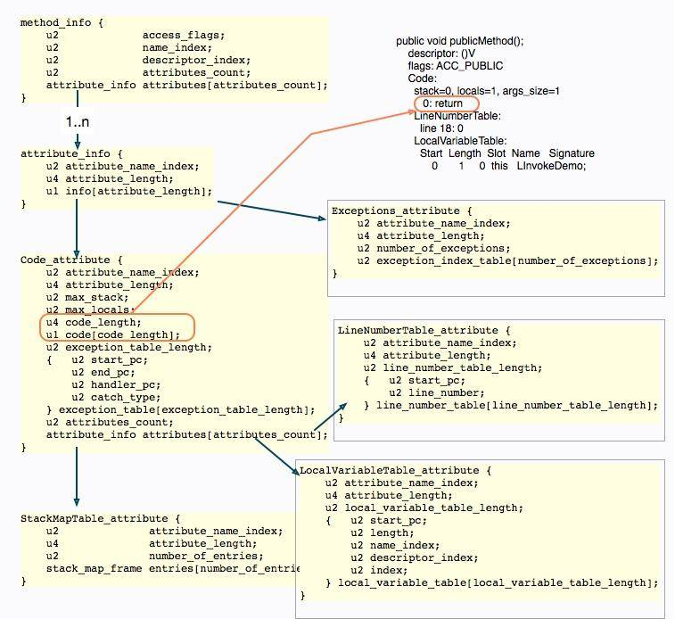
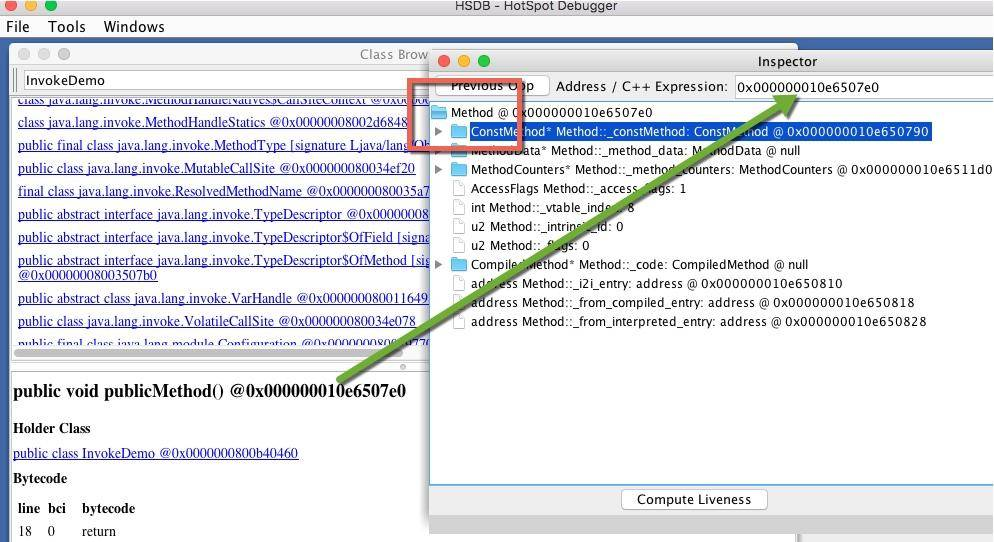
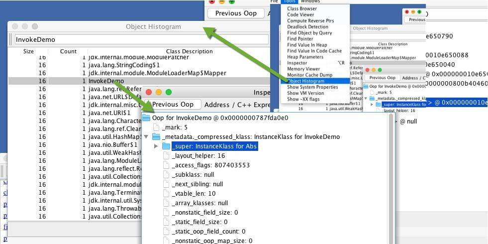

# 从字节码看方法调用的底层实现

本文章我们主要分析从字节码看方法调用的底层实现。

## 字节码结构

### 基本结构

在开始之前，我们先简要地介绍一下 class 文件的内容，这个结构和我们前面使用的 jclasslib 是一样的。关于 class 文件结构的资料已经非常多了[（点击这里可查看官网详细介绍）](https://docs.oracle.com/javase/specs/jvms/se11/html/jvms-4.htmlhttps://docs.oracle.com/javase/specs/jvms/se11/html/jvms-4.html)，这里不再展开讲解了，大体介绍如下。


- magic：魔数，用于标识当前 class 的文件格式，JVM 可据此判断该文件是否可以被解析，目前固定为 0xCAFEBABE。
- major_version：主版本号。
- minor_version：副版本号，这两个版本号用来标识编译时的 JDK 版本，常见的一个异常比如 Unsupported major.minor version 52.0 就是因为运行时的 JDK 版本低于编译时的 JDK 版本（52 是 Java 8 的主版本号）。
- constant_pool_count：常量池计数器，等于常量池中的成员数加 1。
- constant_pool：常量池，是一种表结构，包含 class 文件结构和子结构中引用的所有字符串常量，类或者接口名，字段名和其他常量。
- access_flags：表示某个类或者接口的访问权限和属性。
- this_class：类索引，该值必须是对常量池中某个常量的一个有效索引值，该索引处的成员必须是一个 CONSTANT_Class_info 类型的结构体，表示这个 class 文件所定义的类和接口。
- super_class：父类索引。
- interfaces_count：接口计数器，表示当前类或者接口直接继承接口的数量。
- interfaces：接口表，是一个表结构，成员同 this_class，是对常量池中 CONSTANT_Class_info 类型的一个有效索引值。
- fields_count：字段计数器，当前 class 文件所有字段的数量。
- fields：字段表，是一个表结构，表中每个成员必须是 filed_info 数据结构，用于表示当前类或者接口的某个字段的完整描述，但它不包含从父类或者父接口继承的字段。
- methods_count：方法计数器，表示当前类方法表的成员个数。
- methods：方法表，是一个表结构，表中每个成员必须是 method_info 数据结构，用于表示当前类或者接口的某个方法的完整描述。
- attributes_count：属性计数器，表示当前 class 文件 attributes 属性表的成员个数。
- attributes：属性表，是一个表结构，表中每个成员必须是 attribute_info 数据结构，这里的属性是对 class 文件本身，方法或者字段的补充描述，比如 SourceFile 属性用于表示 class 文件的源代码文件名。



当然，class 文件结构的细节是非常多的，如上图，展示了一个简单方法的字节码描述，可以看到真正的执行指令在整个文件结构中的位置。

## 实际观测

为了避免枯燥的二进制对比分析，直接定位到真正的数据结构，这里介绍一个小工具，使用这种方式学习字节码会节省很多时间。这个工具就是 [asmtools](https://wiki.openjdk.java.net/display/CodeTools/asmtools)，为了方便使用，我已经编译了一个 jar 包，放在了仓库里。

执行下面的命令，将看到类的 JCOD 语法结果。

```bash
java -jar asmtools-7.0.jar jdec LambdaDemo.class
```

输出的结果类似于下面的结构，它与我们上面介绍的字节码组成是一一对应的，对照官网或者资料去学习，速度飞快。若想要细挖字节码，一定要掌握好它。

```bash
class LambdaDemo {
  0xCAFEBABE;
  0; // minor version
  52; // version
  [] { // Constant Pool
    ; // first element is empty
    Method #8 #25; // #1
    InvokeDynamic 0s #30; // #2
    InterfaceMethod #31 #32; // #3
    Field #33 #34; // #4
    String #35; // #5
    Method #36 #37; // #6
    class #38; // #7
    class #39; // #8
    Utf8 "<init>"; // #9
    Utf8 "()V"; // #10
    Utf8 "Code"; // #11
```

了解了类的文件组织方式，下面我们来看一下，类文件在加载到内存中以后，是一个怎样的表现形式。

### 内存表示

准备以下代码，使用 javac -g InvokeDemo.java 进行编译，然后使用 java 命令执行。程序将阻塞在 sleep 函数上，我们来看一下它的内存分布：

```java
interface I {
    default void infMethod() { }

    void inf();
}

abstract class Abs {
    abstract void abs();
}

public class InvokeDemo extends Abs implements I {


    static void staticMethod() { }

    private void privateMethod() { }

    public void publicMethod() { }

    @Override
    public void inf() { }

    @Override
    void abs() { }

    public static void main(String[] args) throws Exception{
        InvokeDemo demo = new InvokeDemo();

        InvokeDemo.staticMethod();
        demo.abs();
        ((Abs) demo).abs();
        demo.inf();
        ((I) demo).inf();
        demo.privateMethod();
        demo.publicMethod();
        demo.infMethod();
        ((I) demo).infMethod();


        Thread.sleep(Integer.MAX_VAL

```

为了更加明显的看到这个过程，下面介绍一个 jhsdb 工具，这是在 Java 9 之后 JDK 先加入的调试工具，我们可以在命令行中使用 jhsdb hsdb 来启动它。注意，要加载相应的进程时，必须确保是同一个版本的应用进程，否则会产生报错。


attach 启动 Java 进程后，可以在 Class Browser 菜单中查看加载的所有类信息。我们在搜索框中输入 InvokeDemo，找到要查看的类。


@ 符号后面的，就是具体的内存地址，我们可以复制一个，然后在 Inspector 视图中查看具体的属性，可以大体认为这就是类在方法区的具体存储。


在 Inspector 视图中，我们找到方法相关的属性 _methods，可惜它无法点开，也无法查看。


接下来使用命令行来检查这个数组里面的值。打开菜单中的 Console，然后输入 examine 命令，可以看到这个数组里的内容，对应的地址就是 Class 视图中的方法地址。

`examine 0x000000010e650570/10`


我们可以在 Inspect 视图中看到方法所对应的内存信息，这确实是一个 Method 方法的表示。



相比较起来，对象就简单了，它只需要保存一个到达 Class 对象的指针即可。我们需要先从对象视图中进入，然后找到它，一步步进入 Inspect 视图。



由以上的这些分析，可以得出下面这张图。执行引擎想要运行某个对象的方法，需要先在栈上找到这个对象的引用，然后再通过对象的指针，找到相应的方法字节码。


### 方法调用指令

关于方法的调用，Java 共提供了 5 个指令，来调用不同类型的函数：

- invokestatic  用来调用静态方法；
- invokevirtual  用于调用非私有实例方法，比如 public 和 protected，大多数方法调用属于这一种；
- invokeinterface 和上面这条指令类似，不过作用于接口类；
- invokespecial 用于调用私有实例方法、构造器及 super 关键字等；
- invokedynamic 用于调用动态方法。

我们依然使用上面的代码片段来看一下前四个指令的使用场景。代码中包含一个接口 I、一个抽象类 Abs、一个实现和继承了两者类的 InvokeDemo。

回想一下，之前讲到的类加载机制，在 class 文件被加载到方法区以后，就完成了从符号引用到具体地址的转换过程。

我们可以看一下编译后的 main 方法字节码，尤其需要注意的是对于接口方法的调用。使用实例对象直接调用，和强制转化成接口调用，所调用的字节码指令分别是 invokevirtual 和 invokeinterface，它们是有所不同的。

```bash
public static void main(java.lang.String[]);
    descriptor: ([Ljava/lang/String;)V
    flags: ACC_PUBLIC, ACC_STATIC
    Code:
      stack=2, locals=2, args_size=1
         0: new           #2                  // class InvokeDemo
         3: dup
         4: invokespecial #3                  // Method "<init>":()V
         7: astore_1
         8: invokestatic  #4                  // Method staticMethod:()V
        11: aload_1
        12: invokevirtual #5                  // Method abs:()V
        15: aload_1
        16: invokevirtual #6                  // Method Abs.abs:()V
        19: aload_1
        20: invokevirtual #7                  // Method inf:()V
        23: aload_1
        24: invokeinterface #8,  1            // InterfaceMethod I.inf:()V
        29: aload_1
        30: invokespecial #9                  // Method privateMethod:()V
        33: aload_1
        34: invokevirtual #10                 // Method publicMethod:()V
        37: aload_1
        38: invokevirtual #11                 // Method infMethod:()V
        41: aload_1
        42: invokeinterface #12,  1           // InterfaceMethod I.infMethod:()V
        47: return
```

另外还有一点，和我们想象中的不同，大多数普通方法调用，使用的是 invokevirtual 指令，它其实和 invokeinterface 是一类的，都属于虚方法调用。很多时候，JVM 需要根据调用者的动态类型，来确定调用的目标方法，这就是动态绑定的过程。

invokevirtual 指令有多态查找的机制，该指令运行时，解析过程如下：

- 找到操作数栈顶的第一个元素所指向的对象实际类型，记做 c；
- 如果在类型 c 中找到与常量中的描述符和简单名称都相符的方法，则进行访问权限校验，如果通过则返回这个方法直接引用，查找过程结束，不通过则返回 java.lang.IllegalAccessError；
- 否则，按照继承关系从下往上依次对 c 的各个父类进行第二步的搜索和验证过程；
- 如果始终没找到合适的方法，则抛出 java.lang.AbstractMethodError 异常，这就是 Java 语言中方法重写的本质。

相对比，invokestatic 指令加上 invokespecial 指令，就属于静态绑定过程。

所以静态绑定，指的是能够直接识别目标方法的情况，而动态绑定指的是需要在运行过程中根据调用者的类型来确定目标方法的情况。

可以想象，相对于静态绑定的方法调用来说，动态绑定的调用会更加耗时一些。由于方法的调用非常的频繁，JVM 对动态调用的代码进行了比较多的优化，比如使用方法表来加快对具体方法的寻址，以及使用更快的缓冲区来直接寻址（ 内联缓存）。

#### invokedynamic

有时候在写一些 Python 脚本或者JS 脚本时，特别羡慕这些动态语言。如果把查找目标方法的决定权，从虚拟机转嫁给用户代码，我们就会有更高的自由度。

之所以单独把 invokedynamic 抽离出来介绍，是因为它比较复杂。和反射类似，它用于一些动态的调用场景，但它和反射有着本质的不同，效率也比反射要高得多。

这个指令通常在 Lambda 语法中出现，我们来看一下一小段代码：

```java
public class LambdaDemo {
    public static void main(String[] args) {
        Runnable r = () -> System.out.println("Hello Lambda");
        r.run();
    }
}
```

使用 javap -p -v 命令可以在 main 方法中看到 invokedynamic 指令：

```bash
public static void main(java.lang.String[]);
    descriptor: ([Ljava/lang/String;)V
    flags: ACC_PUBLIC, ACC_STATIC
    Code:
      stack=1, locals=2, args_size=1
         0: invokedynamic #2,  0              // InvokeDynamic #0:run:()Ljava/lang/Runnable;
         5: astore_1
         6: aload_1
         7: invokeinterface #3,  1            // InterfaceMethod java/lang/Runnable.run:()V
        12: return
```

另外，我们在 javap 的输出中找到了一些奇怪的东西：

```bash
BootstrapMethods:
  0: #27 invokestatic java/lang/invoke/LambdaMetafactory.metafactory:
  (Ljava/lang/invoke/MethodHandles$Lookup;Ljava/lang/String;Ljava/lang
  /invoke/MethodType;Ljava/lang/invoke/MethodType;Ljava/lang/invoke/
  MethodHandle;Ljava/lang/invoke/MethodType;)Ljava/lang/invoke/CallSite;
    Method arguments:
      #28 ()V
      #29 invokestatic LambdaDemo.lambda$main$0:()V
      #28 ()V
```

BootstrapMethods 属性在 Java 1.7 以后才有，位于类文件的属性列表中，这个属性用于保存 invokedynamic 指令引用的引导方法限定符。

和上面介绍的四个指令不同，invokedynamic 并没有确切的接受对象，取而代之的，是一个叫 CallSite 的对象。

```java
static CallSite bootstrap(MethodHandles.Lookup caller, String name, MethodType type);
```

其实，invokedynamic 指令的底层，是使用方法句柄（MethodHandle）来实现的。方法句柄是一个能够被执行的引用，它可以指向静态方法和实例方法，以及虚构的 get 和 set 方法，从 IDE 中可以看到这些函数。


`句柄类型（MethodType）`是我们对方法的具体描述，配合方法名称，能够定位到一类函数。访问方法句柄和调用原来的指令基本一致，但它的调用异常，包括一些权限检查，在运行时才能被发现。

下面这段代码，可以完成一些动态语言的特性，通过方法名称和传入的对象主体，进行不同的调用，而 Bike 和 Man 类，可以没有任何关系。

```java
import java.lang.invoke.MethodHandle;
import java.lang.invoke.MethodHandles;
import java.lang.invoke.MethodType;

public class MethodHandleDemo {
    static class Bike {
        String sound() {
            return "ding ding";
        }
    }

    static class Animal {
        String sound() {
            return "wow wow";
        }
    }


    static class Man extends Animal {
        @Override
        String sound() {
            return "hou hou";
        }
    }


    String sound(Object o) throws Throwable {
        MethodHandles.Lookup lookup = MethodHandles.lookup();
        MethodType methodType = MethodType.methodType(String.class);
        MethodHandle methodHandle = lookup.findVirtual(o.getClass(), "sound", methodType);

        String obj = (String) methodHandle.invoke(o);
        return obj;
    }

    public static void main(String[] args) throws Throwable {
        String str = new MethodHandleDemo().sound(new Bike());
        System.out.println(str);
        str = new MethodHandleDemo().sound(new Animal());
        System.out.println(str);
        str = new MethodHandleDemo().sound(new Man());
        System.out.println(str);
```


可以看到 Lambda 语言实际上是通过方法句柄来完成的，在调用链上自然也多了一些调用步骤，那么在性能上，是否就意味着 Lambda 性能低呢？对于大部分“非捕获”的 Lambda 表达式来说，JIT 编译器的逃逸分析能够优化这部分差异，性能和传统方式无异；但对于“捕获型”的表达式来说，则需要通过方法句柄，不断地生成适配器，性能自然就低了很多（不过和便捷性相比，一丁点性能损失是可接受的）。

除了 Lambda 表达式，我们还没有其他的方式来产生 invokedynamic 指令。但可以使用一些外部的字节码修改工具，比如 ASM，来生成一些带有这个指令的字节码，这通常能够完成一些非常酷的功能，比如完成一门弱类型检查的 JVM-Base 语言。

## 小结

本文章从 Java 字节码的顶层结构介绍开始，通过一个实际代码，了解了类加载以后，在 JVM 内存里的表现形式，并学习了 jhsdb 对 Java 进程的观测方式。

接下来，我们分析了 invokestatic、invokevirtual、invokeinterface、invokespecial 这四个字节码指令的使用场景，并从字节码中看到了这些区别。

最后，了解了 Java 7 之后的 invokedynamic 指令，它实际上是通过方法句柄来实现的。和我们关系最大的就是 Lambda 语法，了解了这些原理，可以忽略那些对 Lambda 性能高低的争论，要尽量写一些“非捕获”的 Lambda 表达式。
