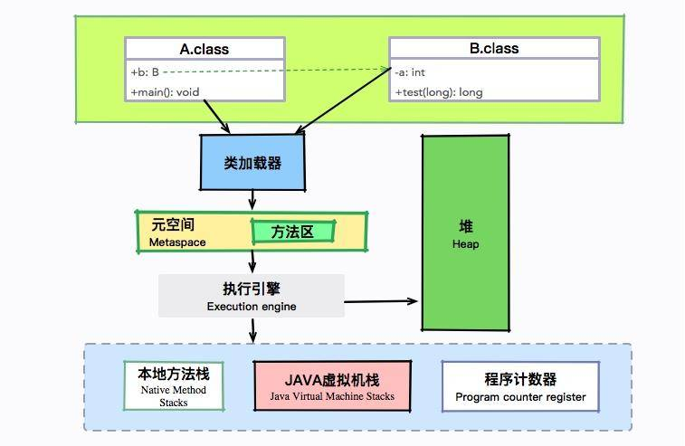
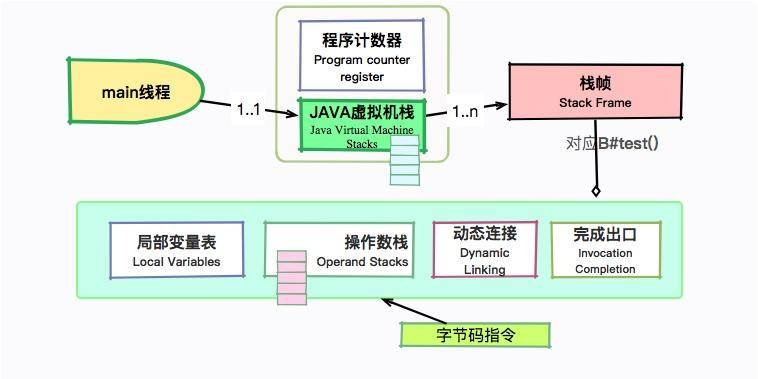
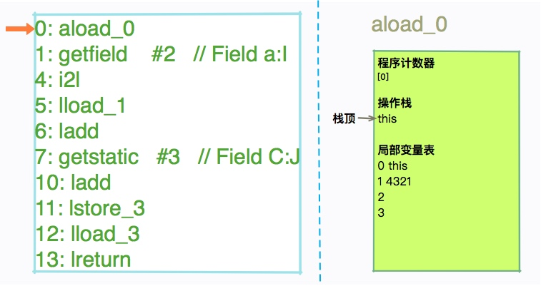

# 从栈帧看字节码是如何在JVM中进行流转的

在上一文章我们掌握了 JVM 的内存区域划分，以及 .class 文件的加载机制。也了解到很多初始化动作是在不同的阶段发生的。

但你可能仍对以下这些问题有疑问：

- 怎么查看字节码文件？
- 字节码文件长什么样子？
- 对象初始化之后，具体的字节码又是怎么执行的？

带着这些疑问，我们进入本文章的学习，本文章将带你动手实践，详细分析一个 Java 文件产生的字节码，并从栈帧层面看一下字节码的具体执行过程。

## 工具介绍

工欲善其事，必先利其器。在开始本文章的内容之前，先给你介绍两个分析字节码的小工具。

### javap

第一个小工具是 javap，javap 是 JDK 自带的反解析工具。它的作用是将 .class 字节码文件解析成可读的文件格式。我们在第一文章，就是用的它输出了 HelloWorld 的内容。

在使用 javap 时我一般会添加 -v 参数，尽量多打印一些信息。同时，我也会使用 -p 参数，打印一些私有的字段和方法。使用起来大概是这样：

```bash
javap -p -v HelloWorld
```

在 Stack Overflow 上有一个非常有意思的问题：我在某个类中增加一行注释之后，为什么两次生成的 .class 文件，它们的 MD5 是不一样的？

这是因为在 javac 中可以指定一些额外的内容输出到字节码。经常用的有

- javac -g:lines 强制生成 LineNumberTable。
- javac -g:vars  强制生成 LocalVariableTable。
- javac -g 生成所有的 debug 信息。

为了观察字节码的流转，我们本文章就会使用到这些参数。

### jclasslib

如果你不太习惯使用命令行的操作，还可以使用 jclasslib，jclasslib 是一个图形化的工具，能够更加直观的查看字节码中的内容。它还分门别类的对类中的各个部分进行了整理，非常的人性化。同时，它还提供了 Idea 的插件，你可以从 plugins 中搜索到它。

如果你在其中看不到一些诸如 LocalVariableTable 的信息，记得在编译代码的时候加上我们上面提到的这些参数。

jclasslib 的下载地址：[https://github.com/ingokegel/jclasslib](https://github.com/ingokegel/jclasslib)

## 类加载和对象创建的时机

接下来，我们来看一个稍微复杂的例子，来具体看一下类加载和对象创建的过程。

首先，我们写一个最简单的 Java 程序 A.java。它有一个公共方法 test，还有一个静态成员变量和动态成员变量。

```java
class B {
    private int a = 1234;

    static long C = 1111;

    public long test(long num) {
        long ret = this.a + num + C;
        return ret;
    }
}

public class A {
    private B b = new B();

    public static void main(String[] args) {
        A a = new A();
        long num = 4321 ;

        long ret = a.b.test(num);

        System.out.println(ret);
    }
}
```

前面我们提到，类的初始化发生在类加载阶段，那对象都有哪些创建方式呢？除了我们常用的 new，还有下面这些方式：

- 使用 Class 的 newInstance 方法。
- 使用 Constructor 类的 newInstance 方法。
- 反序列化。
- 使用 Object 的 clone 方法。

其中，后面两种方式没有调用到构造函数。

当虚拟机遇到一条 new 指令时，首先会检查这个指令的参数能否在常量池中定位一个符号引用。然后检查这个符号引用的类字节码是否加载、解析和初始化。如果没有，将执行对应的类加载过程。

拿我们上面的代码来说，执行 A 代码，在调用 private B b = new B() 时，就会触发 B 类的加载。



让我们结合上图回顾一下前面章节的内容。A 和 B 会被加载到元空间的方法区，进入 main 方法后，将会交给执行引擎执行。这个执行过程是在栈上完成的，其中有几个重要的区域，包括虚拟机栈、程序计数器等。接下来我们详细看一下虚拟机栈上的执行过程。

## 查看字节码

### 命令行查看字节码

使用下面的命令编译源代码 A.java。如果你用的是 Idea，可以直接将参数追加在 VM options 里面。

```bash
javac -g:lines -g:vars A.java
```

这将强制生成 LineNumberTable 和 LocalVariableTable。

然后使用 javap 命令查看 A 和 B 的字节码。

```bash
javap -p -v A
javap -p -v B
```

这个命令，不仅会输出行号、本地变量表信息、反编译汇编代码，还会输出当前类用到的常量池等信息。由于内容很长，这里就不具体展示了，你可以使用上面的命令实际操作一下就可以了。

注意 javap 中的如下字样。

- <1>

```bash
1: invokespecial #1   // Method java/lang/Object."<init>":()V
```

可以看到对象的初始化，首先是调用了 Object 类的初始化方法。注意这里是 `<init>` 而不是 `<cinit>`。

- <2>

```bash
#2 = Fieldref           #6.#27         // B.a:I
```

它其实直接拼接了 #13 和 #14 的内容。

```bash
#6 = Class             #29           // B
#27 = NameAndType       #8:#9         // a:I
...
#8 = Utf8               a
#9 = Utf8               I
```

- <3>

你会注意到 :I 这样特殊的字符。它们也是有意义的，如果你经常使用 jmap 这种命令，应该不会陌生。大体包括：

- B 基本类型 byte
- C 基本类型 char
- D 基本类型 double
- F 基本类型 float
- I 基本类型 int
- J 基本类型 long
- S 基本类型 short
- Z 基本类型 boolean
- V 特殊类型 void
- L 对象类型，以分号结尾，如 Ljava/lang/Object;
- [Ljava/lang/String; 数组类型，每一位使用一个前置的"["字符来描述

我们注意到 code 区域，有非常多的二进制指令。如果你接触过汇编语言，会发现它们之间其实有一定的相似性。但这些二进制指令，并不是操作系统能够认识的，它们是提供给 JVM 运行的源材料。

### 可视化查看字节码

接下来，我们就可以使用更加直观的工具 jclasslib，来查看字节码中的具体内容了。

我们以 B.class 文件为例，来查看它的内容。

首先，我们能够看到 Constant Pool（常量池），这些内容，就存放于我们的 Metaspace 区域，属于非堆。

#### 第一步


常量池包含 .class 文件常量池、运行时常量池、String 常量池等部分，大多是一些静态内容。

#### 第二步

接下来，可以看到两个默认的 `<init>`和 `<cinit>` 方法。以下截图是 test 方法的 code 区域，比命令行版的更加直观。


#### 第三步

继续往下看，我们看到了 LocalVariableTable 的三个变量。其中，slot 0 指向的是 this 关键字。该属性的作用是描述帧栈中局部变量与源码中定义的变量之间的关系。如果没有这些信息，那么在 IDE 中引用这个方法时，将无法获取到方法名，取而代之的则是 arg0 这样的变量名。


本地变量表的 slot 是可以复用的。注意一个有意思的地方，index 的最大值为 3，证明了本地变量表同时最多能够存放 4 个变量。

另外，我们观察到还有 LineNumberTable 等选项。该属性的作用是描述源码行号与字节码行号（字节码偏移量）之间的对应关系，有了这些信息，在 debug 时，就能够获取到发生异常的源代码行号。

#### test 函数执行过程

##### Code 区域介绍

test 函数同时使用了成员变量 a、静态变量 C，以及输入参数 num。我们此时说的函数执行，内存其实就是在虚拟机栈上分配的。下面这些内容，就是 test 方法的字节码。

```bash
public long test(long);
   descriptor: (J)J
   flags: ACC_PUBLIC
   Code:
     stack=4, locals=5, args_size=2
        0: aload_0
        1: getfield      #2                  // Field a:I
        4: i2l
        5: lload_1
        6: ladd
        7: getstatic     #3                  // Field C:J
       10: ladd
       11: lstore_3
       12: lload_3
       13: lreturn
     LineNumberTable:
       line 13: 0
       line 14: 12
     LocalVariableTable:
       Start  Length  Slot  Name   Signature
           0      14     0  this   LB;
           0      14     1   num   J
          12       2     3   ret   J
```

我们介绍一下比较重要的 3 三个数值。

- **stack**

首先，注意 stack 字样，它此时的数值为 4，表明了 test 方法的最大操作数栈深度为 4。JVM 运行时，会根据这个数值，来分配栈帧中操作栈的深度。

- **locals**

相对应的，locals 变量存储了局部变量的存储空间。它的单位是 Slot（槽），可以被重用。其中存放的内容，包括：

1. this
2. 方法参数
3. 异常处理器的参数
4. 方法体中定义的局部变量

- **arg_size**

args_size 就比较好理解。它指的是方法的参数个数，因为每个方法都有一个隐藏参数 this，所以这里的数字是 2。

## 字节码执行过程

我们稍微回顾一下 JVM 运行时的相关内容。main 线程会拥有两个主要的运行时区域：Java 虚拟机栈和程序计数器。其中，虚拟机栈中的每一项内容叫作栈帧，栈帧中包含四项内容：局部变量报表、操作数栈、动态链接和完成出口。

我们的字节码指令，就是靠操作这些数据结构运行的。下面我们看一下具体的字节码指令。



（1）0: aload_0

把第 1 个引用型局部变量推到操作数栈，这里的意思是把 this 装载到了操作数栈中。

对于 static 方法，aload_0 表示对方法的第一个参数的操作。



（2）1: getfield      #2

将栈顶的指定的对象的第 2 个实例域（Field）的值，压入栈顶。#2 就是指的我们的成员变量 a。

```bash
#2 = Fieldref           #6.#27         // B.a:I
...
#6 = Class             #29           // B
#27 = NameAndType       #8:#9         // a:I
```


（3）i2l

将栈顶 int 类型的数据转化为 long 类型，这里就涉及我们的隐式类型转换了。图中的信息没有变动，不再详解介绍。

（4）lload_1

将第一个局部变量入栈。也就是我们的参数 num。这里的 l 表示 long，同样用于局部变量装载。你会看到这个位置的局部变量，一开始就已经有值了。


（5）ladd

把栈顶两个 long 型数值出栈后相加，并将结果入栈。


（6）getstatic #3

根据偏移获取静态属性的值，并把这个值 push 到操作数栈上。


（7）ladd

再次执行 ladd。


（8）lstore_3

把栈顶 long 型数值存入第 4 个局部变量。

还记得我们上面的图么？slot 为 4，索引为 3 的就是 ret 变量。


（9）lload_3

正好与上面相反。上面是变量存入，我们现在要做的，就是把这个变量 ret，压入虚拟机栈中。


（10）lreturn

从当前方法返回 long。

到此为止，我们的函数就完成了相加动作，执行成功了。JVM 为我们提供了非常丰富的字节码指令。详细的字节码指令列表，可以参考以下网址：

[https://docs.oracle.com/javase/specs/jvms/se8/html/jvms-6.html](https://docs.oracle.com/javase/specs/jvms/se8/html/jvms-6.html)

### 注意点

注意上面的第 8 步，我们首先把变量存放到了变量报表，然后又拿出这个值，把它入栈。为什么会有这种多此一举的操作？原因就在于我们定义了 ret 变量。JVM 不知道后面还会不会用到这个变量，所以只好傻瓜式的顺序执行。

为了看到这些差异。大家可以把我们的程序稍微改动一下，直接返回这个值。

```java
public long test(long num) {
       return this.a + num + C;
}
```

再次看下，对应的字节码指令是不是简单了很多？

```bash
0: aload_0
1: getfield     #2                 // Field a:I
4: i2l
5: lload_1
6: ladd
7: getstatic     #3                 // Field C:J
10: ladd
11: lreturn
```

那我们以后编写程序时，是不是要尽量少的定义成员变量？

这是没有必要的。栈的操作复杂度是 O(1)，对我们的程序性能几乎没有影响。平常的代码编写，还是以可读性作为首要任务。

## 小结

本文章，我们学会了使用 javap 和 jclasslib 两个工具。平常工作中，掌握第一个就够了，后者主要为我们提供更加直观的展示。

我们从实际分析一段代码开始，详细介绍了几个字节码指令对程序计数器、局部变量表、操作数栈等内容的影响，初步接触了 Java 的字节码文件格式。

希望你能够建立起一个运行时的脉络，在看到相关的 opcode 时，能够举一反三的思考背后对这些数据结构的操作。这样理解的字节码指令，根本不会忘。

你还可以尝试着对 A 类的代码进行分析，我们这里先留下一个悬念。课程后面会详细介绍 JVM 在方法调用上的一些特点。
