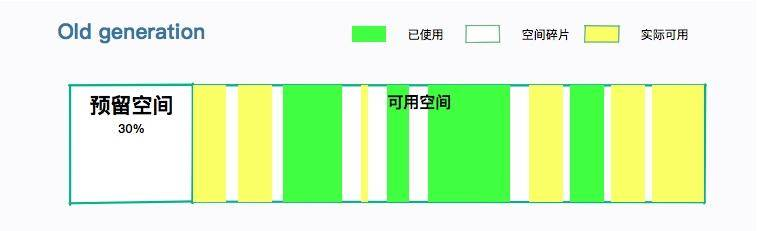

# 垃圾回收你真的了解吗（下）

由于上一文章篇幅比较多，我们在这一文章重点讲解上一文章中提到的 CMS 垃圾回收器，让你可以更好的理解垃圾回收的过程。

在这里首先给你介绍几个概念：

- Minor GC：发生在年轻代的 GC。
- Major GC：发生在老年代的 GC。
- Full GC：全堆垃圾回收。比如 Metaspace 区引起年轻代和老年代的回收。

理解了这三个概念，我们再往下看。

CMS 的全称是 Mostly Concurrent Mark and Sweep Garbage Collector（主要并发­标记­清除­垃圾收集器），它在年轻代使用复制算法，而对老年代使用标记-清除算法。你可以看到，在老年代阶段，比起 Mark-Sweep，它多了一个并发字样。

CMS 的设计目标，是避免在老年代 GC 时出现长时间的卡顿（但它并不是一个老年代回收器）。如果你不希望有长时间的停顿，同时你的 CPU 资源也比较丰富，使用 CMS 是比较合适的。

CMS 使用的是 Sweep 而不是 Compact，所以它的主要问题是碎片化。随着 JVM 的长时间运行，碎片化会越来越严重，只有通过 Full GC 才能完成整理。

为什么 CMS 能够获得更小的停顿时间呢？主要是因为它把最耗时的一些操作，做成了和应用线程并行。接下来我们简要看一下这个过程。

## CMS 回收过程

### 初始标记（Initial Mark）

初始标记阶段，只标记直接关联 GC root 的对象，不用向下追溯。因为最耗时的就在 tracing 阶段，这样就极大地缩短了初始标记时间。

这个过程是 STW 的，但由于只是标记第一层，所以速度是很快的。

注意，这里除了要标记相关的 GC Roots 之外，还要标记年轻代中对象的引用，这也是 CMS 老年代回收，依然要扫描新生代的原因。

### 并发标记（Concurrent Mark）

在初始标记的基础上，进行并发标记。这一步骤主要是 tracinng 的过程，用于标记所有可达的对象。

这个过程会持续比较长的时间，但却可以和用户线程并行。在这个阶段的执行过程中，可能会产生很多变化：

- 有些对象，从新生代晋升到了老年代；
- 有些对象，直接分配到了老年代；
- 老年代或者新生代的对象引用发生了变化。

还记得我们在上一文章提到的卡片标记么？在这个阶段受到影响的老年代对象所对应的卡页，会被标记为 dirty，用于后续重新标记阶段的扫描。

### 并发预清理（Concurrent Preclean）

并发预清理也是不需要 STW 的，目的是为了让重新标记阶段的 STW 尽可能短。这个时候，老年代中被标记为 dirty 的卡页中的对象，就会被重新标记，然后清除掉 dirty 的状态。

由于这个阶段也是可以并发的，在执行过程中引用关系依然会发生一些变化。我们可以假定这个清理动作是第一次清理。

所以重新标记阶段，有可能还会有处于 dirty 状态的卡页。

### 并发可取消的预清理（Concurrent Abortable Preclean）

因为重新标记是需要 STW 的，所以会有很多次预清理动作。并发可取消的预清理，顾名思义，在满足某些条件的时候，可以终止，比如迭代次数、有用工作量、消耗的系统时间等。

这个阶段是可选的。换句话说，这个阶段是“并发预清理”阶段的一种优化。

这个阶段的第一个意图，是避免回扫年轻代的大量对象；另外一个意图，就是当满足最终标记的条件时，自动退出。

我们在前面说过，标记动作是需要扫描年轻代的。如果年轻代的对象太多，肯定会严重影响标记的时间。如果在此之前能够进行一次 Minor GC，情况会不会变得好了许多？
CMS 提供了参数 CMSScavengeBeforeRemark，可以在进入重新标记之前强制进行一次 Minor GC。

但请你记住一件事情，GC 的停顿是不分什么年轻代老年代的。设置了上面的参数，可能会在一个比较长的 Minor GC 之后，紧跟着一个 CMS 的 Remark，它们都是 STW 的。

这部分有非常多的配置参数。但是一般都不会去改动。

### 最终标记（Final Remark）

通常 CMS 会尝试在年轻代尽可能空的情况下运行 Final Remark 阶段，以免接连多次发生 STW 事件。

这是 CMS 垃圾回收阶段的第二次 STW 阶段，目标是完成老年代中所有存活对象的标记。我们前面多轮的 preclean 阶段，一直在和应用线程玩追赶游戏，有可能跟不上引用的变化速度。本轮的标记动作就需要 STW 来处理这些情况。

如果预处理阶段做的不够好，会显著增加本阶段的 STW 时间。你可以看到，CMS 垃圾回收器把回收过程分了多个部分，而影响最大的不是 STW 阶段本身，而是它之前的预处理动作。

### 并发清除（Concurrent Sweep）

此阶段用户线程被重新激活，目标是删掉不可达的对象，并回收它们的空间。

由于 CMS 并发清理阶段用户线程还在运行中，伴随程序运行自然就还会有新的垃圾不断产生，这一部分垃圾出现在标记过程之后，CMS 无法在当次 GC 中处理掉它们，只好留待下一次 GC 时再清理掉。这一部分垃圾就称为“浮动垃圾”。

### 并发重置（Concurrent Reset）

此阶段与应用程序并发执行，重置 CMS 算法相关的内部数据，为下一次 GC 循环做准备。

## 内存碎片

由于 CMS 在执行过程中，用户线程还需要运行，那就需要保证有充足的内存空间供用户使用。如果等到老年代空间快满了，再开启这个回收过程，用户线程可能会产生“Concurrent Mode Failure”的错误，这时会临时启用 Serial Old 收集器来重新进行老年代的垃圾收集，这样停顿时间就很长了（STW）。

这部分空间预留，一般在 30% 左右即可，那么能用的大概只有 70%。参数 -XX:CMSInitiatingOccupancyFraction 用来配置这个比例（记得要首先开启参数UseCMSInitiatingOccupancyOnly）。也就是说，当老年代的使用率达到 70%，就会触发 GC 了。如果你的系统老年代增长不是太快，可以调高这个参数，降低内存回收的次数。

其实，这个比率非常不好设置。一般在堆大小小于 2GB 的时候，都不会考虑 CMS 垃圾回收器。

另外，CMS 对老年代回收的时候，并没有内存的整理阶段。这就造成程序在长时间运行之后，碎片太多。如果你申请一个稍大的对象，就会引起分配失败。

CMS 提供了两个参数来解决这个问题：

（1） UseCMSCompactAtFullCollection（默认开启），表示在要进行 Full GC 的时候，进行内存碎片整理。内存整理的过程是无法并发的，所以停顿时间会变长。

（2）CMSFullGCsBeforeCompaction，每隔多少次不压缩的 Full GC 后，执行一次带压缩的 Full GC。默认值为 0，表示每次进入 Full GC 时都进行碎片整理。

所以，预留空间加上内存的碎片，使用 CMS 垃圾回收器的老年代，留给我们的空间就不是太多，这也是 CMS 的一个弱点。

## 小结

一般的，我们将 CMS 垃圾回收器分为四个阶段：

- 初始标记
- 并发标记
- 重新标记
- 并发清理

我们总结一下 CMS 中都会有哪些停顿（STW）：

1. 初始标记，这部分的停顿时间较短；
2. Minor GC（可选），在预处理阶段对年轻代的回收，停顿由年轻代决定；
3. 重新标记，由于 preclaen 阶段的介入，这部分停顿也较短；
4. Serial-Old 收集老年代的停顿，主要发生在预留空间不足的情况下，时间会持续很长；
5. Full GC，永久代空间耗尽时的操作，由于会有整理阶段，持续时间较长。

在发生 GC 问题时，你一定要明确发生在哪个阶段，然后对症下药。gclog 通常能够非常详细的表现这个过程。

我们再来看一下 CMS 的 trade-off。

- 优势：

低延迟，尤其对于大堆来说。大部分垃圾回收过程并发执行。

- 劣势：
  - 内存碎片问题。Full GC 的整理阶段，会造成较长时间的停顿。
  - 需要预留空间，用来分配收集阶段产生的“浮动垃圾”。
  - 使用更多的 CPU 资源，在应用运行的同时进行堆扫描。

CMS 是一种高度可配置的复杂算法，因此给 JDK 中的 GC 代码库带来了很多复杂性。由于 G1 和 ZGC 的产生，CMS 已经在被废弃的路上。但是，目前仍然有大部分应用是运行在 Java8 及以下的版本之上，针对它的优化，还是要持续很长一段时间。
