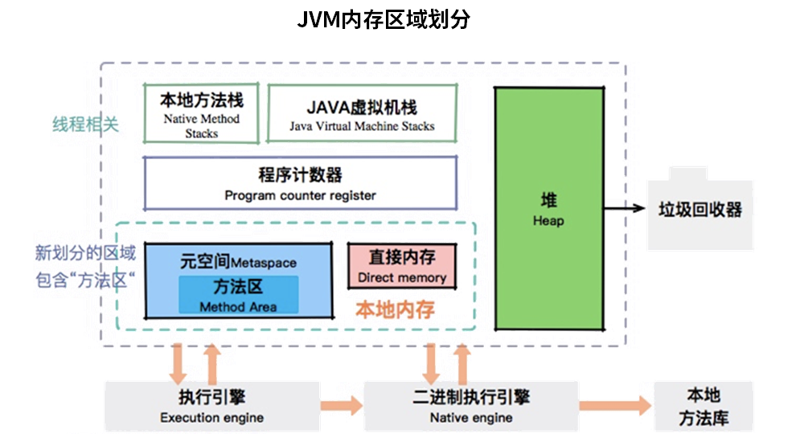
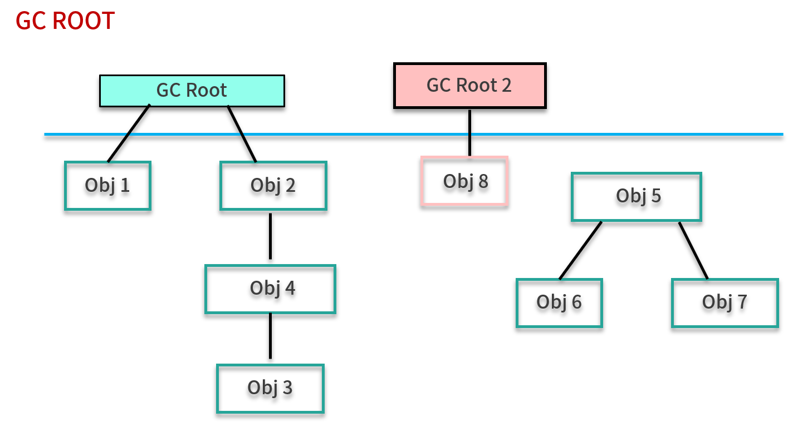
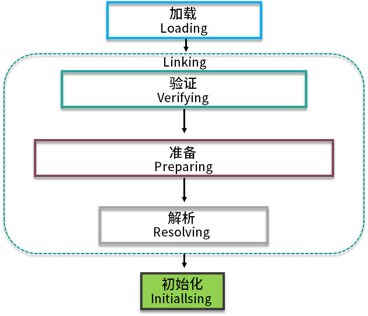

# 常见 JVM 面试题补充

## 对象在哪里分配

数组和对象是堆上分配，但是由于 JIT 的存在，如果发现某些对象没有逃逸出方法，那么就有可能被优化成了栈上分配。

## JVM 有哪些内存区域？（JVM 的内存布局是什么？）

JVM 包含堆、元空间、Java 虚拟机栈、本地方法栈、程序计数器等内存区域，其中，堆是占用内存最大的一块，如下图所示。



## Java 的内存模型是什么？（JMM 是什么？）

JVM 试图定义一种统一的内存模型，能将各种底层硬件以及操作系统的内存访问差异进行封装，使 Java 程序在不同硬件以及操作系统上都能达到相同的并发效果。它分为工作内存和主内存，线程无法对主存储器直接进行操作，如果一个线程要和另外一个线程通信，那么只能通过主存进行交换，如下图所示。


## JVM 垃圾回收时如何确定垃圾？什么是 GC Roots

JVM 采用的是可达性分析算法。JVM 是通过 GC Roots 来判定对象存活的，从 GC Roots 向下追溯、搜索，会产生一个叫做 Reference Chain 的链条。当一个对象不能和任何一个 GC Root 产生关系时，就判定为垃圾，如下图所示。



GC Roots 大体包括：

- 活动线程相关的各种引用，比如虚拟机栈中 栈帧里的引用；
- 类的静态变量引用；
- JNI 引用等。

## 能够找到 Reference Chain 的对象，就一定会存活么

不一定，还要看 Reference 类型，弱引用在 GC 时会被回收，软引用在内存不足的时候会被回收，但如果没有 Reference Chain 对象时，就一定会被回收。

## 强引用、软引用、弱引用、虚引用是什么

普通的对象引用关系就是强引用。

软引用用于维护一些可有可无的对象。只有在内存不足时，系统则会回收软引用对象，如果回收了软引用对象之后仍然没有足够的内存，才会抛出内存溢出异常。

弱引用对象相比软引用来说，要更加无用一些，它拥有更短的生命周期，当 JVM 进行垃圾回收时，无论内存是否充足，都会回收被弱引用关联的对象。

虚引用是一种形同虚设的引用，在现实场景中用的不是很多，它主要用来跟踪对象被垃圾回收的活动。

## 你说你做过 JVM 参数调优和参数配置，请问如何查看 JVM 系统默认值

使用 -XX:+PrintFlagsFinal 参数可以看到参数的默认值，这个默认值还和垃圾回收器有关，比如 UseAdaptiveSizePolicy。

## 你平时工作中用过的 JVM 常用基本配置参数有哪些

主要有 Xmx、Xms、Xmn、MetaspaceSize 等。

你只需要记忆 10 个左右即可，建议记忆 G1 相关的参数。面试时间有限，不会在这上面纠结，除非你表现的太嚣张了。

## 请你谈谈对 OOM 的认识

OOM 是非常严重的问题，除了程序计数器，其他内存区域都有溢出的风险。和我们平常工作最密切的，就是堆溢出，另外，元空间在加载的类非常多的情况下也会溢出，还有就是栈溢出，这个通常影响比较小。堆外也有溢出的可能，这个就比较难排查了。

## 你都有哪些手段用来排查内存溢出

这个话题很大，可以从实践环节中随便摘一个进行总结，下面举一个最普通的例子。

内存溢出包含很多种情况，我在平常工作中遇到最多的就是堆溢出。有一次线上遇到故障，重新启动后，使用 jstat 命令，发现 Old 区一直在增长。我使用 jmap 命令，导出了一份线上堆栈，然后使用 MAT 进行分析，通过对 GC Roots 的分析，发现了一个非常大的 HashMap 对象，这个原本是其他同事做缓存用的，但是一个无界缓存，造成了堆内存占用一直上升，后来，将这个缓存改成 guava 的 Cache，并设置了弱引用，故障就消失了。

## GC 垃圾回收算法与垃圾收集器的关系

常用的垃圾回收算法有标记清除、标记整理、复制算法等，引用计数器也算是一种，但垃圾回收器不使用这种算法，因为有循环依赖的问题。


很多垃圾回收器都是分代回收的：

- 对于年轻代，主要有 Serial、ParNew 等垃圾回收器，回收过程主要使用复制算法。
- 老年代的回收算法有 Serial、CMS 等，主要使用标记清除、标记整理算法等。

我们线上使用较多的是 G1，也有年轻代和老年代的概念，不过它是一个整堆回收器，它的回收对象是小堆区 。

## 生产上如何配置垃圾收集器


首先是内存大小问题，基本上每一个内存区域我都会设置一个上限，来避免溢出问题，比如元空间。通常，堆空间我会设置成操作系统的 2/3，超过 8GB 的堆，优先选用 G1。

然后我会对 JVM 进行初步优化，比如根据老年代的对象提升速度，来调整年轻代和老年代之间的比例。

接下来是专项优化，判断的主要依据是系统容量、访问延迟、吞吐量等，我们的服务是高并发的，所以对 STW 的时间非常敏感。

我会通过记录详细的 GC 日志，来找到这个瓶颈点，借用 GCeasy 这样的日志分析工具，很容易定位到问题。

## 怎么查看服务器默认的垃圾回收器是哪一个

这通常会使用另外一个参数，即 -XX:+PrintCommandLineFlags，来打印所有的参数，包括使用的垃圾回收器。

## 对于 JDK 自带的监控和性能分析工具用过哪些

- jps：用来显示 Java 进程；
- jstat：用来查看 GC；
- jmap：用来 dump 堆；
- jstack：用来 dump 栈；
- jhsdb：用来查看执行中的内存信息；

## 栈帧都有哪些数据

栈帧包含：局部变量表、操作数栈、动态连接、返回地址等。

## JIT 是什么

为了提高热点代码的执行效率，在运行时，虚拟机将会把这些代码编译成与本地平台相关的机器码，并进行各种层次的优化，完成这个任务的编译器，就称为即时编译器（Just In Time Compiler），简称 JIT 编译器。

## Java 的双亲委托机制是什么


双亲委托的意思是，除了顶层的启动类加载器以外，其余的类加载器，在加载之前，都会委派给它的父加载器进行加载，这样一层层向上传递，直到祖先们都无法胜任，它才会真正的加载，Java 默认是这种行为。

## 有哪些打破了双亲委托机制的案例

- Tomcat 可以加载自己目录下的 class 文件，并不会传递给父类的加载器；
- Java 的 SPI，发起者是 BootstrapClassLoader，BootstrapClassLoader 已经是最上层了，它直接获取了 AppClassLoader 进行驱动加载，和双亲委派是相反的。

## 简单描述一下（分代）垃圾回收的过程


分代回收器有两个分区：老生代和新生代，新生代默认的空间占总空间的 1/3，老生代的默认占比是 2/3。

新生代使用的是复制算法，新生代里有 3 个分区：Eden、To Survivor、From Survivor，它们的默认占比是 8:1:1。

当年轻代中的 Eden 区分配满的时候，就会触发年轻代的 GC（Minor GC），具体过程如下：

- 在 Eden 区执行了第一次 GC 之后，存活的对象会被移动到其中一个 Survivor 分区（以下简称 from）；
- Eden 区再次 GC，这时会采用复制算法，将 Eden 和 from 区一起清理，存活的对象会被复制到 to 区，接下来，只要清空 from 区就可以了。

## CMS 分为哪几个阶段

- 初始标记
- 并发标记
- 并发预清理
- 并发可取消的预清理
- 重新标记
- 并发清理

由于《深入理解 Java 虚拟机》一书的流行，面试时省略并发清理、并发可取消的预清理这两个阶段，一般也是没问题的。

## CMS 都有哪些问题

- 内存碎片问题，Full GC 的整理阶段，会造成较长时间的停顿；
- 需要预留空间，用来分配收集阶段产生的“浮动垃圾”；
- 使用更多的 CPU 资源，在应用运行的同时进行堆扫描；
- 停顿时间是不可预期的。

## 你使用过 G1 垃圾回收器的哪几个重要参数


最重要的是 MaxGCPauseMillis，可以通过它设定 G1 的目标停顿时间，它会尽量去达成这个目标。G1HeapRegionSize 可以设置小堆区的大小，一般是 2 的次幂。InitiatingHeapOccupancyPercent 启动并发 GC 时的堆内存占用百分比，G1 用它来触发并发 GC 周期，基于整个堆的使用率，而不只是某一代内存的使用比例，默认是 45%。

## GC 日志的 real、user、sys 是什么意思

- real 指的是从开始到结束所花费的时间，比如进程在等待 I/O 完成，这个阻塞时间也会被计算在内。
- user 指的是进程在用户态（User Mode）所花费的时间，只统计本进程所使用的时间，是指多核。
- sys  指的是进程在核心态（Kernel Mode）所花费的 CPU 时间量，即内核中的系统调用所花费的时间，只统计本进程所使用的时间。

## 什么情况会造成元空间溢出

元空间默认是没有上限的，不加限制比较危险。当应用中的 Java 类过多时，比如 Spring 等一些使用动态代理的框架生成了很多类，如果占用空间超出了我们的设定值，就会发生元空间溢出。

## 什么时候会造成堆外内存溢出

使用了 Unsafe 类申请内存，或者使用了 JNI 对内存进行操作，这部分内存是不受 JVM 控制的，不加限制使用的话，会很容易发生内存溢出。

## SWAP 会影响性能么

当操作系统内存不足时，会将部分数据写入到 SWAP ，但是 SWAP 的性能是比较低的。如果应用的访问量较大，需要频繁申请和销毁内存，那么很容易发生卡顿。一般在高并发场景下，会禁用 SWAP。

## 有什么堆外内存的排查思路

进程占用的内存，可以使用 top 命令，看 RES 段占用的值，如果这个值大大超出我们设定的最大堆内存，则证明堆外内存占用了很大的区域。

使用 gdb 命令可以将物理内存 dump 下来，通常能看到里面的内容。更加复杂的分析可以使用 Perf 工具，或者谷歌开源的 GPerftools。那些申请内存最多的 native 函数，就很容易找到。

## HashMap 中的 key，可以是普通对象么？有什么需要注意的地方

Map 的 key 和 value 可以是任何类型，但要注意的是，一定要重写它的 equals 和 hashCode 方法，否则容易发生内存泄漏。

## 怎么看死锁的线程

通过 jstack 命令，可以获得线程的栈信息，死锁信息会在非常明显的位置（一般是最后）进行提示。

## 如何写一段简单的死锁代码

```java
/**
 * 描述：     必定死锁的情况
 */
public class MustDeadLock implements Runnable {

    public int flag;
    static Object o1 = new Object();
    static Object o2 = new Object();

    public void run() {
        System.out.println("线程"+Thread.currentThread().getName() + "的flag为" + flag);
        if (flag == 1) {
            synchronized (o1) {
                try {
                    Thread.sleep(500);
                } catch (Exception e) {
                    e.printStackTrace();
                }
                synchronized (o2) {
                    System.out.println("线程1获得了两把锁");
                }
            }
        }
        if (flag == 2) {
            synchronized (o2) {
                try {
                    Thread.sleep(500);
                } catch (Exception e) {
                    e.printStackTrace();
                }
                synchronized (o1) {
                    System.out.println("线程2获得了两把锁");
                }
            }
        }
    }

    public static void main(String[] argv) {
        MustDeadLock r1 = new MustDeadLock();
        MustDeadLock r2 = new MustDeadLock();
        r1.flag = 1;
        r2.flag = 2;
        Thread t1 = new Thread(r1, "t1");
        Thread t2 = new Thread(r2, "t2");
        t1.start();
        t2.start();
    }
}
```

## invokedynamic 指令是干什么的

invokedynamic 是 Java 7 版本之后新加入的字节码指令，使用它可以实现一些动态类型语言的功能。我们使用的 Lambda 表达式，在字节码上就是 invokedynamic 指令实现的，它的功能有点类似反射，但它是使用方法句柄实现的，执行效率更高。

## volatile 关键字的原理是什么？有什么作用

使用了 volatile 关键字的变量，每当变量的值有变动的时候，都会将更改立即同步到主内存中；而如果某个线程想要使用这个变量，就先要从主存中刷新到工作内存，这样就确保了变量的可见性。

## 什么是方法内联

为了减少方法调用的开销，可以把一些短小的方法，比如 getter/setter，纳入到目标方法的调用范围之内，这样就少了一次方法调用，速度就能得到提升，这就是方法内联的概念。

## 对象是怎么从年轻代进入老年代的

下面 4 种情况下，对象会从年轻代进入到老年代。

- 如果对象够老，则会通过提升（Promotion）的方式进入老年代，一般根据对象的年龄进行判断。
- 动态对象年龄判定，有的垃圾回收算法，比如 G1，并不要求 age 必须达到 15 才能晋升到老年代，它会使用一些动态的计算方法。
- 分配担保，当 Survivor 空间不够的时候，则需要依赖其他内存（指老年代）进行分配担保，这个时候，对象也会直接在老年代上分配。
- 超出某个大小的对象将直接在老年代上分配，不过这个值默认为 0，意思是全部首选 Eden 区进行分配。

## safepoint 是什么

当发生 GC 时，用户线程必须全部停下来，才可以进行垃圾回收，这个状态我们可以认为 JVM 是安全的（safe），整个堆的状态是稳定的。如果在 GC 前，有线程迟迟进入不了 safepoint，那么整个 JVM 都在等待这个阻塞的线程，造成了整体 GC 的时间变长。

## MinorGC、MajorGC、FullGC 都什么时候发生

MinorGC 在年轻代空间不足的时候发生，MajorGC 指的是老年代的 GC，出现 MajorGC 一般经常伴有 MinorGC。

FullGC 有三种情况：第一，当老年代无法再分配内存的时候；第二，元空间不足的时候；第三，显示调用 System.gc 的时候。另外，像 CMS 一类的垃圾回收器，在 MinorGC 出现 promotion failure 的时候也会发生 FullGC。

## 类加载有几个过程



加载、验证、准备、解析、初始化。

## 什么情况下会发生栈溢出

栈的大小可以通过 -Xss 参数进行设置，当递归层次太深的时候，则会发生栈溢出。
