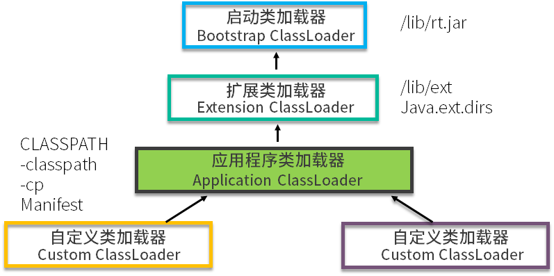

# 类的加载机制

本文章我们主要从覆盖 JDK 的类开始讲解 JVM 的类加载机制。其实，JVM 的类加载机制和 Java 的类加载机制类似，但 JVM 的类加载过程稍有些复杂。

前面文章我们讲到，JVM 通过加载 .class 文件，能够将其中的字节码解析成操作系统机器码。那这些文件是怎么加载进来的呢？又有哪些约定？接下来我们就详细介绍 JVM 的类加载机制，同时介绍三个实际的应用场景。

我们首先看几个面试题。

- 我们能够通过一定的手段，覆盖 HashMap 类的实现么？
- 有哪些地方打破了 Java 的类加载机制？
- 如何加载一个远程的 .class 文件？怎样加密 .class 文件？

关于类加载，很多同学都知道双亲委派机制，但这明显不够。面试官可能要你讲出几个能打破这个机制的例子，这个时候不要慌。上面几个问题，是我在接触的一些比较高级的面试场景中，遇到的一些问法。在平常的工作中，也有大量的相关应用，我们会理论联系实践综合分析这些问题。

## 类加载过程

现实中并不是说，我把一个文件修改成 .class 后缀，就能够被 JVM 识别。类的加载过程非常复杂，主要有这几个过程：加载、验证、准备、解析、初始化。这些术语很多地方都出现过，我们不需要死记硬背，而应该要了解它背后的原理和要做的事情。


如图所示。大多数情况下，类会按照图中给出的顺序进行加载。下面我们就来分别介绍下这个过程。

### 加载

加载的主要作用是将外部的 .class 文件，加载到 Java 的方法区内，你可以回顾一下我们在上一篇文章讲的内存区域图。加载阶段主要是找到并加载类的二进制数据，比如从 jar 包里或者 war 包里找到它们。

### 验证

肯定不能任何 .class 文件都能加载，那样太不安全了，容易受到恶意代码的攻击。验证阶段在虚拟机整个类加载过程中占了很大一部分，不符合规范的将抛出 java.lang.VerifyError 错误。像一些低版本的 JVM，是无法加载一些高版本的类库的，就是在这个阶段完成的。

### 准备

从这部分开始，将为一些类变量分配内存，并将其初始化为默认值。此时，实例对象还没有分配内存，所以这些动作是在方法区上进行的。

我们顺便看一道面试题。下面两段代码，code-snippet 1 将会输出 0，而 code-snippet 2 将无法通过编译。

```java
code-snippet 1：
     public class A {
         static int a ;
         public static void main(String[] args) {
             System.out.println(a);
         }
     }
 code-snippet 2：
 public class A {
     public static void main(String[] args) {
         int a ;
         System.out.println(a);
     }
 }
```

为什么会有这种区别呢？

这是因为局部变量不像类变量那样存在准备阶段。类变量有两次赋初始值的过程，一次在准备阶段，赋予初始值（也可以是指定值）；另外一次在初始化阶段，赋予程序员定义的值。

因此，即使程序员没有为类变量赋值也没有关系，它仍然有一个默认的初始值。但局部变量就不一样了，如果没有给它赋初始值，是不能使用的。

### 解析

解析在类加载中是非常非常重要的一环，是将符号引用替换为直接引用的过程。这句话非常的拗口，其实理解起来也非常的简单。

符号引用是一种定义，可以是任何字面上的含义，而直接引用就是直接指向目标的指针、相对偏移量。

直接引用的对象都存在于内存中，你可以把通讯录里的女友手机号码，类比为符号引用，把面对面和你吃饭的人，类比为直接引用。

解析阶段负责把整个类激活，串成一个可以找到彼此的网，过程不可谓不重要。那这个阶段都做了哪些工作呢？大体可以分为：

- 类或接口的解析
- 类方法解析
- 接口方法解析
- 字段解析

我们来看几个经常发生的异常，就与这个阶段有关。

- java.lang.NoSuchFieldError 根据继承关系从下往上，找不到相关字段时的报错。
- java.lang.IllegalAccessError 字段或者方法，访问权限不具备时的错误。
- java.lang.NoSuchMethodError 找不到相关方法时的错误。

解析过程保证了相互引用的完整性，把继承与组合推进到运行时。

### 初始化

如果前面的流程一切顺利的话，接下来该初始化成员变量了，到了这一步，才真正开始执行一些字节码。

接下来是另一道面试题，你可以猜想一下，下面的代码，会输出什么？

```java
public class A {
     static int a = 0 ;
     static {
         a = 1;
         b = 1;
     }
     static int b = 0;

     public static void main(String[] args) {
         System.out.println(a);
         System.out.println(b);
     }
 }
```

结果是 1 0。a 和 b 唯一的区别就是它们的 static 代码块的位置。

这就引出一个规则：static 语句块，只能访问到定义在 static 语句块之前的变量。所以下面的代码是无法通过编译的。

```java
static {
         b = b + 1;
 }
 static int b = 0;
```

我们再来看第二个规则：JVM 会保证在子类的初始化方法执行之前，父类的初始化方法已经执行完毕。

所以，JVM 第一个被执行的类初始化方法一定是 java.lang.Object。另外，也意味着父类中定义的 static 语句块要优先于子类的。

#### `<clinit>与<init>`

说到这里，不得不再说一个面试题：`<clinit>` 方法和 `<init>`方法有什么区别？

主要是为了让你弄明白类的初始化和对象的初始化之间的差别。

```java
public class A {
     static {
         System.out.println("1");
     }
     public A(){
         System.out.println("2");
         }
     }

     public class B extends A {
         static{
         System.out.println("a");
     }
     public B(){
         System.out.println("b");
     }

     public static void main(String[] args){
         A ab = new B();
         ab = new B();
     }
 }
```

先公布下答案：

```java
1
a
2
b
2
b
```

你可以看下这张图。其中 static 字段和 static 代码块，是属于类的，在类的加载的初始化阶段就已经被执行。类信息会被存放在方法区，在同一个类加载器下，这些信息有一份就够了，所以上面的 static 代码块只会执行一次，它对应的是 `<clinit>` 方法。

而对象初始化就不一样了。通常，我们在 new 一个新对象的时候，都会调用它的构造方法，就是 `<init>`，用来初始化对象的属性。每次新建对象的时候，都会执行。


所以，上面代码的 static 代码块只会执行一次，对象的构造方法执行两次。再加上继承关系的先后原则，不难分析出正确结果。

## 类加载器

整个类加载过程任务非常繁重，虽然这活儿很累，但总得有人干。类加载器做的就是上面 5 个步骤的事。

如果你在项目代码里，写一个 java.lang 的包，然后改写 String 类的一些行为，编译后，发现并不能生效。JRE 的类当然不能轻易被覆盖，否则会被别有用心的人利用，这就太危险了。

那类加载器是如何保证这个过程的安全性呢？其实，它是有着严格的等级制度的。

### 几个类加载器

首先，我们介绍几个不同等级的类加载器。

- Bootstrap ClassLoader

这是加载器中的大 Boss，任何类的加载行为，都要经它过问。它的作用是加载核心类库，也就是 rt.jar、resources.jar、charsets.jar 等。当然这些 jar 包的路径是可以指定的，-Xbootclasspath 参数可以完成指定操作。

这个加载器是 C++ 编写的，随着 JVM 启动。

- Extention ClassLoader

扩展类加载器，主要用于加载 lib/ext 目录下的 jar 包和 .class 文件。同样的，通过系统变量 java.ext.dirs 可以指定这个目录。

这个加载器是个 Java 类，继承自 URLClassLoader。

- App ClassLoader

这是我们写的 Java 类的默认加载器，有时候也叫作 System ClassLoader。一般用来加载 classpath 下的其他所有 jar 包和 .class 文件，我们写的代码，会首先尝试使用这个类加载器进行加载。

- Custom ClassLoader

自定义加载器，支持一些个性化的扩展功能。

## 双亲委派机制

关于双亲委派机制的问题面试中经常会被问到，你可能已经倒背如流了。

双亲委派机制的意思是除了顶层的启动类加载器以外，其余的类加载器，在加载之前，都会委派给它的父加载器进行加载。这样一层层向上传递，直到祖先们都无法胜任，它才会真正的加载。

打个比方。有一个家族，都是一些听话的孩子。孙子想要买一块棒棒糖，最终都要经过爷爷过问，如果力所能及，爷爷就直接帮孙子买了。

但你有没有想过，“类加载的双亲委派机制，双亲在哪里？明明都是单亲？”

我们还是用一张图来讲解。可以看到，除了启动类加载器，每一个加载器都有一个parent，并没有所谓的双亲。但是由于翻译的问题，这个叫法已经非常普遍了，一定要注意背后的差别。



我们可以翻阅 JDK 代码的 ClassLoader#loadClass 方法，来看一下具体的加载过程。和我们描述的一样，它首先使用 parent 尝试进行类加载，parent 失败后才轮到自己。同时，我们也注意到，这个方法是可以被覆盖的，也就是双亲委派机制并不一定生效。


这个模型的好处在于 Java 类有了一种优先级的层次划分关系。比如 Object 类，这个毫无疑问应该交给最上层的加载器进行加载，即使是你覆盖了它，最终也是由系统默认的加载器进行加载的。

如果没有双亲委派模型，就会出现很多个不同的 Object 类，应用程序会一片混乱。

### 一些自定义加载器

下面我们就来聊一聊可以打破双亲委派机制的一些案例。为了支持一些自定义加载类多功能的需求，Java 设计者其实已经作出了一些妥协。

#### 案例一：tomcat

tomcat 通过 war 包进行应用的发布，它其实是违反了双亲委派机制原则的。简单看一下 tomcat 类加载器的层次结构。


对于一些需要加载的非基础类，会由一个叫作 WebAppClassLoader 的类加载器优先加载。等它加载不到的时候，再交给上层的 ClassLoader 进行加载。这个加载器用来隔绝不同应用的 .class 文件，比如你的两个应用，可能会依赖同一个第三方的不同版本，它们是相互没有影响的。

如何在同一个 JVM 里，运行着不兼容的两个版本，当然是需要自定义加载器才能完成的事。

那么 tomcat 是怎么打破双亲委派机制的呢？可以看图中的 WebAppClassLoader，它加载自己目录下的 .class 文件，并不会传递给父类的加载器。但是，它却可以使用 SharedClassLoader 所加载的类，实现了共享和分离的功能。

但是你自己写一个 ArrayList，放在应用目录里，tomcat 依然不会加载。它只是自定义的加载器顺序不同，但对于顶层来说，还是一样的。

#### 案例二：SPI

Java 中有一个 SPI 机制，全称是 Service Provider Interface，是 Java 提供的一套用来被第三方实现或者扩展的 API，它可以用来启用框架扩展和替换组件。

这个说法可能比较晦涩，但是拿我们常用的数据库驱动加载来说，就比较好理解了。在使用 JDBC 写程序之前，通常会调用下面这行代码，用于加载所需要的驱动类。

```java
Class.forName("com.mysql.jdbc.Driver")
```

这只是一种初始化模式，通过 static 代码块显式地声明了驱动对象，然后把这些信息，保存到底层的一个 List 中。这种方式我们不做过多的介绍，因为这明显就是一个接口编程的思路，没什么好奇怪的。

但是你会发现，即使删除了 Class.forName 这一行代码，也能加载到正确的驱动类，什么都不需要做，非常的神奇，它是怎么做到的呢？

我们翻开 MySQL 的驱动代码，发现了一个奇怪的文件。之所以能够发生这样神奇的事情，就是在这里实现的。

路径：

```java
mysql-connector-java-8.0.15.jar!/META-INF/services/java.sql.Driver
```

里面的内容是：

```java
com.mysql.cj.jdbc.Driver
```

通过在 META-INF/services 目录下，创建一个以接口全限定名为命名的文件（内容为实现类的全限定名），即可自动加载这一种实现，这就是 SPI。

SPI 实际上是“基于接口的编程＋策略模式＋配置文件”组合实现的动态加载机制，主要使用 java.util.ServiceLoader 类进行动态装载。


这种方式，同样打破了双亲委派的机制。

DriverManager 类和 ServiceLoader 类都是属于 rt.jar 的。它们的类加载器是 Bootstrap ClassLoader，也就是最上层的那个。而具体的数据库驱动，却属于业务代码，这个启动类加载器是无法加载的。这就比较尴尬了，虽然凡事都要祖先过问，但祖先没有能力去做这件事情，怎么办？

我们可以一步步跟踪代码，来看一下这个过程。

```java
//part1:DriverManager::loadInitialDrivers
  //jdk1.8 之后，变成了lazy的ensureDriversInitialized
  ...
  ServiceLoader <Driver> loadedDrivers = ServiceLoader.load(Driver.class);
  Iterator<Driver> driversIterator = loadedDrivers.iterator();
  ...

  //part2:ServiceLoader::load
  public static <T> ServiceLoader<T> load(Class<T> service) {
      ClassLoader cl = Thread.currentThread().getContextClassLoader();
      return ServiceLoader.load(service, cl);
  }
```

通过代码你可以发现 Java 玩了个魔术，它把当前的类加载器，设置成了线程的上下文类加载器。那么，对于一个刚刚启动的应用程序来说，它当前的加载器是谁呢？也就是说，启动 main 方法的那个加载器，到底是哪一个？

所以我们继续跟踪代码。找到 Launcher 类，就是 jre 中用于启动入口函数 main 的类。我们在 Launcher 中找到以下代码。

```java
public Launcher() {
 Launcher.ExtClassLoader var1;
 try {
     var1 = Launcher.ExtClassLoader.getExtClassLoader();
 } catch (IOException var10) {
     throw new InternalError("Could not create extension class loader", var10);
 }

 try {
     this.loader = Launcher.AppClassLoader.getAppClassLoader(var1);
 } catch (IOException var9) {
     throw new InternalError("Could not create application class loader", var9);
 }
 Thread.currentThread().setContextClassLoader(this.loader);
 ...
 }
```

到此为止，事情就比较明朗了，当前线程上下文的类加载器，是应用程序类加载器。使用它来加载第三方驱动，是没有什么问题的。

我们之所以花大量的篇幅来介绍这个过程，第一，可以让你更好的看到一个打破规则的案例。第二，这个问题面试时出现的几率也是比较高的，你需要好好理解。

#### 案例三：OSGi

OSGi 曾经非常流行，Eclipse 就使用 OSGi 作为插件系统的基础。OSGi 是服务平台的规范，旨在用于需要长运行时间、动态更新和对运行环境破坏最小的系统。

OSGi 规范定义了很多关于包生命周期，以及基础架构和绑定包的交互方式。这些规则，通过使用特殊 Java 类加载器来强制执行，比较霸道。

比如，在一般 Java 应用程序中，classpath 中的所有类都对所有其他类可见，这是毋庸置疑的。但是，OSGi 类加载器基于 OSGi 规范和每个绑定包的 manifest.mf 文件中指定的选项，来限制这些类的交互，这就让编程风格变得非常的怪异。但我们不难想象，这种与直觉相违背的加载方式，肯定是由专用的类加载器来实现的。

随着 jigsaw 的发展（旨在为 Java SE 平台设计、实现一个标准的模块系统），我个人认为，现在的 OSGi，意义已经不是很大了。OSGi 是一个庞大的话题，你只需要知道，有这么一个复杂的东西，实现了模块化，每个模块可以独立安装、启动、停止、卸载，就可以了。

不过，如果你有机会接触相关方面的工作，也许会不由的发出感叹：原来 Java 的类加载器，可以玩出这么多花样。

## 如何替换 JDK 的类

让我们回到本文章开始的问题，如何替换 JDK 中的类？比如，我们现在就拿 HashMap为例。

当 Java 的原生 API 不能满足需求时，比如我们要修改 HashMap 类，就必须要使用到 Java 的 endorsed 技术。我们需要将自己的 HashMap 类，打包成一个 jar 包，然后放到 -Djava.endorsed.dirs 指定的目录中。注意类名和包名，应该和 JDK 自带的是一样的。但是，java.lang 包下面的类除外，因为这些都是特殊保护的。

因为我们上面提到的双亲委派机制，是无法直接在应用中替换 JDK 的原生类的。但是，有时候又不得不进行一下增强、替换，比如你想要调试一段代码，或者比 Java 团队早发现了一个 Bug。所以，Java 提供了 endorsed 技术，用于替换这些类。这个目录下的 jar 包，会比 rt.jar 中的文件，优先级更高，可以被最先加载到。

## 小结

通过本文章的学习我们可以了解到，一个 Java 类的加载，经过了加载、验证、准备、解析、初始化几个过程，每一个过程都划清了各自负责的事情。

接下来，我们了解到 Java 自带的三个类加载器。同时了解到，main 方法的线程上下文加载器，其实是 Application ClassLoader。

一般情况下，类加载是遵循双亲委派机制的。我们也认识到，这个双亲，很有问题。通过 3 个案例的学习和介绍，可以看到有很多打破这个规则的情况。类加载器通过开放的 API，让加载过程更加灵活。

Java 的类加载器是非常重要的知识点，也是面试常考的知识点，本文章提供了多个面试题，你可以实际操作体验一下。

所以我们在文章开始时的第三个问题就很简单了，无论是远程存储字节码，还是将字节码进行加密，这都是业务需求。要做这些，我们实现一个新的类加载器就可以了。
