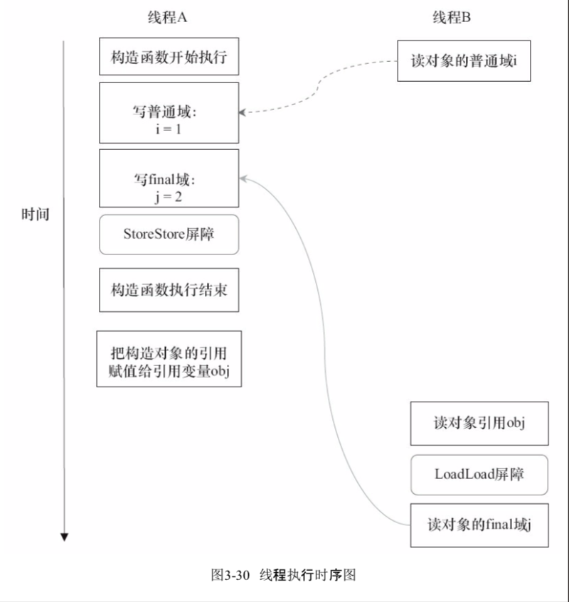
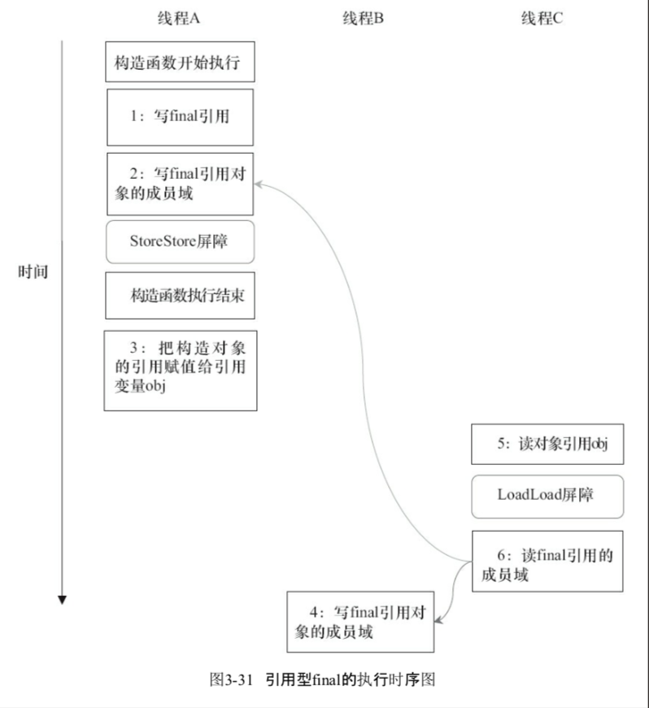

# final 域的内存语义

对于 final 域，编译器和处理器要遵守两个重排序规则。

- 在构造函数内对一个 final 域的写入，与随后把这个被构造对象的引用赋值给一个引用变量，这两个操作之间不能重排序。
- 初次读一个包含 final 域的对象的引用，与随后初次读这个 final 域，这两个操作之间不能重排序。

下面通过一些示例性的代码来分别说明这两个规则。

```java
public class FinalExample {
    int i;　　　　　　　　　　// 普通变量
    final int j;　　　　　　　　// final变量
    static FinalExample obj;
    public FinalExample () {　　// 构造函数
        i = 1;　　　　　　　　// 写普通域
        j = 2;　　　　　　　　// 写 final 域
    }
    public static void writer () {　// 写线程A执行
        obj = new FinalExample ();
    }
    public static void reader () {　// 读线程B执行
        FinalExample object = obj; // 读对象引用
        int a = object.i;　　　　　// 读普通域
        int b = object.j;　　　　　// 读 final 域
    }
}
```

这里假设一个线程A执行writer()方法，随后另一个线程B执行reader()方法。下面我们通过这两个线程的交互来说明这两个规则。

## 写 final 域的重排序规则

写 final 域的重排序规则禁止把 final 域的写重排序到构造函数之外。这个规则的实现包含下面2个方面。

- JMM禁止编译器把 final 域的写重排序到构造函数之外。
- 编译器会在 final 域的写之后，构造函数return之前，插入一个StoreStore屏障。这个屏障禁止处理器把 final 域的写重排序到构造函数之外。

现在让我们分析 writer() 方法。writer() 方法只包含一行代码：

finalExampl e=new FinalExample()。这行代码包含两个步骤，如下。

- 构造一个 FinalExample 类型的对象。
- 把这个对象的引用赋值给引用变量 obj。假设线程B读对象引用与读对象的成员域之间没有重排序（马上会说明为什么需要这个假设），下图是一种可能的执行时序。
  
在图中，写普通域的操作被编译器重排序到了构造函数之外，读线程B错误地读取了普通变量i初始化之前的值。而写 final 域的操作，被写 final 域的重排序规则“限定”在了构造函数之内，读线程B正确地读取了 final 变量初始化之后的值。

写 final 域的重排序规则可以确保：在对象引用为任意线程可见之前，对象的 final 域已经被正确初始化过了，而普通域不具有这个保障。以下图为例，在读线程B“看到”对象引用 obj 时，很可能 obj 对象还没有构造完成（对普通域i的写操作被重排序到构造函数外，此时初始值1还没有写入普通域i）。



## 读 final 域的重排序规则

读 final 域的重排序规则是，在一个线程中，初次读对象引用与初次读该对象包含的 final 域，JMM禁止处理器重排序这两个操作（注意，这个规则仅仅针对处理器）。编译器会在读 final 域操作的前面插入一个LoadLoad屏障。

初次读对象引用与初次读该对象包含的 final 域，这两个操作之间存在间接依赖关系。由于编译器遵守间接依赖关系，因此编译器不会重排序这两个操作。大多数处理器也会遵守间接依赖，也不会重排序这两个操作。但有少数处理器允许对存在间接依赖关系的操作做重排序（比如alpha处理器），这个规则就是专门用来针对这种处理器的。

reader()方法包含3个操作。

- 初次读引用变量 obj。
- 初次读引用变量 obj 指向对象的普通域j。
- 初次读引用变量 obj 指向对象的 final 域i。

现在假设写线程A没有发生任何重排序，同时程序在不遵守间接依赖的处理器上执行，下图所示是一种可能的执行时序。


在上图中，读对象的普通域的操作被处理器重排序到读对象引用之前。读普通域时，该域还没有被写线程 A 写入，这是一个错误的读取操作。而读 final 域的重排序规则会把读对象 final 域的操作“限定”在读对象引用之后，此时该 final 域已经被A线程初始化过了，这是一个正确的读取操作。

读 final 域的重排序规则可以确保：在读一个对象的 final 域之前，一定会先读包含这个 final 域的对象的引用。在这个示例程序中，如果该引用不为 null，那么引用对象的 final 域一定已经被A线程初始化过了

## final 域为引用类型

上面我们看到的 final 域是基础数据类型，如果 final 与是引用类型，将会有什么效果，请看下列示例代码：

```java

public class FinalReferenceExample {
    final int[] intArray; // final是引用类型
    static FinalReferenceExample obj;
    public FinalReferenceExample () { // 构造函数
        intArray = new int[1]; // 1
        intArray[0] = 1; // 2
    }
    public static void writerOne () { // 写线程A执行
        obj = new FinalReferenceExample (); // 3
    }
    public static void writerTwo () { // 写线程B执行
        obj.intArray[0] = 2; // 4
    }
    public static void reader () { // 读线程C执行
        if (obj != null) { // 5
            int temp1 = obj.intArray[0]; // 6
        }
    }

```

本例final域为一个引用类型，它引用一个int型的数组对象。对于引用类型，写final域的重排序规则对编译器和处理器增加了如下约束：在构造函数内对一个final引用的对象的成员域的写入，与随后在构造函数外把这个被构造对象的引用赋值给一个引用变量，这两个操作之间不能重排序。

对上面的示例程序，假设首先线程 A 执行 writerOne() 方法，执行完后线程 B 执行writerTwo() 方法，执行完后线程C 执行 reader() 方法。图3-31是一种可能的线程执行时序。



在图3-31中，1是对final域的写入，2是对这个final域引用的对象的成员域的写入，3是把被构造的对象的引用赋值给某个引用变量。这里除了前面提到的1不能和3重排序外，2和3也不能重排序。

JMM 可以确保读线程C至少能看到写线程A在构造函数中对 final 引用对象的成员域的写入。即C至少能看到数组下标0的值为1。而写线程B对数组元素的写入，读线程C可能看得到，也可能看不到。JMM不保证线程B的写入对读线程C可见，因为写线程B和读线程C之间存在数据竞争，此时的执行结果不可预知。

如果想要确保读线程C看到写线程B对数组元素的写入，写线程B和读线程C之间需要使用同步原语（lock或volatile）来确保内存可见性。

## 总结

- 写 final 域的重排序规则禁止把 final 域的写重排序到构造函数之外
- 读 final 域的重排序规则是，在一个线程中，初次读对象引用与初次读该对象包含的 final 域，JMM禁止处理器重排序这两个操作（在读一个对象的 final 域之前，一定会先读包含这个 final 域的对象的引用）
- 对于引用类型的写 final 域额外增加了如下约束：在构造函数内对一个 final 引用的对象的成员域的写入，与随后在构造函数外把这个被构造对象的引用赋值给一个引用变量，这两个操作之间不能重排序(对 final 引用的对象的成员域的写入，一定在构造对象的引用赋值给一个引用变量之前)

final 域的重排序和构造函数息息相关。在构造函数内，所有对 final 域的操作(final域的初始化，final 是引用对象时，对其成员变量的写入)对其他线程都是可见的。但是，如果不在构造函数内，而且不是初次读（即final域的成员变量，在构造函数外被某个线程修改）的话，JMM不保证线程能看到final域的修改。如果想要确保读线程能看到其他写线程对 final 域的写入，写线程和读线程之间需要使用同步原语（lock或volatile）来确保内存可见性。
