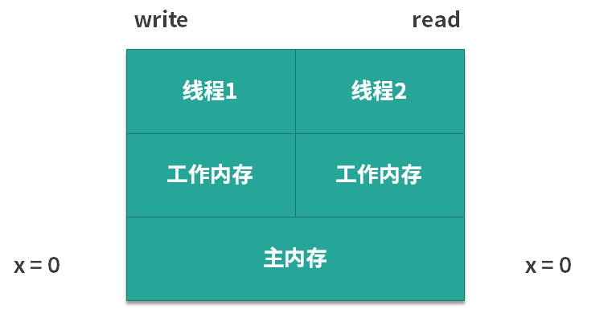

# 什么是”内存可见性“问题

我们先从两个案例来入手，看一看什么是可见性问题。

## 案例一

我们来看看下面的代码，有一个变量 x，它是 int 类型的，如下所示：

```java
public class Visibility {

    int x = 0;

    public void write() {
        x = 1;
    }

    public void read() {
        int y = x;
    }
}
```

这是一段很简单的代码，类中有两个方法：

- write 方法，作用是给 x 赋值，代码中，把 x 赋值为 1，由于 x 的初始值是 0，所以执行 write 方法相当于改变了 x 的值；
- read 方法，作用是把 x 读取出来，读取的时候我们用了一个新的 int 类型变量的 y 来接收 x 的值。

我们假设有两个线程来执行上述代码，第 1 个线程执行的是 write 方法，第 2 个线程执行的是 read 方法。下面我们来分析一下，代码在实际运行过程中的情景是怎么样的，如下图所示：



在图中可以看出，由于 x 的初始值为 0，所以对于左边的第 1 个线程和右边的第 2 个线程而言，它们都可以从主内存中去获取到这个信息，对两个线程来说 x 都是 0。可是此时我们假设第 1 个线程先去执行 write 方法，它就把 x 的值从 0 改为了 1，但是它改动的动作并不是直接发生在主内存中的，而是会发生在第 1 个线程的工作内存中，如下图所示。


那么，假设线程 1 的工作内存还未同步给主内存，此时假设线程 2 开始读取，那么它读到的 x 值不是 1，而是 0，也就是说虽然此时线程 1 已经把 x 的值改动了，但是对于第 2 个线程而言，根本感知不到 x 的这个变化，这就产生了可见性问题。

## 案例二

下面我们再来看一个案例。在如下所示的代码中，有两个变量 a 和 b， 并且把它们赋初始值为 10 和 20。

```java
/**
 * 描述：演示可见性带来的问题
 */
public class VisibilityProblem {

    int a = 10;
    int b = 20;

    private void change() {
        a = 30;
        b = a;
    }


    private void print() {
        System.out.println("b=" + b + ";a=" + a);
    }

    public static void main(String[] args) {
        while (true) {
            VisibilityProblem problem = new VisibilityProblem();
            new Thread(new Runnable() {
                @Override
                public void run() {
                    try {
                        Thread.sleep(1);
                    } catch (InterruptedException e) {
                        e.printStackTrace();
                    }
                    problem.change();
                }
            }).start();

            new Thread(new Runnable() {
                @Override
                public void run() {
                    try {
                        Thread.sleep(1);
                    } catch (InterruptedException e) {
                        e.printStackTrace();
                    }
                    problem.print();
                }
            }).start();
        }
    }
}
```

在类中，有两个方法：

- change 方法，把 a 改成 30，然后把 b 赋值为 a 的值；
- print 方法，先打印出 b 的值，然后再打印出 a 的值。
  
接下来我们来看一下 main 函数，在 main 函数中同样非常简单。首先有一个 while 的死循环，在这个循环中，我们新建两个线程，并且让它们先休眠一毫秒，然后再分别去执行 change 方法和 print 方法。休眠一毫秒的目的是让它们执行这两个方法的时间，尽可能的去靠近。

下面我们运行这段代码并分析一下可能出现的情况。

- 第 1 种情况：是最普通的情况了。假设第 1 个线程，也就是执行 change 的线程先运行，并且运行完毕了，然后第 2 个线程开始运行，那么第 2 个线程自然会打印出 b = 30;a = 30 的结果。
- 第 2 种情况：与第 1 种情况相反。因为线程先 start，并不代表它真的先执行，所以第 2 种情况是第 2 个线程先打印，然后第 1 个线程再去进行 change，那么此时打印出来的就是 a 和 b 的初始值，打印结果为 b = 20;a = 10。
- 第 3 种情况：它们几乎同时运行，所以会出现交叉的情况。比如说当第 1 个线程的 change 执行到一半，已经把 a 的值改为 30 了，而 b 的值还未来得及修改，此时第 2 个线程就开始打印了，所以此时打印出来的 b 还是原始值 20，而 a 已经变为了 30， 即打印结果为 b = 20;a = 30。
  
这些都很好理解，但是有一种情况不是特别容易理解，那就是打印结果为 b = 30;a = 10，我们来想一下，为什么会发生这种情况？

- 首先打印出来的是 b = 30，这意味着 b 的值被改变了，也就是说 b = a 这个语句已经执行了；
- 如果 b = a 要想执行，那么前面 a = 30 也需要执行，此时 b 才能等于 a 的值，也就是 30；
- 这也就意味着 change 方法已经执行完毕了。

可是在这种情况下再打印 a，结果应该是 a = 30，而不应该打印出 a = 10。因为在刚才 change 执行的过程中，a 的值已经被改成 30 了，不再是初始值的 10。所以，如果出现了打印结果为 b = 30;a = 10 这种情况，就意味着发生了可见性问题：a 的值已经被第 1 个线程修改了，但是其他线程却看不到，由于 a 的最新值却没能及时同步过来，所以才会打印出 a 的旧值。发生上述情况的几率不高。

## 解决问题

那么我们应该如何避免可见性问题呢？在案例一中，我们可以使用 volatile 来解决问题，我们在原来的代码的基础上给 x 变量加上 volatile 修饰，其他的代码不变。加了 volatile 关键字之后，只要第 1 个线程修改完了 x 的值，那么当第 2 个线程想读取 x 的时候，它一定可以读取到 x 的最新的值，而不可能读取到旧值。

同理，我们也可以用 volatile 关键字来解决案例二的问题，如果我们给 a 和 b 加了 volatile 关键字后，无论运行多长时间，也不会出现 b = 30;a = 10 的情况，这是因为 volatile 保证了只要 a 和 b 的值发生了变化，那么读取的线程一定能感知到。

## 能够保证可见性的措施

除了 volatile 关键字可以让变量保证可见性外，synchronized、Lock、并发集合等一系列工具都可以在一定程度上保证可见性，具体保证可见性的时机和手段，我将在第 61 课时 happens-before 原则中详细展开讲解。

### synchronized 不仅保证了原子性，还保证了可见性

下面我们再来分析一下之前所使用过的 synchronized 关键字，在理解了可见性问题之后，相信你对 synchronized 的理解会更加深入。

关于 synchronized 这里有一个特别值得说的点，我们之前可能一致认为，使用了 synchronized 之后，它会设立一个临界区，这样在一个线程操作临界区内的数据的时候，另一个线程无法进来同时操作，所以保证了线程安全。

其实这是不全面的，这种说法没有考虑到可见性问题，完整的说法是：synchronized 不仅保证了临界区内最多同时只有一个线程执行操作，同时还保证了在前一个线程释放锁之后，之前所做的所有修改，都能被获得同一个锁的下一个线程所看到，也就是能读取到最新的值。因为如果其他线程看不到之前所做的修改，依然也会发生线程安全问题。

## 总结

内存可见性，指一线程对共享变量的更改，对另一线程不可见。
