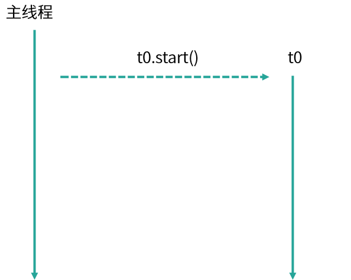

# 使用线程池比手动创建线程好在哪里

## 为什么要使用线程池

首先，回顾线程池的相关知识，在 Java 诞生之初是没有线程池的概念的，而是先有线程，随着线程数的不断增加，人们发现需要一个专门的类来管理它们，于是才诞生了线程池。没有线程池的时候，每发布一个任务就需要创建一个新的线程，这样在任务少时是没有问题的，如代码所示。

```java
/**
 * 描述：单个任务的时候，新建线程来执行
*/
public class OneTask {

    public static void main(String[] args) {
        Thread thread0 = new Thread(new Task());
        thread0.start();
    }

    static class Task implements Runnable {

        public void run() {
           System.out.println("Thread Name: " + Thread.currentThread().getName());
        }
    }
}
```

在这段代码中，我们发布了一个新的任务并放入子线程中，然后启动子线程执行任务，这时的任务也非常简单，只是打印出当前线程的名字，这种情况下，打印结果显示 Thread Name: Thread-0，即我们当前子线程的默认名字。



我们来看一下任务执行流程，如图所示，主线程调用 start() 方法，启动了一个 t0 的子线程。这是在一个任务的场景下，随着我们的任务增多，比如现在有 10 个任务了，那么我们就可以使用 for 循环新建 10 个子线程，如代码所示。

```java
/**
* 描述：     for循环新建10个线程
*/
public class TenTask {

    public static void main(String[] args) {
        for (int i = 0; i < 10; i++) {
            Thread thread = new Thread(new Task());
            thread.start();
        }
    }

    static class Task implements Runnable {

        public void run() {
            System.out.println("Thread Name: " + Thread.currentThread().getName());
        }
    }
}
```

执行结果：

```java
Thread Name: Thread-1
Thread Name: Thread-4
Thread Name: Thread-3
Thread Name: Thread-2
Thread Name: Thread-0
Thread Name: Thread-5
Thread Name: Thread-6
Thread Name: Thread-7
Thread Name: Thread-8
Thread Name: Thread-9
```

这里你会发现，打印出来的顺序是错乱的，比如 Thread-4 打印在了 Thread-3 之前，这是因为，虽然  Thread-3 比  Thread-4 先执行 start 方法，但是这并不代表  Thread-3 就会先运行，运行的顺序取决于线程调度器，有很大的随机性，这是需要我们注意的地方。


我们再看来下线程的执行流程，如图所示，主线程通过 for 循环创建了 t0~t9 这 10 个子线程，它们都可以正常的执行任务，但如果此时我们的任务量突然飙升到 10000 会怎么样？我们先来看看依然用 for 循环的实现方式：

```java
for (int i = 0; i < 10000; i++) {
    Thread thread = new Thread(new Task());
    thread.start();
}
```

如图所示，我们创建了 10000 个子线程，而 Java 程序中的线程与操作系统中的线程是一一对应的，此时假设线程中的任务需要一定的耗时才能够完成，便会产生很大的系统开销与资源浪费。


创建线程时会产生系统开销，并且每个线程还会占用一定的内存等资源，更重要的是我们创建如此多的线程也会给稳定性带来危害，因为每个系统中，可创建线程的数量是有一个上限的，不可能无限的创建。线程执行完需要被回收，大量的线程又会给垃圾回收带来压力。但我们的任务确实非常多，如果都在主线程串行执行，那效率也太低了，那应该怎么办呢？于是便诞生了线程池来平衡线程与系统资源之间的关系。

我们来总结下如果每个任务都创建一个线程会带来哪些问题：

- 第一点，反复创建线程系统开销比较大，每个线程创建和销毁都需要时间，如果任务比较简单，那么就有可能导致创建和销毁线程消耗的资源比线程执行任务本身消耗的资源还要大。
- 第二点，过多的线程会占用过多的内存等资源，还会带来过多的上下文切换，同时还会导致系统不稳定。

## 线程池解决问题思路

针对上面的两点问题，线程池有两个解决思路。

首先，针对反复创建线程开销大的问题，线程池用一些固定的线程一直保持工作状态并反复执行任务。

其次，针对过多线程占用太多内存资源的问题，解决思路更直接，线程池会根据需要创建线程，控制线程的总数量，避免占用过多内存资源。

### 如何使用线程池

线程池就好比一个池塘，池塘里的水是有限且可控的，比如我们选择线程数固定数量的线程池，假设线程池有 5 个线程，但此时的任务大于 5 个，线程池会让余下的任务进行排队，而不是无限制的扩张线程数量，保障资源不会被过度消耗。如代码所示，我们往 5 个线程的线程池中放入 10000 个任务并打印当前线程名字，结果会是怎么样呢？

```java
/**
* 描述：用固定线程数的线程池执行10000个任务
*/
public class ThreadPoolDemo {

    public static void main(String[] args) {
        ExecutorService service = Executors.newFixedThreadPool(5);
        for (int i = 0; i < 10000; i++) {
            service.execute(new Task());
        }
    System.out.println(Thread.currentThread().getName());
    }

    static class Task implements Runnable {

        public void run() {
            System.out.println("Thread Name: " + Thread.currentThread().getName());
        }
    }
}
```

执行效果：

```java
Thread Name: pool-1-thread-1
Thread Name: pool-1-thread-2
Thread Name: pool-1-thread-3
Thread Name: pool-1-thread-4
Thread Name: pool-1-thread-5
Thread Name: pool-1-thread-5
Thread Name: pool-1-thread-5
Thread Name: pool-1-thread-5
Thread Name: pool-1-thread-5
Thread Name: pool-1-thread-2
Thread Name: pool-1-thread-1
Thread Name: pool-1-thread-5
Thread Name: pool-1-thread-3
Thread Name: pool-1-thread-5
...
```

如打印结果所示，打印的线程名始终在 Thread Name: pool-1-thread-1~5 之间变化，并没有超过这个范围，也就证明了线程池不会无限制地扩张线程的数量，始终是这5个线程在工作。


执行流程如图所示，首先创建了一个线程池，线程池中有 5 个线程，然后线程池将 10000 个任务分配给这 5 个线程，这 5 个线程反复领取任务并执行，直到所有任务执行完毕，这就是线程池的思想。

## 使用线程池的好处

使用线程池比手动创建线程主要有三点好处。

- 第一点，线程池可以解决线程生命周期的系统开销问题，同时还可以加快响应速度。因为线程池中的线程是可以复用的，我们只用少量的线程去执行大量的任务，这就大大减小了线程生命周期的开销。而且线程通常不是等接到任务后再临时创建，而是已经创建好时刻准备执行任务，这样就消除了线程创建所带来的延迟，提升了响应速度，增强了用户体验。
- 第二点，线程池可以统筹内存和 CPU 的使用，避免资源使用不当。线程池会根据配置和任务数量灵活地控制线程数量，不够的时候就创建，太多的时候就回收，避免线程过多导致内存溢出，或线程太少导致 CPU 资源浪费，达到了一个完美的平衡。
- 第三点，线程池可以统一管理资源。比如线程池可以统一管理任务队列和线程，可以统一开始或结束任务，比单个线程逐一处理任务要更方便、更易于管理，同时也有利于数据统计，比如我们可以很方便地统计出已经执行过的任务的数量。
