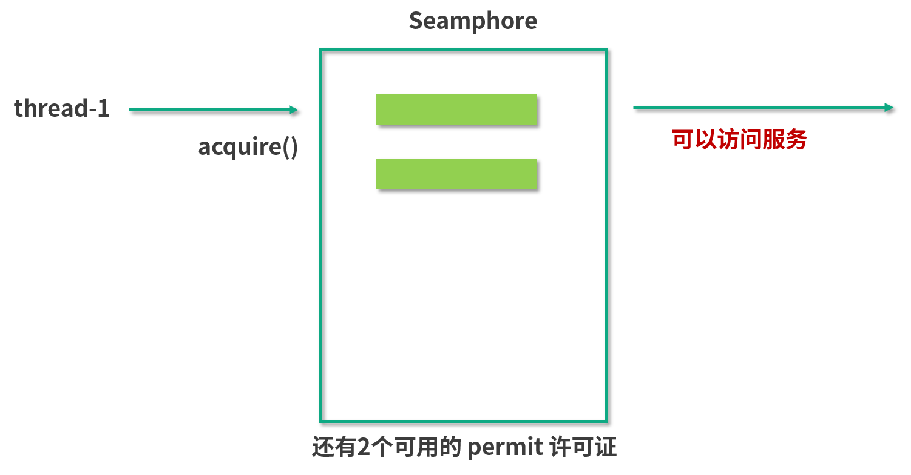
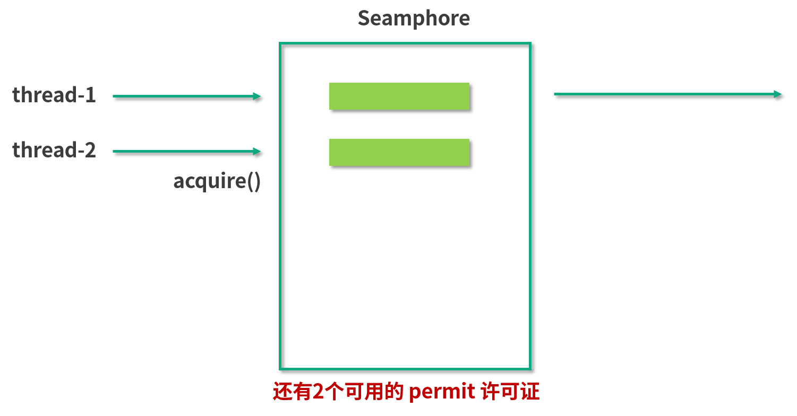
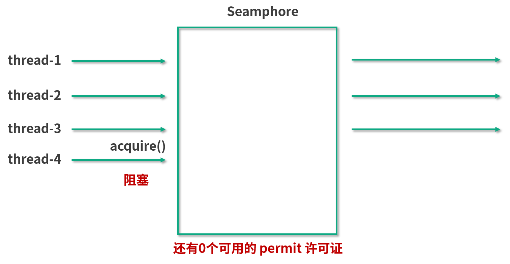

# Semaphore(信号量)能被 FixedThreadPool 替代吗

## Semaphore 信号量


从图中可以看出，信号量的一个最主要的作用就是，来控制那些需要限制并发访问量的资源。具体来讲，信号量会维护“许可证”的计数，而线程去访问共享资源前，必须先拿到许可证。线程可以从信号量中去“获取”一个许可证，一旦线程获取之后，信号量持有的许可证就转移过去了，所以信号量手中剩余的许可证要减一。

同理，线程也可以“释放”一个许可证，如果线程释放了许可证，这个许可证相当于被归还给信号量了，于是信号量中的许可证的可用数量加一。当信号量拥有的许可证数量减到 0 时，如果下个线程还想要获得许可证，那么这个线程就必须等待，直到之前得到许可证的线程释放，它才能获取。由于线程在没有获取到许可证之前不能进一步去访问被保护的共享资源，所以这就控制了资源的并发访问量，这就是整体思路。

应用实例、使用场景
背景

我们来看一个具体的场景：


在这个场景中，我们的服务是中间这个方块儿，左侧是请求，右侧是我们所依赖的那个慢服务。出于种种原因（比如计算量大、依赖的下游服务多等），右边的慢服务速度很慢，并且它可以承受的请求数量也很有限，一旦有太多的请求同时到达它这边，可能会导致它这个服务不可用，会压垮它。所以我们必须要保护它，不能让太多的线程同时去访问。那怎么才能做到这件事情呢？

在讲解怎么做到这个事情之前，我们先来看一看，在通常的场景下，我们用一个普通线程池能不能做到这件事情。

```java
public class SemaphoreDemo1 {

    public static void main(String[] args) {
        ExecutorService service = Executors.newFixedThreadPool(50);
        for (int i = 0; i < 1000; i++) {
            service.submit(new Task());
        }
        service.shutdown();
    }

    static class Task implements Runnable {

        @Override
        public void run() {
            System.out.println(Thread.currentThread().getName() + "调用了慢服务");
            try {
                //模拟慢服务
                Thread.sleep(3000);
            } catch (InterruptedException e) {
                e.printStackTrace();
            }
        }
    }
}
```

在这段代码中，有一个固定 50 个线程的线程池，然后给线程池提交 1000 个任务，并且每一个任务所执行的内容，就是去休眠 3 秒钟，来模拟调用这个慢服务的过程。我们启动这个程序，会发现打印出来的结果如下所示：

```java
pool-1-thread-2调用了慢服务
pool-1-thread-4调用了慢服务
pool-1-thread-3调用了慢服务
pool-1-thread-1调用了慢服务
pool-1-thread-5调用了慢服务
pool-1-thread-6调用了慢服务
...
（包含了pool-1-thread-1到pool-1-thread-50这50个线程）
```

它会从线程 1 一直到线程 50 都去调用这个慢服务，当然实际调用顺序每次都会不一样，但是这 50 个线程都会去几乎同时调用这个慢服务，在这种情况下，就会导致我们的慢服务崩溃。

所以，必须严格限制能够同时到达该服务的请求数。比如，我们想限制同时不超过 3 个请求来访问该服务，该怎么实现呢？并且这里有一点值得注意，我们的前提条件是，线程池中确实有 50 个线程，线程数肯定超过了 3 个，那么怎么进一步控制这么多的线程不同时访问慢服务呢？我们可以通过信号量来解决这个问题。

### 正常情况下获取许可证


这张图的方框代表一个许可证为 3 的信号量，每一个绿色的长条代表一个许可证（permit）。现在我们拥有 3 个许可证，并且信号量的特点是非常“慷慨”，只要它持有许可证，别人想请求的话它都会分发的。假设此时 Thread 1 来请求了，在这种情况下，信号量就会把一个许可证给到这边的第一个线程 Thread 1。于是 Thread 1 获得了许可证，变成了下图这个样子：



Thread 1 拿到许可证之后就拥有了访问慢服务的资格，它紧接着就会去访问我们的慢服务，同时，我们的信号量手中持有的许可证也减为了 2。假设这个慢服务速度很慢，可能长时间内不返回，所以在没返回之前，Thread 1 也会不释放许可证，在此期间第二个线程又来请求了：



同理，此时由于信号量手中持有两个许可证，还是可以满足 Thread 2 的需求的，所以就把第二个许可证给了第二个线程。这样一来，第二个线程也拿到了我们的许可证，可以访问右边的慢服务了，如图所示：


同理，在前两个线程返回前，第三个线程也过来了，也是按照同样的方式获得了许可证，并且访问慢服务：


### 没许可证时，会阻塞前来请求的线程

至此，我们信号量中的许可证已经没有了，因为原有的 3 个都分给这 3 个线程了。在这种情况下，信号量就可以进一步发挥作用了，此时假设第 4 个线程再来请求找我们信号量拿许可证，由于此时线程 1、线程 2、线程 3 都正在访问“慢服务”，还没归还许可证，而信号量自身也没有更多的许可证了，所以在这个时候就会发生这样的一种情况：



线程 4 在找我们用 acquire 方法请求许可证的时候，它会被阻塞，意味着线程 4 没有拿到许可证，也就没有被允许访问“慢服务”，也就是说此时“慢服务”依然只能被前面的 3 个线程访问，这样就达到我们最开始的目的了：限制同时最多有 3 个线程调用我们的慢服务。

### 有线程释放信号量后

假设此时线程 1 因为最早去的，它执行完了这个任务，于是返回了。返回的时候它会调用 release 方法，表示“我处理完了我的任务，我想把许可证还回去”，所以，此时线程 1 就释放了之前持有的许可证，把它还给了我们的信号量，于是信号量所持有的许可证数量从 0 又变回了 1，如图所示：


此时由于许可证已经归还给了信号量，那么刚才找我们要许可证的线程 4 就可以顺利地拿到刚刚释放的这个许可证了。于是线程 4 也就拥有了访问慢服务的访问权，接下来它也会去访问这个慢服务。

不过要注意，此时线程 1 先归还了许可证给信号量，再由信号量把这个许可证转给线程 4，所以，此时同时访问慢服务的依然只有 3 个线程，分别是线程 2、3 和 4，因为之前的线程 1 已经完成任务并且离开了。


### 如果有两个线程释放许可证

假设程序继续运行，随着时间推移，线程 2 和 3 同时执行完毕，然后释放手中的许可证。于是信号量又重新拥有了 2 个许可证，它会把许可证进一步发放给还有这个需求的线程 5 和线程 6，那么这两个线程也就能访问这个慢服务了：


不过此时访问慢服务的就变成了线程 4、5、6，可以看出，总的数量从来没有超过 3 个。

在这个例子中，线程 4 一开始获取许可证的时候被阻塞了，那个时候即使有线程 5 和线程 6 甚至线程 100 都来执行 acquire 方法的话，信号量也会把这些通通给阻塞住，这样就起到了信号量最主要的控制并发量的作用。

## 总结

以上的过程，展示了如何利用信号量，去控制在同一时刻最多只有 3 个线程执行某任务的目的，那主要就是通过控制许可证的发放和归还的方式实现的。

## 用法

### 使用流程

讲完了场景之后，我们来看一下具体的用法，使用流程主要分为以下三步。

首先初始化一个信号量，并且传入许可证的数量，这是它的带公平参数的构造函数：public Semaphore(int permits, boolean fair)，传入两个参数，第一个参数是许可证的数量，另一个参数是是否公平。如果第二个参数传入 true，则代表它是公平的策略，会把之前已经等待的线程放入到队列中，而当有新的许可证到来时，它会把这个许可证按照顺序发放给之前正在等待的线程；如果这个构造函数第二个参数传入 false，则代表非公平策略，也就有可能插队，就是说后进行请求的线程有可能先得到许可证。

第二个流程是在建立完这个构造函数，初始化信号量之后，我们就可以利用 acquire() 方法。在调用慢服务之前，让线程来调用 acquire 方法或者 acquireUninterruptibly方法，这两个方法的作用是要获取许可证，这同时意味着只有这个方法能顺利执行下去的话，它才能进一步访问这个代码后面的调用慢服务的方法。如果此时信号量已经没有剩余的许可证了，那么线程就会等在 acquire 方法的这一行代码中，所以它也不会进一步执行下面调用慢服务的方法。我们正是用这种方法，保护了我们的慢服务。

acquire() 和 acquireUninterruptibly() 的区别是：是否能响应中断。acquire() 是可以支持中断的，也就是说，它在获取信号量的期间，假设这个线程被中断了，那么它就会跳出 acquire() 方法，不再继续尝试获取了。而 acquireUninterruptibly() 方法是不会被中断的。

第三步就是在任务执行完毕之后，调用 release() 来释放许可证，比如说我们在执行完慢服务这行代码之后，再去执行 release() 方法，这样一来，许可证就会还给我们的信号量了。

## 其他主要方法介绍

除了这几个主要方法以外，还有一些其他的方法，我再来介绍一下。

### public boolean tryAcquire()

tryAcquire 和之前介绍锁的 trylock 思维是一致的，是尝试获取许可证，相当于看看现在有没有空闲的许可证，如果有就获取，如果现在获取不到也没关系，不必陷入阻塞，可以去做别的事。

### public boolean tryAcquire(long timeout, TimeUnit unit)

同样有一个重载的方法，它里面传入了超时时间。比如传入了 3 秒钟，则意味着最多等待 3 秒钟，如果等待期间获取到了许可证，则往下继续执行；如果超时时间到，依然获取不到许可证，它就认为获取失败，且返回 false。

### availablePermits()

这个方法用来查询可用许可证的数量，返回一个整型的结果。下面我们来看一段示例代码：

```java
public class SemaphoreDemo2 {

    static Semaphore semaphore = new Semaphore(3);

    public static void main(String[] args) {
        ExecutorService service = Executors.newFixedThreadPool(50);
        for (int i = 0; i < 1000; i++) {
            service.submit(new Task());
        }
        service.shutdown();
    }

    static class Task implements Runnable {

        @Override
        public void run() {
            try {
                semaphore.acquire();
            } catch (InterruptedException e) {
                e.printStackTrace();
            }
            System.out.println(Thread.currentThread().getName() + "拿到了许可证，花费2秒执行慢服务");
            try {
                Thread.sleep(2000);
            } catch (InterruptedException e) {
                e.printStackTrace();
            }
            System.out.println("慢服务执行完毕，" + Thread.currentThread().getName() + "释放了许可证");
            semaphore.release();
        }
    }
}
```

在这段代码中我们新建了一个数量为 3 的信号量，然后又有一个和之前一样的固定 50 线程的线程池，并且往里面放入 1000 个任务。每个任务在执行模拟慢服务之前，会先用信号量的 acquire 方法获取到信号量，然后再去执行这 2 秒钟的慢服务，最后利用 release() 方法来释放许可证。

代码执行结果如下：

```java
pool-1-thread-1拿到了许可证，花费2秒执行慢服务
pool-1-thread-2拿到了许可证，花费2秒执行慢服务
pool-1-thread-3拿到了许可证，花费2秒执行慢服务
慢服务执行完毕，pool-1-thread-1释放了许可证
慢服务执行完毕，pool-1-thread-2释放了许可证
慢服务执行完毕，pool-1-thread-3释放了许可证
pool-1-thread-4拿到了许可证，花费2秒执行慢服务
pool-1-thread-5拿到了许可证，花费2秒执行慢服务
pool-1-thread-6拿到了许可证，花费2秒执行慢服务
慢服务执行完毕，pool-1-thread-4释放了许可证
慢服务执行完毕，pool-1-thread-5释放了许可证
慢服务执行完毕，pool-1-thread-6释放了许可证
...
```

它会先让线程 1、2、3 拿到许可证，然后分别去执行这 2 秒钟的慢服务，直到执行完毕则会释放许可证，后面的线程才能进一步拿到许可证来执行服务。当前面 3 个线程还没有执行完毕，也就是还没有释放许可证的时候，后面的线程其实已经来请求了，它们也会尝试调用 acquire 方法，只不过这个时候会被阻塞住。通过执行结果可以看出，同时最多只有 3 个线程可以访问我们的慢服务。

## 特殊用法：一次性获取或释放多个许可证

我们再来介绍一下信号量的一种特殊用法，那就是它可以一次性释放或者获取多个许可证。

比如 semaphore.acquire(2)，里面传入参数 2，这就叫一次性获取两个许可证。同时释放也是一样的，semaphore.release(3) 相当于一次性释放三个许可证。

为什么要这样做呢？我们列举一个使用场景。比如说第一个任务 A（Task A ）会调用很耗资源的方法一 method1()，而任务 B 调用的是方法二 method 2，但这个方法不是特别消耗资源。在这种情况下，假设我们一共有 5 个许可证，只能允许同时有 1 个线程调用方法一，或者同时最多有 5 个线程调用方法二，但是方法一和方法二不能同时被调用。

所以，我们就要求 Task A 在执行之前要一次性获取到 5 个许可证才能执行，而 Task B 只需要获取一个许可证就可以执行了。这样就避免了任务 A 和 B 同时运行，同时又很好的兼顾了效率，不至于同时只允许一个线程访问方法二，那样的话也存在浪费资源的情况，所以这就相当于我们可以根据自己的需求合理地利用信号量的许可证来分配资源。

## 注意点

信号量还有几个注意点：

- 获取和释放的许可证数量尽量保持一致，否则比如每次都获取 2 个但只释放 1 个甚至不释放，那么信号量中的许可证就慢慢被消耗完了，最后导致里面没有许可证了，那其他的线程就再也没办法访问了；
- 在初始化的时候可以设置公平性，如果设置为 true 则会让它更公平，但如果设置为 false 则会让总的吞吐量更高。
- 信号量是支持跨线程、跨线程池的，而且并不是哪个线程获得的许可证，就必须由这个线程去释放。事实上，对于获取和释放许可证的线程是没有要求的，比如线程 A 获取了然后由线程 B 释放，这完全是可以的，只要逻辑合理即可。
  
## 信号量能被 FixedThreadPool 替代吗

让我们回到本课时的题目：信号量能不能被 FixedThreadPool 代替呢？这个问题相当于，信号量是可以限制同时访问的线程数，那为什么不直接用固定数量线程池去限制呢？这样不是更方便吗？比如说线程池里面有 3 个线程，那自然最多只有 3 个线程去访问了。

这是一个很好的问题，我们在实际业务中会遇到这样的情况：假如，在调用慢服务之前需要有个判断条件，比如只想在每天的零点附近去访问这个慢服务时受到最大线程数的限制（比如 3 个线程），而在除了每天零点附近的其他大部分时间，我们是希望让更多的线程去访问的。所以在这种情况下就应该把线程池的线程数量设置为 50 ，甚至更多，然后在执行之前加一个 if 判断，如果符合时间限制了（比如零点附近），再用信号量去额外限制，这样做是比较合理的。

再说一个例子，比如说在大型应用程序中会有不同类型的任务，它们也是通过不同的线程池来调用慢服务的。因为调用方不只是一处，可能是 Tomcat 服务器或者网关，我们就不应该限制，或者说也无法做到限制它们的线程池的大小。但可以做的是，在执行任务之前用信号量去限制一下同时访问的数量，因为我们的信号量具有跨线程、跨线程池的特性，所以即便这些请求来自于不同的线程池，我们也可以限制它们的访问。如果用 FixedThreadPool 去限制，那就做不到跨线程池限制了，这样的话会让功能大大削弱。

基于以上的理由，如果想要限制并发访问的线程数，用信号量是更合适的。
