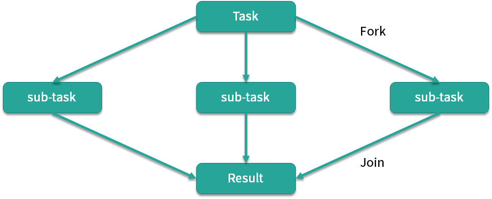
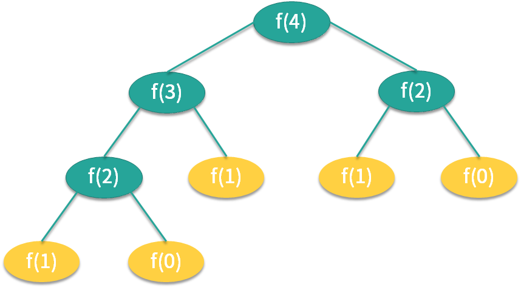

# 常见的线程池及使用场景

6 种常见的线程池如下。

- FixedThreadPool
- CachedThreadPool
- ScheduledThreadPool
- SingleThreadExecutor
- SingleThreadScheduledExecutor
- ForkJoinPool

## FixedThreadPool

第一种线程池叫作 FixedThreadPool，它的核心线程数和最大线程数是一样的，所以可以把它看作是固定线程数的线程池，它的特点是线程池中的线程数除了初始阶段需要从 0 开始增加外，之后的线程数量就是固定的，就算任务数超过线程数，线程池也不会再创建更多的线程来处理任务，而是会把超出线程处理能力的任务放到任务队列中进行等待。而且就算任务队列满了，到了本该继续增加线程数的时候，由于它的最大线程数和核心线程数是一样的，所以也无法再增加新的线程了。


如图所示，线程池有 t0~t9，10 个线程，它们会不停地执行任务，如果某个线程任务执行完了，就会从任务队列中获取新的任务继续执行，期间线程数量不会增加也不会减少，始终保持在 10 个。

## CachedThreadPool

第二种线程池是 CachedThreadPool，可以称作可缓存线程池，它的特点在于线程数是几乎可以无限增加的（实际最大可以达到 Integer.MAX_VALUE，为 2^31-1，这个数非常大，所以基本不可能达到），而当线程闲置时还可以对线程进行回收。也就是说该线程池的线程数量不是固定不变的，当然它也有一个用于存储提交任务的队列，但这个队列是 SynchronousQueue，队列的容量为0，实际不存储任何任务，它只负责对任务进行中转和传递，所以效率比较高。

当我们提交一个任务后，线程池会判断已创建的线程中是否有空闲线程，如果有空闲线程则将任务直接指派给空闲线程，如果没有空闲线程，则新建线程去执行任务，这样就做到了动态地新增线程。让我们举个例子，如下方代码所示。

```java
ExecutorService service = Executors.newCachedThreadPool();
    for (int i = 0; i < 1000; i++) {
        service.execute(new Task() {
    });
 }
```

使用 for 循环提交 1000 个任务给 CachedThreadPool，假设这些任务处理的时间非常长，会发生什么情况呢？因为 for 循环提交任务的操作是非常快的，但执行任务却比较耗时，就可能导致 1000 个任务都提交完了但第一个任务还没有被执行完，所以此时 CachedThreadPool 就可以动态的伸缩线程数量，随着任务的提交，不停地创建 1000 个线程来执行任务，而当任务执行完之后，假设没有新的任务了，那么大量的闲置线程又会造成内存资源的浪费，这时线程池就会检测线程在 60 秒内有没有可执行任务，如果没有就会被销毁，最终线程数量会减为 0。

## ScheduledThreadPool

第三个线程池是 ScheduledThreadPool，它支持定时或周期性执行任务。比如每隔 10 秒钟执行一次任务，而实现这种功能的方法主要有 3 种，如代码所示：

```java
ScheduledExecutorService service = Executors.newScheduledThreadPool(10);

service.schedule(new Task(), 10, TimeUnit.SECONDS);

service.scheduleAtFixedRate(new Task(), 10, 10, TimeUnit.SECONDS);

service.scheduleWithFixedDelay(new Task(), 10, 10, TimeUnit.SECONDS);
```

那么这 3 种方法有什么区别呢？

- 第一种方法 schedule 比较简单，表示延迟指定时间后执行一次任务，如果代码中设置参数为 10 秒，也就是 10 秒后执行一次任务后就结束。
- 第二种方法 scheduleAtFixedRate 表示以固定的频率执行任务，它的第二个参数 initialDelay 表示第一次延时时间，第三个参数 period 表示周期，也就是第一次延时后每次延时多长时间执行一次任务。
- 第三种方法 scheduleWithFixedDelay 与第二种方法类似，也是周期执行任务，区别在于对周期的定义，之前的 scheduleAtFixedRate 是以任务开始的时间为时间起点开始计时，时间到就开始执行第二次任务，而不管任务需要花多久执行；而 scheduleWithFixedDelay 方法以任务结束的时间为下一次循环的时间起点开始计时。

举个例子，假设某个同学正在熬夜写代码，需要喝咖啡来提神，假设每次喝咖啡都需要花10分钟的时间，如果此时采用第2种方法 scheduleAtFixedRate，时间间隔设置为 1 小时，那么他将会在每个整点喝一杯咖啡，以下是时间表：

```java
00:00: 开始喝咖啡

00:10: 喝完了

01:00: 开始喝咖啡

01:10: 喝完了

02:00: 开始喝咖啡

02:10: 喝完了
```

但是假设他采用第3种方法 scheduleWithFixedDelay，时间间隔同样设置为 1 小时，那么由于每次喝咖啡需要10分钟，而 scheduleWithFixedDelay 是以任务完成的时间为时间起点开始计时的，所以第2次喝咖啡的时间将会在1:10，而不是1:00整，以下是时间表：

```java
00:00: 开始喝咖啡

00:10: 喝完了

01:10: 开始喝咖啡

01:20: 喝完了

02:20: 开始喝咖啡

02:30: 喝完了
```

## SingleThreadExecutor

第四种线程池是 SingleThreadExecutor，它会使用唯一的线程去执行任务，原理和 FixedThreadPool 是一样的，只不过这里线程只有一个，如果线程在执行任务的过程中发生异常，线程池也会重新创建一个线程来执行后续的任务。这种线程池由于只有一个线程，所以非常适合用于所有任务都需要按被提交的顺序依次执行的场景，而前几种线程池不一定能够保障任务的执行顺序等于被提交的顺序，因为它们是多线程并行执行的。

## SingleThreadScheduledExecutor

第五个线程池是 SingleThreadScheduledExecutor，它实际和第三种 ScheduledThreadPool 线程池非常相似，它只是 ScheduledThreadPool 的一个特例，内部只有一个线程，如源码所示：

```java
new ScheduledThreadPoolExecutor(1)
```

它只是将 ScheduledThreadPool 的核心线程数设置为了 1。


总结上述的五种线程池，我们以核心线程数、最大线程数，以及线程存活时间三个维度进行对比，如表格所示。

第一个线程池 FixedThreadPool，它的核心线程数和最大线程数都是由构造函数直接传参的，而且它们的值是相等的，所以最大线程数不会超过核心线程数，也就不需要考虑线程回收的问题，如果没有任务可执行，线程仍会在线程池中存活并等待任务。

第二个线程池 CachedThreadPool 的核心线程数是 0，而它的最大线程数是 Integer 的最大值，线程数一般是达不到这么多的，所以如果任务特别多且耗时的话，CachedThreadPool 就会创建非常多的线程来应对。

同理，你可以课后按照同样的方法来分析后面三种线程池的参数，来加深对知识的理解。

## ForkJoinPool



最后，我们来看下第六种线程池 ForkJoinPool，这个线程池是在 JDK 7 加入的，它的名字 ForkJoin 也描述了它的执行机制，主要用法和之前的线程池是相同的，也是把任务交给线程池去执行，线程池中也有任务队列来存放任务。但是 ForkJoinPool 线程池和之前的线程池有两点非常大的不同之处。第一点它非常适合执行可以产生子任务的任务。

如图所示，我们有一个 Task，这个 Task 可以产生三个子任务，三个子任务并行执行完毕后将结果汇总给 Result，比如说主任务需要执行非常繁重的计算任务，我们就可以把计算拆分成三个部分，这三个部分是互不影响相互独立的，这样就可以利用 CPU 的多核优势，并行计算，然后将结果进行汇总。这里面主要涉及两个步骤，第一步是拆分也就是 Fork，第二步是汇总也就是 Join，到这里你应该已经了解到 ForkJoinPool 线程池名字的由来了。

举个例子，比如面试中经常考到的菲波那切数列，你一定非常熟悉，这个数列的特点就是后一项的结果等于前两项的和，第 0 项是 0，第 1 项是 1，那么第 2 项就是 0+1=1，以此类推。我们在写代码时应该首选效率更高的迭代形式或者更高级的乘方或者矩阵公式法等写法，不过假设我们写成了最初版本的递归形式，伪代码如下所示：

```java
if (n <= 1) {
    return n;
 } else {
    Fib f1 = new Fib(n - 1);
    Fib f2 = new Fib(n - 2);
    f1.solve();
    f2.solve();
    number = f1.number + f2.number;
    return number;
 }
```

你可以看到如果 n<=1 则直接返回 n，如果 n>1 ，先将前一项 f1 的值计算出来，然后往前推两项求出 f2 的值，然后将两值相加得到结果，所以我们看到在求和运算中产生了两个子任务。计算 f(4) 的流程如下图所示。



在计算 f(4) 时需要首先计算出 f(2) 和 f(3)，而同理，计算 f(3) 时又需要计算 f(1) 和 f(2)，以此类推。


这是典型的递归问题，对应到我们的 ForkJoin 模式，如图所示，子任务同样会产生子子任务，最后再逐层汇总，得到最终的结果。

ForkJoinPool 线程池有多种方法可以实现任务的分裂和汇总，其中一种用法如下方代码所示。

```java
class Fibonacci extends RecursiveTask<Integer> {

    int n;

    public Fibonacci(int n) {
        this.n = n;
    }

    @Override
    public Integer compute() {
        if (n <= 1) {
            return n;
        }
    Fibonacci f1 = new Fibonacci(n - 1);
    f1.fork();
    Fibonacci f2 = new Fibonacci(n - 2);
    f2.fork();
    return f1.join() + f2.join();
    }
 }
```

我们看到它首先继承了 RecursiveTask，RecursiveTask 类是对ForkJoinTask 的一个简单的包装，这时我们重写 compute() 方法，当 n<=1 时直接返回，当 n>1 就创建递归任务，也就是 f1 和 f2，然后我们用 fork() 方法分裂任务并分别执行，最后在 return 的时候，使用 join() 方法把结果汇总，这样就实现了任务的分裂和汇总。

```java
public static void main(String[] args) throws ExecutionException, InterruptedException { 
    ForkJoinPool forkJoinPool = new ForkJoinPool();
    for (int i = 0; i < 10; i++) { 
        ForkJoinTask task = forkJoinPool.submit(new Fibonacci(i));
        System.out.println(task.get());
    }
 }
```

上面这段代码将会打印出斐波那契数列的第 0 到 9 项的值：

```java
0
1
1
2
3
5
8
13
21
34
```

这就是 ForkJoinPool 线程池和其他线程池的第一点不同。

我们来看第二点不同，第二点不同之处在于内部结构，之前的线程池所有的线程共用一个队列，但 ForkJoinPool 线程池中每个线程都有自己独立的任务队列，如图所示。


ForkJoinPool 线程池内部除了有一个共用的任务队列之外，每个线程还有一个对应的双端队列 deque，这时一旦线程中的任务被 Fork 分裂了，分裂出来的子任务放入线程自己的 deque 里，而不是放入公共的任务队列中。如果此时有三个子任务放入线程 t1 的 deque 队列中，对于线程 t1 而言获取任务的成本就降低了，可以直接在自己的任务队列中获取而不必去公共队列中争抢也不会发生阻塞（除了后面会讲到的 steal 情况外），减少了线程间的竞争和切换，是非常高效的。


我们再考虑一种情况，此时线程有多个，而线程 t1 的任务特别繁重，分裂了数十个子任务，但是 t0 此时却无事可做，它自己的 deque 队列为空，这时为了提高效率，t0 就会想办法帮助 t1 执行任务，这就是“work-stealing”的含义。

双端队列 deque 中，线程 t1 获取任务的逻辑是后进先出，也就是LIFO（Last In Frist Out），而线程 t0 在“steal”偷线程 t1 的 deque 中的任务的逻辑是先进先出，也就是FIFO（Fast In Frist Out），如图所示，图中很好的描述了两个线程使用双端队列分别获取任务的情景。你可以看到，使用 “work-stealing” 算法和双端队列很好地平衡了各线程的负载。


最后，我们用一张全景图来描述 ForkJoinPool 线程池的内部结构，你可以看到 ForkJoinPool 线程池和其他线程池很多地方都是一样的，但重点区别在于它每个线程都有一个自己的双端队列来存储分裂出来的子任务。ForkJoinPool 非常适合用于递归的场景，例如树的遍历、最优路径搜索等场景。
