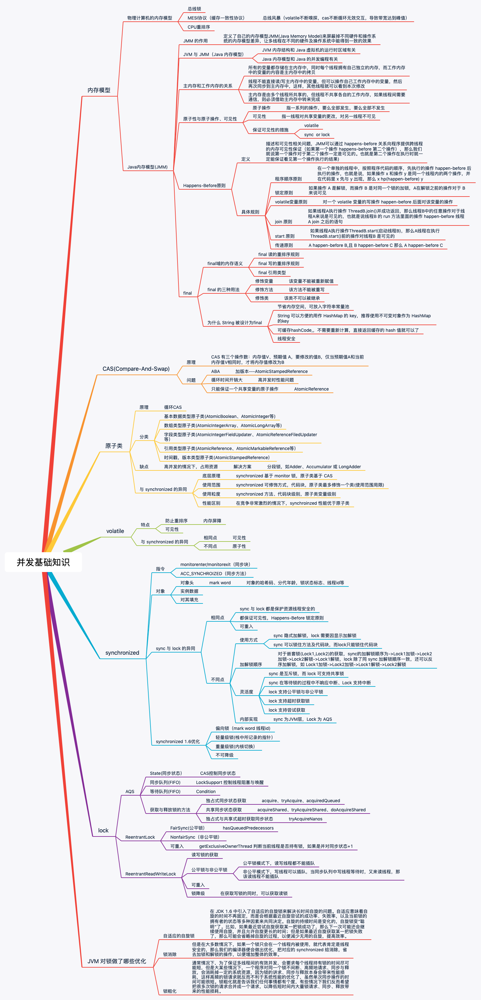
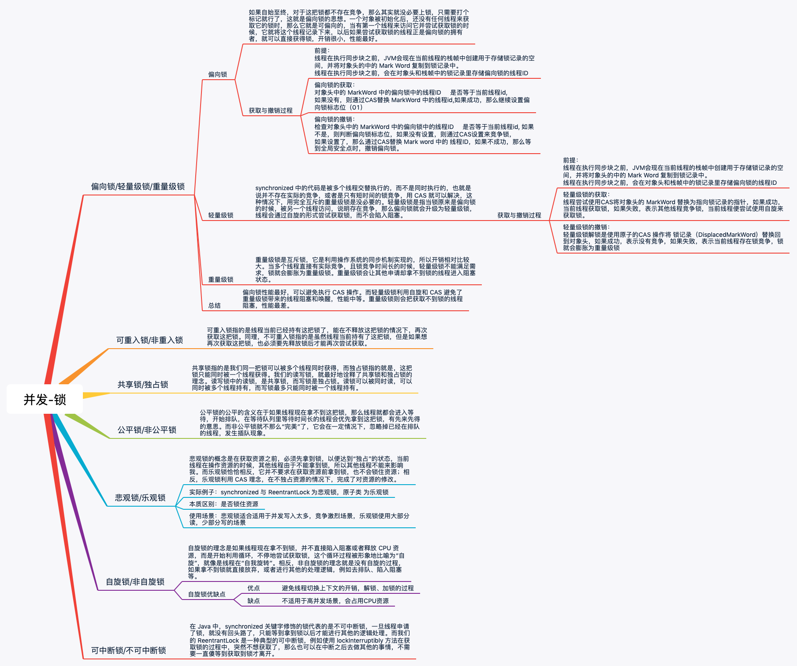
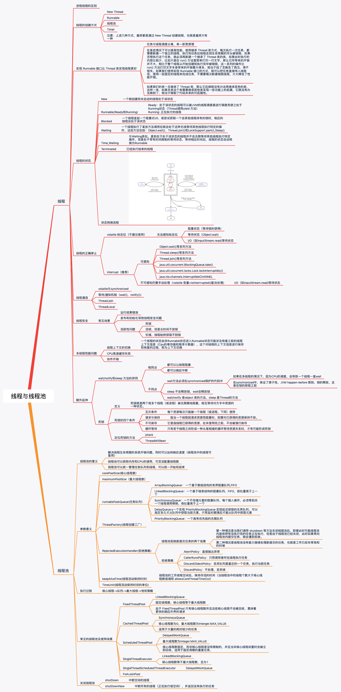
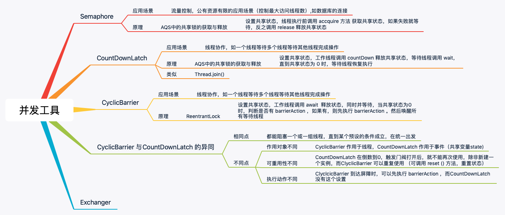

# 并发面试知识总结

知识点总结：

并发基础        | 并发-锁      | 线程与线程池    | 并发-工具
------------- | -------------|------------- |-------------
  |  ||

对应脑图如下：

- [Java-并发基础](../xmind/../Xmind/Java-并发基础.xmind)
- [Java-并发-锁](../xmind/../Xmind/Java-并发-锁.xmind)
- [Java-线程与线程池](../xmind/../Xmind/Java-线程与线程池.xmind)
- [Java-并发-工具](../xmind/../Xmind/Java-并发-工具.xmind)

>以上内容为 [XMind](https://www.xmind.cn/) 脑图，需要下载后使用 XMind 打开

## Java 内存模型

- 《Java并发编程的艺术》第二章 Java并发机制的底层实现原理
- 《Java并发编程的艺术》第三章 内存模型
- [讲一讲什么是 Java 内存模型](/并发/讲一讲什么是%20Java%20内存模型.md)
- [什么是指令重排序，为什么需要指令重排序](/并发/什么是指令重排序.md)
- [什么是”内存可见性“问题](/并发/什么是”内存可见性“问题.md)
- [主内存和工作内存的关系](/并发/主内存和工作内存的关系.md)
- [什么是 happen-before 规则](/并发/什么是%20happen-before%20规则.md)
- [final 域的内存语义](/并发/final%20域的内存语义.md)
- [为什么 String 被设计为不可变的](/并发/为什么%20String%20被设计为不可变的.md)

## CAS

- 《Java并发编程的艺术》第二章 2.3节原子操作的实现原理
- [什么是 CAS](/并发/什么是CAS.md)
- [CAS 有哪些问题](/并发/CAS有哪些问题.md)

## 原子类

- 《Java并发编程的艺术》第七章 Java 中的 13个原子操作
- [原子类是如何利用 CAS 保证线程安全的](/并发/原子类是如何利用CAS保证线程安全的.md)
- [AtomicInteger 在高并发下性能不好，如何解决，为什么](/并发/AtomicInteger在高并发下性能瓶颈的解决方案.md)
- [原子类和 volatile 有什么异同](/并发/原子类和volatile的异同.md)
- [AtomicInteger 和 synchronized 的异同点](/并发/AtomicInteger和synchronized的异同点.md)

## volatile

- 《Java并发编程的艺术》第三章 内存模型
- [volatile 防止重排序的原理是什么](https://juejin.im/post/6844903683260432398#heading-6)
- [单例模式的双重检查锁模式为什么必须加 volatile](/并发/单例模式的双重检查锁模式为什么必须加volatile.md)

## synchronized 与 Lock

- 《Java并发编程的艺术》第二章 Java 并发机制的底层实现原理
- 《Java并发编程的艺术》第五章 Java 中的锁
- [你知道那几种锁，分别有什么特点](/并发/Java中锁的分类.md)
- [悲观锁和了乐观锁的本质是什么](/并发/Java中锁的分类.md)
- [如何看到 synchronized 背后的 “monitor"锁](/并发/如何看到synchronized背后的monitor锁.md)
- [synchronized 和 Lock 如何选择](/并发/synchronized和Lock如何选择.md)
- [Lock 有哪几个常用方法，分别有什么用](/并发/Lock常用方法及其作用.md)
- [Lock 为什么要在 finally 中释放锁](/并发/Lock为什么要在finally中释放锁.md)
- [AQS 的内部原理是怎么样的](https://juejin.im/post/6844903689375711239)
- [AQS 中的 Condition 内部原理是怎么样的](https://juejin.im/post/6844903712171753479)
- [ReentrantLock 内部实现原理](https://juejin.im/post/6844903720099151879)
- [讲一讲公平锁和非公平锁，为什么要”非公平“](https://juejin.im/post/6844903720099151879#heading-4)
- [ReentrantReadWriteLock（读写锁） 获取锁的的规则](https://juejin.im/post/6844903742660165645)
- [ReentrantReadWriteLock（读写锁）锁降级](https://juejin.im/post/6844903742660165645#heading-13)
- [JVM 对锁做了哪些优化](/并发/JVM对锁做了哪些优化.md)

## 线程

### 线程基础知识

- 《Java并发编程的艺术》第四章 Java并发编程基础
- [线程的实现方式](/并发/线程的实现方式.md)
- [如何正确的停止线程](/并发/如何正确的停止线程.md)
- [线程如何在6种状态之间进行切换的](/并发/线程如何在6中状态之间进行切换的.md)
- [ThreadLocal 内部原理及其使用场景](https://juejin.im/post/6844903683231055880)
- [wait/notify/notifyAll方法的使用注意事项](/并发/wait、notify、notifyAll方法的使用注意事项.md)
- [有哪几种实现生产者消费者模式的方法](/并发/有哪几种实现生产者消费者模式的方法.md)

### 线程安全

- [一共有哪3类线程安全问题](/并发/3类线程安全问题.md)
- [哪些场景需要额外注意线程安全的问题](/并发/哪些场景需要额外注意线程安全的问题.md)
- [为什么多线程会带来性能问题](/并发/为什么多线程会带来性能问题.md)

### 线程死锁

- [如何写一个必然死锁的例子](/并发/如何写一个必然死锁的例子.md)
- [发生死锁必须满足哪4个条件](/并发/发生死锁必须满足哪4个条件.md)
- [如何用命令行和代码定位死锁](/并发/如何用命令行和代码定位死锁.md)

## 线程池

- 《Java并发编程的艺术》第九章 Java中的线程池
- [使用线程池比手动创建线程好在哪里](/并发/使用线程池比手动创建线程好在哪里.md)
- [线程池的各个参数的意义](/并发/线程各个参数的意义.md)
- [线程池有哪4种拒绝策略](/并发/线程池有哪4种拒绝策略.md)
- [常见的线程池及使用场景](/并发/常见的线程池及使用场景.md)
- [线程池中常用的阻塞队列有哪些](/并发/线程池中常用的阻塞队列有哪些.md)
- [合适的线程池数量是多少，CPU核心数和线程数的关系](/并发/合适的线程池数量时多少，CPU核心数和线程数的关系.md)
- [shutDown和 shutDownNow 的区别](/并发/shutDown和shutDownNow的区别.md)
- [线程池实现“线程复用的内部原理"](/并发/线程池实现"线程复用的原理".md)

## 并发工具类

- [Semaphore(信号量)能被 FixedThreadPool 替代吗](/并发/信号量能被FixedThreadPool替代吗.md)
- [CountDownLatch 是如何安排线程执行顺序的](/并发/CountDownLatch是如何安排线程执行顺序的.md)
- [CyclicBarrier 和 CountDownLatch 有什么异同](/并发/CyclicBarrier和CountDownLatch有什么异同.md)
