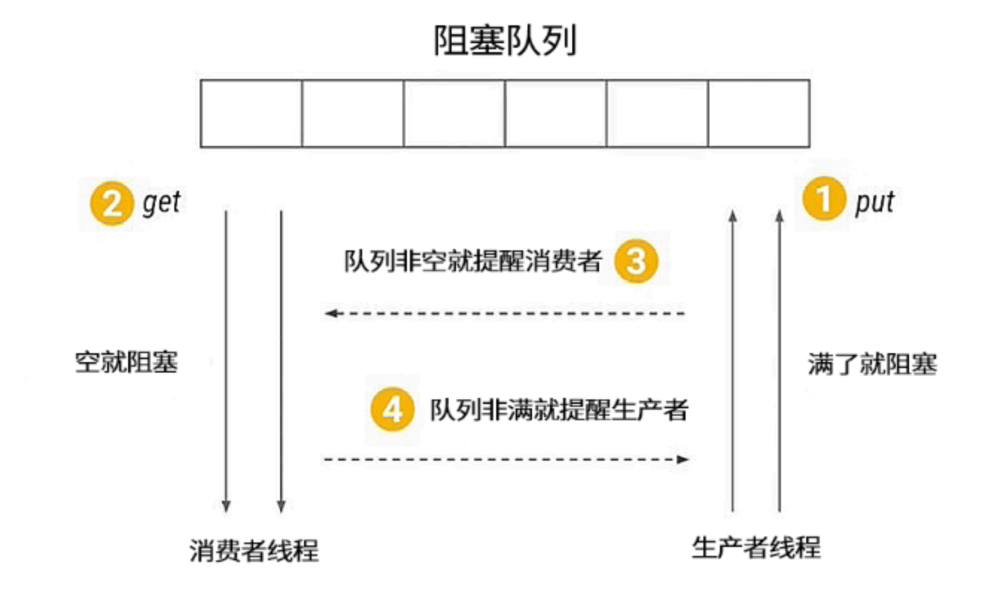

# 有哪几种实现生产者消费者模式的方法

## 生产者消费者模式

我们先来看看什么是生产者消费者模式，生产者消费者模式是程序设计中非常常见的一种设计模式，被广泛运用在解耦、消息队列等场景。在现实世界中，我们把生产商品的一方称为生产者，把消费商品的一方称为消费者，有时生产者的生产速度特别快，但消费者的消费速度跟不上，俗称“产能过剩”，又或是多个生产者对应多个消费者时，大家可能会手忙脚乱。如何才能让大家更好地配合呢？这时在生产者和消费者之间就需要一个中介来进行调度，于是便诞生了生产者消费者模式。



使用生产者消费者模式通常需要在两者之间增加一个阻塞队列作为媒介，有了媒介之后就相当于有了一个缓冲，平衡了两者的能力，整体的设计如图所示，最上面是阻塞队列，右侧的 1 是生产者线程，生产者n在生产数据后将数据存放在阻塞队列中，左侧的 2 是消费者线程，消费者获取阻塞队列中的数据。而中间的 3 和 4 分别代表生产者消费者之间互相通信的过程，因为无论阻塞队列是满还是空都可能会产生阻塞，阻塞之后就需要在合适的时机去唤醒被阻塞的线程。

那么什么时候阻塞线程需要被唤醒呢？有两种情况。第一种情况是当消费者看到阻塞队列为空时，开始进入等待，这时生产者一旦往队列中放入数据，就会通知所有的消费者，唤醒阻塞的消费者线程。另一种情况是如果生产者发现队列已经满了，也会被阻塞，而一旦消费者获取数据之后就相当于队列空了一个位置，这时消费者就会通知所有正在阻塞的生产者进行生产，这便是对生产者消费者模式的简单介绍。

## 如何用 BlockingQueue 实现生产者消费者模式

我们接下来看如何用 wait/notify/Condition/BlockingQueue 实现生产者消费者模式，先从最简单的 BlockingQueue 开始讲起：

```java
public static void main(String[] args) {

  BlockingQueue<Object> queue = new ArrayBlockingQueue<>(10);

 Runnable producer = () -> {
    while (true) {
          queue.put(new Object());
  }
   };

new Thread(producer).start();
new Thread(producer).start();

Runnable consumer = () -> {
      while (true) {
           queue.take();
}
   };
new Thread(consumer).start();
new Thread(consumer).start();
}
```

如代码所示，首先，创建了一个 ArrayBlockingQueue 类型的 BlockingQueue，命名为 queue 并将它的容量设置为 10；其次，创建一个简单的生产者，while(true) 循环体中的queue.put() 负责往队列添加数据；然后，创建两个生产者线程并启动；同样消费者也非常简单，while(true) 循环体中的 queue.take() 负责消费数据，同时创建两个消费者线程并启动。为了代码简洁并突出设计思想，代码里省略了 try/catch 检测，我们不纠结一些语法细节。以上便是利用 BlockingQueue 实现生产者消费者模式的代码。虽然代码非常简单，但实际上 ArrayBlockingQueue 已经在背后完成了很多工作，比如队列满了就去阻塞生产者线程，队列有空就去唤醒生产者线程等。

如何用 Condition 实现生产者消费者模式
BlockingQueue 实现生产者消费者模式看似简单，背后却暗藏玄机，我们在掌握这种方法的基础上仍需要掌握更复杂的实现方法。我们接下来看如何在掌握了 BlockingQueue 的基础上利用 Condition 实现生产者消费者模式，它们背后的实现原理非常相似，相当于我们自己实现一个简易版的 BlockingQueue：

```java
public class MyBlockingQueueForCondition {

   private Queue queue;
   private int max = 16;
   private ReentrantLock lock = new ReentrantLock();
   private Condition notEmpty = lock.newCondition();
   private Condition notFull = lock.newCondition();


   public MyBlockingQueueForCondition(int size) {
       this.max = size;
       queue = new LinkedList();
   }

   public void put(Object o) throws InterruptedException {
       lock.lock();
       try {
           while (queue.size() == max) {
               notFull.await();
           }
           queue.add(o);
           notEmpty.signalAll();
       } finally {
           lock.unlock();
       }
   }

   public Object take() throws InterruptedException {
       lock.lock();
       try {
           while (queue.size() == 0) {
               notEmpty.await();
           }
           Object item = queue.remove();
           notFull.signalAll();
           return item;
       } finally {
           lock.unlock();
       }
   }
}
```

如代码所示，首先，定义了一个队列变量 queue 并设置最大容量为 16；其次，定义了一个 ReentrantLock 类型的 Lock 锁，并在 Lock 锁的基础上创建两个 Condition，一个是 notEmpty，另一个是 notFull，分别代表队列没有空和没有满的条件；最后，声明了 put 和 take 这两个核心方法。

因为生产者消费者模式通常是面对多线程的场景，需要一定的同步措施保障线程安全，所以在 put 方法中先将 Lock 锁上，然后，在 while 的条件里检测 queue 是不是已经满了，如果已经满了，则调用 notFull 的 await() 阻塞生产者线程并释放 Lock，如果没有满，则往队列放入数据并利用 notEmpty.signalAll() 通知正在等待的所有消费者并唤醒它们。最后在 finally 中利用 lock.unlock() 方法解锁，把 unlock 方法放在 finally 中是一个基本原则，否则可能会产生无法释放锁的情况。

下面再来看 take 方法，take 方法实际上是与 put 方法相互对应的，同样是通过 while 检查队列是否为空，如果为空，消费者开始等待，如果不为空则从队列中获取数据并通知生产者队列有空余位置，最后在 finally 中解锁。

这里需要注意，我们在 take() 方法中使用 while( queue.size() == 0 ) 检查队列状态，而不能用 if( queue.size() == 0 )。为什么呢？大家思考这样一种情况，因为生产者消费者往往是多线程的，我们假设有两个消费者，第一个消费者线程获取数据时，发现队列为空，便进入等待状态；因为第一个线程在等待时会释放 Lock 锁，所以第二个消费者可以进入并执行 if( queue.size() == 0 )，也发现队列为空，于是第二个线程也进入等待；而此时，如果生产者生产了一个数据，便会唤醒两个消费者线程，而两个线程中只有一个线程可以拿到锁，并执行 queue.remove 操作，另外一个线程因为没有拿到锁而卡在被唤醒的地方，而第一个线程执行完操作后会在 finally 中通过 unlock 解锁，而此时第二个线程便可以拿到被第一个线程释放的锁，继续执行操作，也会去调用 queue.remove 操作，然而这个时候队列已经为空了，所以会抛出 NoSuchElementException 异常，这不符合我们的逻辑。而如果用 while 做检查，当第一个消费者被唤醒得到锁并移除数据之后，第二个线程在执行 remove 前仍会进行 while 检查，发现此时依然满足 queue.size() == 0 的条件，就会继续执行 await 方法，避免了获取的数据为 null 或抛出异常的情况。

## 如何用 wait/notify 实现生产者消费者模式

最后我们再来看看使用 wait/notify 实现生产者消费者模式的方法，实际上实现原理和Condition 是非常类似的，它们是兄弟关系：

```java
class MyBlockingQueue {

   private int maxSize;
   private LinkedList<Object> storage;

   public MyBlockingQueue(int size) {
       this.maxSize = size;
       storage = new LinkedList<>();
   }

   public synchronized void put() throws InterruptedException {
       while (storage.size() == maxSize) {
           wait();
       }
       storage.add(new Object());
       notifyAll();
   }

   public synchronized void take() throws InterruptedException {
       while (storage.size() == 0) {
           wait();
       }
       System.out.println(storage.remove());
       notifyAll();
   }
}
```

如代码所示，最主要的部分仍是 take 与 put 方法，我们先来看 put 方法，put 方法被 synchronized 保护，while 检查队列是否为满，如果不满就往里放入数据并通过 notifyAll() 唤醒其他线程。同样，take 方法也被 synchronized 修饰，while 检查队列是否为空，如果不为空就获取数据并唤醒其他线程。使用这个 MyBlockingQueue 实现的生产者消费者代码如下：

```java
/**
* 描述：wait形式实现生产者消费者模式
*/
public class WaitStyle {

   public static void main(String[] args) {
       MyBlockingQueue myBlockingQueue = new MyBlockingQueue(10);
       Producer producer = new Producer(myBlockingQueue);
       Consumer consumer = new Consumer(myBlockingQueue);
       new Thread(producer).start();
       new Thread(consumer).start();
   }
}

class Producer implements Runnable {

   private MyBlockingQueue storage;

   public Producer(MyBlockingQueue storage) {
       this.storage = storage;
   }

   @Override
   public void run() {
       for (int i = 0; i < 100; i++) {
           try {
               storage.put();
           } catch (InterruptedException e) {
               e.printStackTrace();
           }
       }
   }
}

class Consumer implements Runnable {

   private MyBlockingQueue storage;

   public Consumer(MyBlockingQueue storage) {
       this.storage = storage;
   }

   @Override
   public void run() {
       for (int i = 0; i < 100; i++) {
           try {
               storage.take();
           } catch (InterruptedException e) {
               e.printStackTrace();
           }
       }
   }
}
```

以上就是三种实现生产者消费者模式的讲解，其中，第一种 BlockingQueue 模式实现比较简单，但其背后的实现原理在第二种、第三种实现方法中得以体现，第二种、第三种实现方法本质上是我们自己实现了 BlockingQueue 的一些核心逻辑，供生产者与消费者使用。
