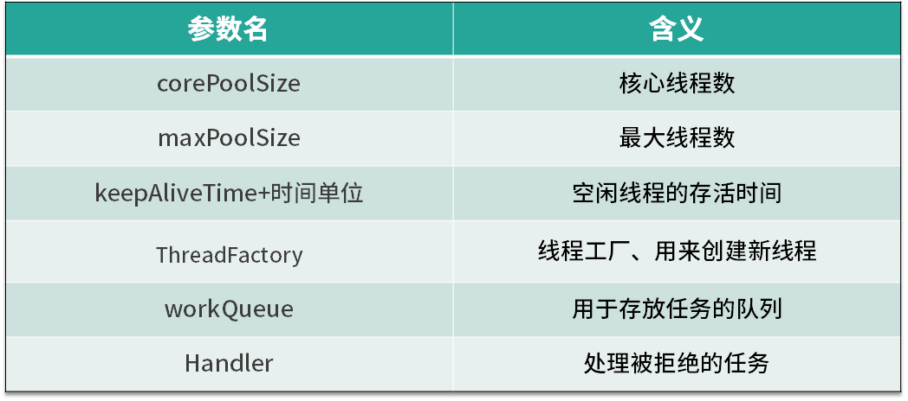

# 线程池的各个参数的意义

## 线程池的参数

首先，我们来看下线程池中各个参数的含义，如表所示线程池主要有 6 个参数，其中第 3 个参数由 keepAliveTime + 时间单位组成。我们逐一看下它们各自的含义，corePoolSize 是核心线程数，也就是常驻线程池的线程数量，与它对应的是 maximumPoolSize，表示线程池最大线程数量，当我们的任务特别多而 corePoolSize 核心线程数无法满足需求的时候，就会向线程池中增加线程，以便应对任务突增的情况。

## 线程创建的时机

接下来，我们来具体看下这两个参数所代表的含义，以及线程池中创建线程的时机。如上图所示，当提交任务后，线程池首先会检查当前线程数，如果此时线程数小于核心线程数，比如最开始线程数量为 0，则新建线程并执行任务，随着任务的不断增加，线程数会逐渐增加并达到核心线程数，此时如果仍有任务被不断提交，就会被放入 workQueue 任务队列中，等待核心线程执行完当前任务后重新从 workQueue 中提取正在等待被执行的任务。

此时，假设我们的任务特别的多，已经达到了 workQueue 的容量上限，这时线程池就会启动后备力量，也就是 maximumPoolSize 最大线程数，线程池会在 corePoolSize 核心线程数的基础上继续创建线程来执行任务，假设任务被不断提交，线程池会持续创建线程直到线程数达到 maximumPoolSize 最大线程数，如果依然有任务被提交，这就超过了线程池的最大处理能力，这个时候线程池就会拒绝这些任务，我们可以看到实际上任务进来之后，线程池会逐一判断 corePoolSize、workQueue、maximumPoolSize，如果依然不能满足需求，则会拒绝任务。

## corePoolSize 与 maximumPoolSize

通过上面的流程图，我们了解了 corePoolSize 和 maximumPoolSize 的具体含义，corePoolSize 指的是核心线程数，线程池初始化时线程数默认为 0，当有新的任务提交后，会创建新线程执行任务，如果不做特殊设置，此后线程数通常不会再小于 corePoolSize ，因为它们是核心线程，即便未来可能没有可执行的任务也不会被销毁。随着任务量的增加，在任务队列满了之后，线程池会进一步创建新线程，最多可以达到 maximumPoolSize 来应对任务多的场景，如果未来线程有空闲，大于 corePoolSize 的线程会被合理回收。所以正常情况下，线程池中的线程数量会处在 corePoolSize 与 maximumPoolSize 的闭区间内。

### “长工”与“临时工”

我们可以把 corePoolSize 与 maximumPoolSize 比喻成长工与临时工，通常古代一个大户人家会有几个固定的长工，负责日常的工作，而大户人家起初肯定也是从零开始雇佣长工的。假如长工数量被老爷设定为 5 人，也就对应了 corePoolSize，不管这 5 个长工是忙碌还是空闲，都会一直在大户人家待着，可到了农忙或春节，长工的人手显然就不够用了，这时就需要雇佣更多的临时工，这些临时工就相当于在 corePoolSize 的基础上继续创建新线程，但临时工也是有上限的，也就对应了 maximumPoolSize，随着农忙或春节结束，老爷考虑到人工成本便会解约掉这些临时工，家里工人数量便会从 maximumPoolSize 降到 corePoolSize，所以老爷家的工人数量会一致保持在 corePoolSize 和 maximumPoolSize 的区间。

在这里我们用一个动画把整个线程池变化过程生动地描述出来，比如线程池的 corePoolSize 为 5，maximumPoolSize 为 10，任务队列容量为 100，随着任务被提交，我们的线程数量会从 0 慢慢增长到 5，然后就不再增长了，新的任务会被放入队列中，直到队列被塞满，然后在 corePoolSize 的基础上继续创建新线程来执行队列中的任务，线程会逐渐增加到 maximumPoolSize， 然后线程数不再增加，如果此时仍有任务被不断提交，线程池就会拒绝任务。随着队列中任务被执行完，被创建的 10 个线程现在无事可做了，这时线程池会根据 keepAliveTime 参数来销毁线程，已达到减少内存占用的目的。

通过对流程图的理解和动画演示，我们总结出线程池的几个特点。

- 线程池希望保持较少的线程数，并且只有在负载变得很大时才增加线程。

- 线程池只有在任务队列填满时才创建多于 corePoolSize 的线程，如果使用的是无界队列（例如 LinkedBlockingQueue），那么由于队列不会满，所以线程数不会超过 corePoolSize。

- 通过设置 corePoolSize 和 maximumPoolSize 为相同的值，就可以创建固定大小的线程池。

- 通过设置 maximumPoolSize 为很高的值，例如 Integer.MAX_VALUE，就可以允许线程池创建任意多的线程。

## keepAliveTime+时间单位

第三个参数是 keepAliveTime + 时间单位，当线程池中线程数量多于核心线程数时，而此时又没有任务可做，线程池就会检测线程的 keepAliveTime，如果超过规定的时间，无事可做的线程就会被销毁，以便减少内存的占用和资源消耗。如果后期任务又多了起来，线程池也会根据规则重新创建线程，所以这是一个可伸缩的过程，比较灵活，我们也可以用 setKeepAliveTime 方法动态改变 keepAliveTime 的参数值。

## ThreadFactory

第四个参数是 ThreadFactory，ThreadFactory 实际上是一个线程工厂，它的作用是生产线程以便执行任务。我们可以选择使用默认的线程工厂，创建的线程都会在同一个线程组，并拥有一样的优先级，且都不是守护线程，我们也可以选择自己定制线程工厂，以方便给线程自定义命名，不同的线程池内的线程通常会根据具体业务来定制不同的线程名。

## workQueue 和 Handler

最后两个参数是 workQueue 和 Handler，它们分别对应阻塞队列和任务拒绝策略。
