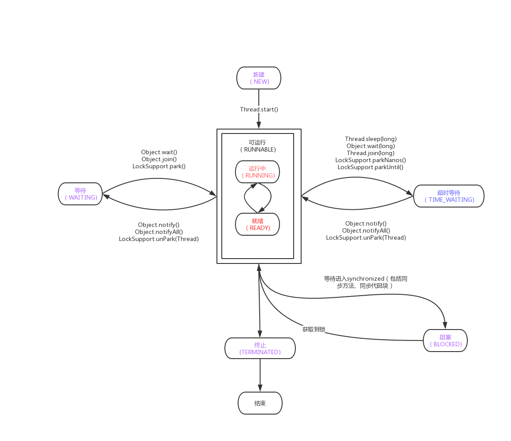

# 线程如何在6中状态之间进行切换的

## 线程的 6 种状态

就像生物从出生到长大、最终死亡的过程一样，线程也有自己的生命周期，在 Java 中线程的生命周期中一共有 6 种状态。

- New（新创建）
- Runnable（可运行）
- Blocked（被阻塞）
- Waiting（等待）
- Timed Waiting（计时等待）
- Terminated（被终止）

如果想要确定线程当前的状态，可以通过 getState() 方法，并且线程在任何时刻只可能处于 1 种状态。

## New 新创建

New 表示线程被创建但尚未启动的状态：当我们用 new Thread() 新建一个线程时，如果线程没有开始运行 start() 方法，所以也没有开始执行 run() 方法里面的代码，那么此时它的状态就是 New。而一旦线程调用了 start()，它的状态就会从 New 变成 Runnable，也就是状态转换图中中间的这个大方框里的内容。

## Runnable 可运行

Java 中的 Runable 状态对应操作系统线程状态中的两种状态，分别是 Running 和 Ready，也就是说，Java 中处于 Runnable 状态的线程有可能正在执行，也有可能没有正在执行，正在等待被分配 CPU 资源。

所以，如果一个正在运行的线程是 Runnable 状态，当它运行到任务的一半时，执行该线程的 CPU 被调度去做其他事情，导致该线程暂时不运行，它的状态依然不变，还是 Runnable，因为它有可能随时被调度回来继续执行任务。
阻塞状态

接下来，我们来看下 Runnable 下面的三个方框，它们统称为阻塞状态，在 Java 中阻塞状态通常不仅仅是 Blocked，实际上它包括三种状态，分别是 Blocked(被阻塞）、Waiting(等待）、Timed Waiting(计时等待），这三 种状态统称为阻塞状态，下面我们来看看这三种状态具体是什么含义。

## Blocked 被阻塞

首先来看最简单的 Blocked，从箭头的流转方向可以看出，从 Runnable 状态进入 Blocked 状态只有一种可能，就是进入 synchronized 保护的代码时没有抢到 monitor 锁，无论是进入 synchronized 代码块，还是 synchronized 方法，都是一样。

我们再往右看，当处于 Blocked 的线程抢到 monitor 锁，就会从 Blocked 状态回到Runnable 状态。

## Waiting 等待

我们再看看 Waiting 状态，线程进入 Waiting 状态有三种可能性。

1. 没有设置 Timeout 参数的 Object.wait() 方法。
2. 没有设置 Timeout 参数的 Thread.join() 方法。
3. LockSupport.park() 方法。

刚才强调过，Blocked 仅仅针对 synchronized monitor 锁，可是在 Java 中还有很多其他的锁，比如 ReentrantLock，如果线程在获取这种锁时没有抢到该锁就会进入 Waiting 状态，因为本质上它执行了 LockSupport.park() 方法，所以会进入 Waiting 状态。同样，Object.wait() 和 Thread.join() 也会让线程进入 Waiting 状态。

Blocked 与 Waiting 的区别是 Blocked 在等待其他线程释放 monitor 锁，而 Waiting 则是在等待某个条件，比如 join 的线程执行完毕，或者是 notify()/notifyAll() 。

## Timed Waiting 限期等待

在 Waiting 上面是 Timed Waiting 状态，这两个状态是非常相似的，区别仅在于有没有时间限制，Timed Waiting 会等待超时，由系统自动唤醒，或者在超时前被唤醒信号唤醒。

以下情况会让线程进入 Timed Waiting 状态。

- 设置了时间参数的 Thread.sleep(long millis) 方法；
- 设置了时间参数的 Object.wait(long timeout) 方法；
- 设置了时间参数的 Thread.join(long millis) 方法；
- 设置了时间参数的 LockSupport.parkNanos(long nanos) 方法和 LockSupport.parkUntil(long deadline) 方法。

讲完如何进入这三种状态，我们再来看下如何从这三种状态流转到下一个状态。

想要从 Blocked 状态进入 Runnable 状态，要求线程获取 monitor 锁，而从 Waiting 状态流转到其他状态则比较特殊，因为首先 Waiting 是不限时的，也就是说无论过了多长时间它都不会主动恢复。

只有当执行了 LockSupport.unpark()，或者 join 的线程运行结束，或者被中断时才可以进入 Runnable 状态。

如果其他线程调用 notify() 或 notifyAll()来唤醒它，它会直接进入 Blocked 状态，这是为什么呢？因为唤醒 Waiting 线程的线程如果调用 notify() 或 notifyAll()，要求必须首先持有该 monitor 锁，所以处于 Waiting 状态的线程被唤醒时拿不到该锁，就会进入 Blocked 状态，直到执行了 notify()/notifyAll() 的唤醒它的线程执行完毕并释放 monitor 锁，才可能轮到它去抢夺这把锁，如果它能抢到，就会从 Blocked 状态回到 Runnable 状态。

同样在 Timed Waiting 中执行 notify() 和 notifyAll() 也是一样的道理，它们会先进入 Blocked 状态，然后抢夺锁成功后，再回到 Runnable 状态。

当然对于 Timed Waiting 而言，如果它的超时时间到了且能直接获取到锁/join的线程运行结束/被中断/调用了LockSupport.unpark()，会直接恢复到 Runnable 状态，而无需经历 Blocked 状态。

## Terminated 终止

再来看看最后一种状态，Terminated 终止状态，要想进入这个状态有两种可能。
run() 方法执行完毕，线程正常退出。

出现一个没有捕获的异常，终止了 run() 方法，最终导致意外终止。

## 注意点

最后我们再看线程转换的两个注意点。
线程的状态是需要按照箭头方向来走的，比如线程从 New 状态是不可以直接进入 Blocked 状态的，它需要先经历 Runnable 状态。

线程生命周期不可逆：一旦进入 Runnable 状态就不能回到 New 状态；一旦被终止就不可能再有任何状态的变化。所以一个线程只能有一次 New 和 Terminated 状态，只有处于中间状态才可以相互转换。
