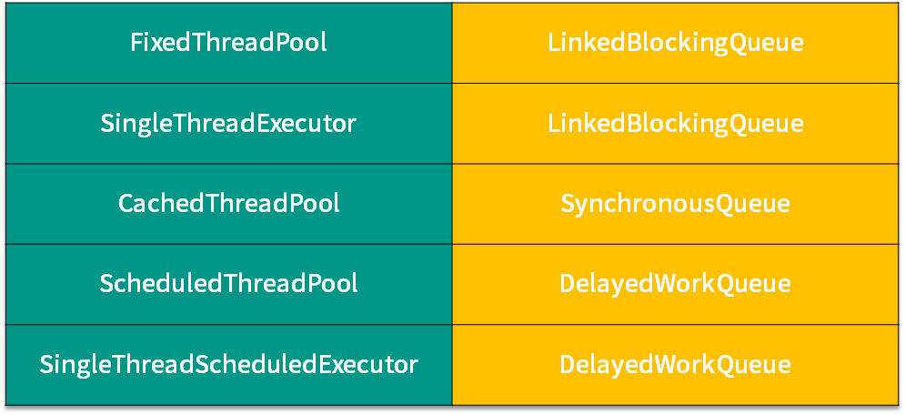

# 线程池中常用的阻塞队列有哪些

## 线程池内部结构

线程池的内部结构主要由四部分组成，如图所示。

- 第一部分是线程池管理器，它主要负责管理线程池的创建、销毁、添加任务等管理操作，它是整个线程池的管家。
- 第二部分是工作线程，也就是图中的线程 t0~t9，这些线程勤勤恳恳地从任务队列中获取任务并执行。
- 第三部分是任务队列，作为一种缓冲机制，线程池会把当下没有处理的任务放入任务队列中，由于多线程同时从任务队列中获取任务是并发场景，此时就需要任务队列满足线程安全的要求，所以线程池中任务队列采用 BlockingQueue 来保障线程安全。
- 第四部分是任务，任务要求实现统一的接口，以便工作线程可以处理和执行。

## 阻塞队列

线程池中的这四个主要组成部分最值得我们关注的就是阻塞队列了，如表格所示，不同的线程池会选用不同的阻塞队列。

表格左侧是线程池，右侧为它们对应的阻塞队列，你可以看到 5 种线程池对应了 3 种阻塞队列，我们接下来对它们进行逐一的介绍。

## LinkedBlockingQueue

对于 FixedThreadPool 和 SingleThreadExector 而言，它们使用的阻塞队列是容量为 Integer.MAX_VALUE 的 LinkedBlockingQueue，可以认为是无界队列。由于 FixedThreadPool 线程池的线程数是固定的，所以没有办法增加特别多的线程来处理任务，这时就需要 LinkedBlockingQueue 这样一个没有容量限制的阻塞队列来存放任务。这里需要注意，由于线程池的任务队列永远不会放满，所以线程池只会创建核心线程数量的线程，所以此时的最大线程数对线程池来说没有意义，因为并不会触发生成多于核心线程数的线程。

## SynchronousQueue

第二种阻塞队列是 SynchronousQueue，对应的线程池是 CachedThreadPool。线程池 CachedThreadPool 的最大线程数是 Integer 的最大值，可以理解为线程数是可以无限扩展的。CachedThreadPool 和上一种线程池 FixedThreadPool 的情况恰恰相反，FixedThreadPool 的情况是阻塞队列的容量是无限的，而这里 CachedThreadPool 是线程数可以无限扩展，所以 CachedThreadPool 线程池并不需要一个任务队列来存储任务，因为一旦有任务被提交就直接转发给线程或者创建新线程来执行，而不需要另外保存它们。

我们自己创建使用 SynchronousQueue 的线程池时，如果不希望任务被拒绝，那么就需要注意设置最大线程数要尽可能大一些，以免发生任务数大于最大线程数时，没办法把任务放到队列中也没有足够线程来执行任务的情况。

## DelayedWorkQueue
  
第三种阻塞队列是DelayedWorkQueue，它对应的线程池分别是 ScheduledThreadPool 和 SingleThreadScheduledExecutor，这两种线程池的最大特点就是可以延迟执行任务，比如说一定时间后执行任务或是每隔一定的时间执行一次任务。DelayedWorkQueue 的特点是内部元素并不是按照放入的时间排序，而是会按照延迟的时间长短对任务进行排序，内部采用的是“堆”的数据结构。之所以线程池 ScheduledThreadPool 和 SingleThreadScheduledExecutor 选择 DelayedWorkQueue，是因为它们本身正是基于时间执行任务的，而延迟队列正好可以把任务按时间进行排序，方便任务的执行。
