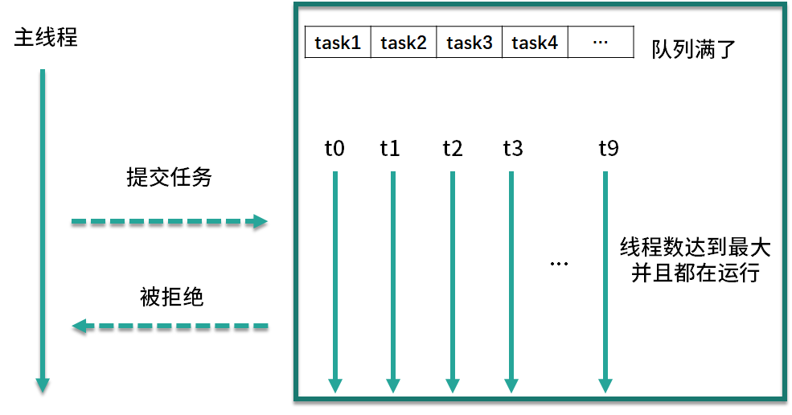

# 线程池有哪4种拒绝策略

## 拒绝时机

首先，新建线程池时可以指定它的任务拒绝策略，例如：

```java
newThreadPoolExecutor(5, 10, 5, TimeUnit.SECONDS, new LinkedBlockingQueue<>(),
   new ThreadPoolExecutor.DiscardOldestPolicy());
```

以便在必要的时候按照我们的策略来拒绝任务，那么拒绝任务的时机是什么呢？线程池会在以下两种情况下会拒绝新提交的任务。

- 第一种情况是当我们调用 shutdown 等方法关闭线程池后，即便此时可能线程池内部依然有没执行完的任务正在执行，但是由于线程池已经关闭，此时如果再向线程池内提交任务，就会遭到拒绝。
- 第二种情况是线程池没有能力继续处理新提交的任务，也就是工作已经非常饱和的时候。

我们具体讲一下第二种情况，也就是由于工作饱和导致的拒绝。比如新建一个线程池，使用容量上限为 10 的 ArrayBlockingQueue 作为任务队列，并且指定线程池的核心线程数为 5，最大线程数为 10，假设此时有 20 个耗时任务被提交，在这种情况下，线程池会首先创建核心数量的线程，也就是5个线程来执行任务，然后往队列里去放任务，队列的 10 个容量被放满了之后，会继续创建新线程，直到达到最大线程数 10。此时线程池中一共有 20 个任务，其中 10 个任务正在被 10 个线程执行，还有 10 个任务在任务队列中等待，而且由于线程池的最大线程数量就是 10，所以已经不能再增加更多的线程来帮忙处理任务了，这就意味着此时线程池工作饱和，这个时候再提交新任务时就会被拒绝。



我们结合图示来分析上述情况，首先看右侧上方的队列部分，你可以看到目前队列已经满了，而图中队列下方的每个线程都在工作，且线程数已经达到最大值 10，如果此时再有新的任务提交，线程池由于没有能力继续处理新提交的任务，所以就会拒绝。

我们了解了线程池拒绝任务的时机，那么我们如何正确地选择拒绝策略呢？Java 在 ThreadPoolExecutor 类中为我们提供了 4 种默认的拒绝策略来应对不同的场景，都实现了 RejectedExecutionHandler 接口，如下所示：

- AbortPolicy
- DiscardPolicy
- DiscardOldestPolicy
- CallerRunsPolicy

接下来，我们将具体讲解这 4 种拒绝策略。

## 拒绝策略

- 第一种拒绝策略是 AbortPolicy，这种拒绝策略在拒绝任务时，会直接抛出一个类型为 RejectedExecutionException 的 RuntimeException，让你感知到任务被拒绝了，于是你便可以根据业务逻辑选择重试或者放弃提交等策略。
- 第二种拒绝策略是 DiscardPolicy，这种拒绝策略正如它的名字所描述的一样，当新任务被提交后直接被丢弃掉，也不会给你任何的通知，相对而言存在一定的风险，因为我们提交的时候根本不知道这个任务会被丢弃，可能造成数据丢失。
- 第三种拒绝策略是 DiscardOldestPolicy，如果线程池没被关闭且没有能力执行，则会丢弃任务队列中的头结点，通常是存活时间最长的任务，这种策略与第二种不同之处在于它丢弃的不是最新提交的，而是队列中存活时间最长的，这样就可以腾出空间给新提交的任务，但同理它也存在一定的数据丢失风险。
- 第四种拒绝策略是 CallerRunsPolicy，相对而言它就比较完善了，当有新任务提交后，如果线程池没被关闭且没有能力执行，则把这个任务交于提交任务的线程执行，也就是谁提交任务，谁就负责执行任务。这样做主要有两点好处。
第一点新提交的任务不会被丢弃，这样也就不会造成业务损失。
第二点好处是，由于谁提交任务谁就要负责执行任务，这样提交任务的线程就得负责执行任务，而执行任务又是比较耗时的，在这段期间，提交任务的线程被占用，也就不会再提交新的任务，减缓了任务提交的速度，相当于是一个负反馈。在此期间，线程池中的线程也可以充分利用这段时间来执行掉一部分任务，腾出一定的空间，相当于是给了线程池一定的缓冲期。