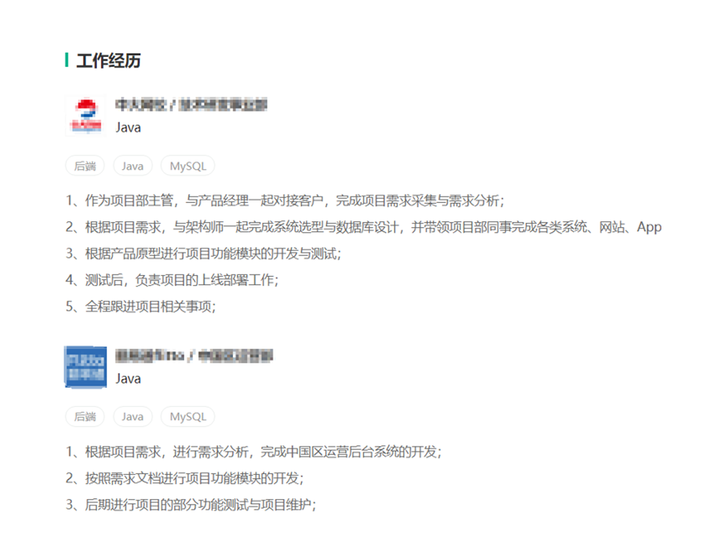
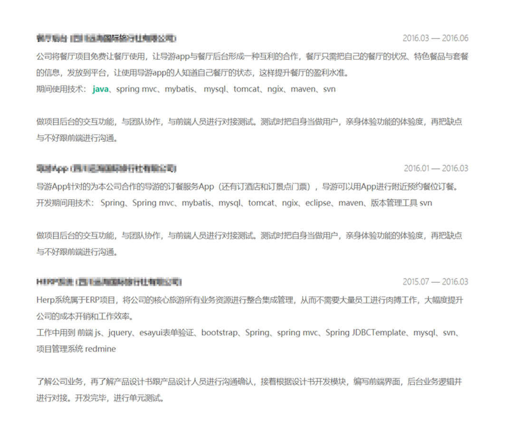
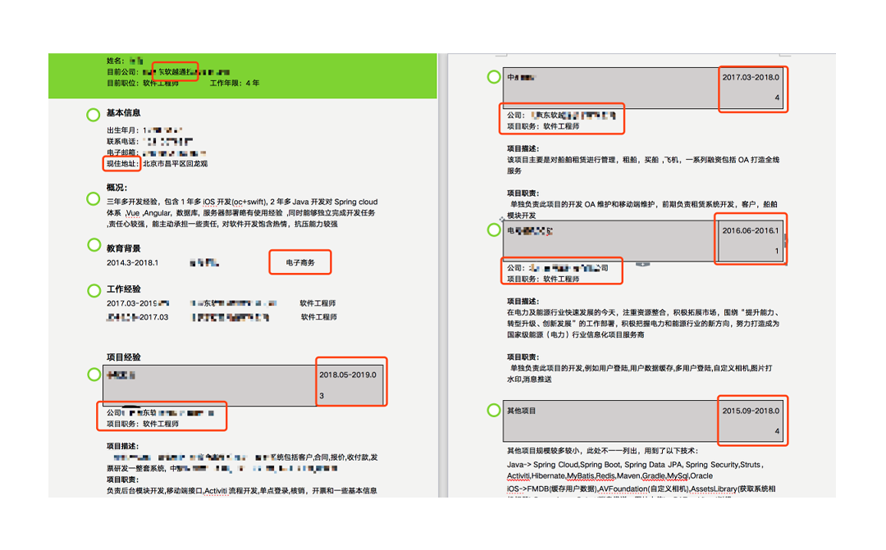
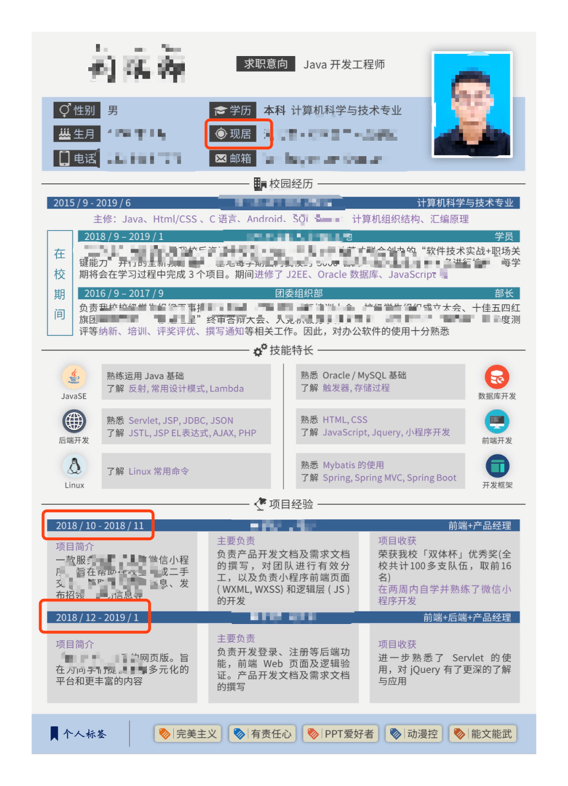

# 使用STAR法则表现自己

相信前面的内容让你在简历修改和面试技巧方面都提高了认知，那么在我们把简历内容、投递和面试行为都升级了之后，还有什么可以加分的呢？

带着这个问题，我们来着重来聊聊一个神秘的法则：STAR。

有些同学可能听说过这个名词，甚至被提示过“要按照star法则”修改简历，但是大多数人不明所以，依旧我行我素：简历该怎么写还怎么写，面试交流想到哪说到哪。

其实，为了达到更好的沟通效果，或者让简历和面试看起来更专业流畅，建议你遵守一些行业内的“套路”。

STAR法则是在人力资源培训或者企业级面试培训中，必定会给各部门leader普及的知识。按照STAR法则可以询问出候选人的过往经历和工作能力，还能判断是否真的做某些项目过还是在编造经历，所以请你不要小觑它的重要性。

那我们先来看看STAR法则究竟代表了什么。

STAR看上去是英文单词：星星，实际上它是个缩写，由4个词组合起来的，4个字母分别代表不同含义。

- S：Situation，指的是项目背景
- T：Task，项目任务
- A：Action，你自己承担的工作
- R：Result，工作结果
  
hr喜欢这样的简历：在写工作经历的时候提到tar，写项目经历的时候用STAR。而实际上我在拉勾招人的时候看见的简历80%以上都缺少Result结果，往往就这部分人的简历最容易被pass，所以如果你的简历少了这个部分，要赶快补充。而且在平时的工作中，使用STAR法则对内部工作进行汇报也同样有效。

在使用STAR法则的时候也没有必要生搬硬套，一定要准备4个方向。你可以灵活一点，在描述任务和实际行动的时候，视情况合并t和a，因为任务也许就是你的行动。

下面我们来看几个例子，我随机截选了一些技术同学的简历作为教材，请简历的主人不要介意，关键信息我都打了码。如果你也有类似的问题，也希望你可以尽快修改。

先看第一个例子。这是一位Java工程师的简历，我们看到他的工作经历部分，做到了多项陈列，这项比一条工作经历的同学就胜出很多，但是他也有很多优化空间。

比如列出的这几条工作经验里，并没有突出Java的能力；他提到了带领项目去工作，但是没有数据支持，比如多少个项目，什么级别的项目，前面我有提到过技术人简历里要提什么类型的项目，你可以参考那个优先级。

这份工作经历，最大的问题就是没有提到结果，也就是R，没有结果就算你做了很多，也不知道是100分还是0分，所以结果是体现你能力非常重要的一部分。

第二个例子。我们来看项目经验的部分。

这位同学在简历中提到了3个项目，每个项目都先描述了项目背景，以及他做项目使用的技术，这是非常好的习惯。但是仔细一看又踩了一些坑。

首先前2个项目涉及的领域都非常相似，都是旅游餐饮一块的，当然除非将来还是要投递这类型的公司这么写是没问题的，如果不是这个行业，就会显得很累赘。

在他描述完使用了什么技术之后，缺少T或者A，只是提到了做交互功能，给人一种没有出多大力的感觉，所以这一块尽量补充。

最后，致命的一点：前两个项目的结果和收获一模一样，字数都没少，一看就让人觉得没有思考，很有可能工作上也是这样应付。

所以如果有以上问题，赶快修改。

再来看第三个例子。这张图大约是80%的简历信息。我们从顶部看一遍。

绿色部分首先提到了自己在东软。软件公司的工作经历在求职互联网公司时不是加分项，因为大多数外包软件项目涉及的数据量、并发量有限。这时候就需要充分把项目里的技术亮点和个人突出贡献写出来。

注意一下现居地，这个说法不好，你住在哪个城市和就业城市不一定相同。hr关心的是你的所在地，或者期望城市。

第二个减分项前面也说过，就是不出名也不专业的学历，这个对工程师就业是非常不利的，处理思路和前面一样，这类的学历背景放在项目经历之后。

可以看到这位同学在工作经历第二次提到了上一家公司，而且还有个什么问题？没错，就是没有1、2、3点，到底他在这2家工作做了什么工作，完全不知道。

后面跟了4个项目。首先注意下排版。其次我们发现这3个项目中船中航电网，都是国企范儿的案例，所以投递互联网公司要么注意选择类似的行业，要么更换几个互联网的项目。

另外我们说：项目的名称，不是写服务的公司，而是概括这个项目是干嘛的。在项目中东软的提示又出现了，可以删除。在项目中还算比较好的写出了背景和职责，可以看作把sta都涉及到了，还差一点关键的r，建议补充
做完项目结果如何？

第四个例子也是来看下整体，这个同学简历看起来品质是比较好的，是用心准备过的。

但是有些部分是过于花俏了，有点像产品或者设计的简历。姓名部分采用了毛笔字的字体附带拼音，这个就没有必要。现居地也是和前面一样注意替换。

这位因为是应届生，所以写了一些专业相关、实践项目和团委方面的内容，如果是已经工作的朋友注意避免。

工作经历和项目经历有多个话，要按照倒序来写，离现在越近的写在最上面。

我们看见他在描述项目的时候分了三块，项目介绍、主要负责什么、项目收获是什么，STAR是比较清晰的，但是这种排版就不适合放在正式的简历里了，你可以使用前面领取的拉勾简历模版去编辑一份新的简历。

这个简历还有几个不太加分的部分，第一个是最底部的个人标签，投递技术岗，动漫控、能文能武这种如果不是投递动漫类的公司、或者内容相关岗位，建议换一下，前面我也有提到如果去表达自己的个性描述。

第二个我没粘贴出来，这份简历有2页，第二页大部分内容是这位同学自己给自己写的推荐信，一开始我以为是请大学老师给写的，后来我发现是自己写，还有个大标题《推荐信》。这个部分在求职互联网技术岗位时，可以优化删除。

看完以上几个案例，你对star的了解和运用有没有进步一点呢？

期望你在接下来的求职中可以去其糟粕取其精华，学以致用
