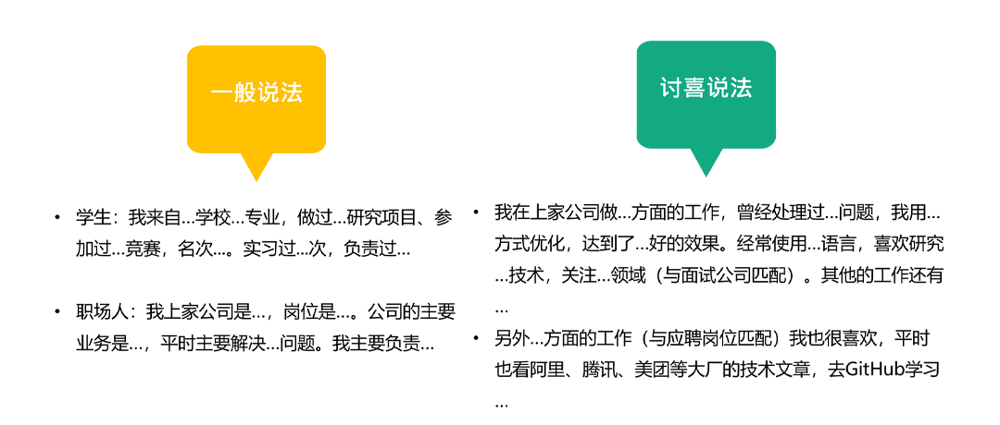
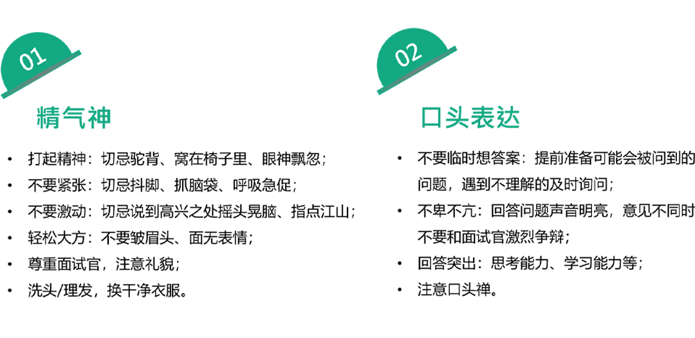

# 如何提高面试成功率

- 如何在短期内提升技术或者说专业能力；为什么说短期呢，你应该知道一个职位的招聘周期是有限的，基本上从你看到职位开始，2周内是黄金时间，这期间会有很多竞争对手投递和面试，所以你要和时间赛跑；
这里提醒你一下，尽量不要在半夜12点前后去投递，这个时间的简历HR第二天很有可能就忘记了，直接开始处理新的，所以建议你在早上9，10点，或者下午3，4点投递，hr的关注度会高一些。
- 你要会管理自己的面试行为，从细节上争取赢得面试官的兴趣和好感。

讲完专业技术部分如何提升，我们再来看一下在面试时如何从细节上管理自己的表现，给面试官一个好印象。

我会从这几点展开讲，
首先是自我介绍，记住要打破传统模式，你的基本信息通过简历已经传递给面试官了，这里你要说一些他不知道的，同时也是他感兴趣的内容；
其次是你的肢体语言和外形，爱笑和爱整洁的孩子运气不会太差；
然后是你的口头表达，说话要条理清楚，提前在家打一下腹稿，回答时注意你的语气语调等；
最后是学会观察面试官，他的每一个表情和动作都是有用信息，另外，面试的时候你应该和面试官对视，有眼神交流，不要低着头，翻白眼思考之类的，你可以看对方的眼睛和鼻梁，千万不要盯着对方的发际线。

好的，那我们来展开说如何优化这几点细节。

第一项自我介绍，左边黄色下方是大家基本都会用的常规模式，像毕业学校和上家公司的职位title这些其实简历都有了，这里我希望你可以优化一些说法，比如具体的工作内容，用的比较得意的语言或者技术、做过哪些项目，关注什么领域（选择和面试公司相近的）。我之前让你列出来过一些认清自我的清单，这个时候就可以派上用场了。

另外，还可以有心的提一提对某个方向的工作也很感兴趣，也就是面试的这个职位的工作方向，不用太刻意；如果面试官问你平时有没有学习习惯，这里一定不是问你有没有去过培训班，你可以说一些你关注的博主和公众号，看过什么比较好的技术书籍，有没有自己写过分享过一些东西，这些都是让你出彩的内容，尽量用起来。

接着是注意你的肢体语言和口头表达方式。先看精神面貌方面，

- 不要萎靡不振、给人一种很慵懒的感觉，
- 不要紧张，很多候选人聊着聊着到了不熟悉的领域就开始紧张，声音都发抖了，你不要觉得夸张，这是真实情况，尤其是初入职场的同学容易出现；紧张可以，但注意抑制一下，不要在面部表情或者声音上表现出来，提前准备或者多面试几次就会舒缓很多了；
- 不要激动，和面试官聊到相见恨晚，拍大腿敲桌子，手舞足蹈；不要这样，因为面试官很有可能是在顺着你聊，观察你的反应；
- 注意大方一些，面试的时候一定会触碰到一些不是很开心的话题，比如为什么离开上家公司，这个时候有个很禁忌的微表情就是皱眉头，这样会让人觉得你烦恼很多，很消极，既然已经离开了就洒脱一些，尝试微笑去回答一些敏感问题；

在你没正式入职之前，千万不可掉以轻心，不关心坐在你面前的是谁。因为你不知道什么时候就遇到了人力总监或者技术总监，甚至是微服私访的CTO；所以要耐心的回答每一个面试官的问题，哪怕会有重复，注意礼貌；
最后注意一下个人的仪表，整洁干净没有异味即可。

再来看下表达方式方面:

- 很多没有准备习惯的同学容易犯第一个问题，就是临时去想答案。临时想到的回答，哪怕答案是对的，在后面回想起来都会有小小的遗憾。举个极端的例子，就像百度robin被泼的时候他肯定没准备好要说什么，不过还好他很快挽回了局面，而我们没有他那么高情商，面试也不会遇到这种突发的不可抗力，所以请你提前准备做好未雨绸缪，把面试官大概会问的常规性问题都提前想想要从哪几方面去回答，心里有个底。
- 说话的方式，一方面记得要有底气的去沟通，也就是中气十足；另一方面，在被面试官追问或者质疑的时候不要激烈争辩，虽说道不同不相为谋，但是面试也是个双选的过程，不满意下次再挑好的就可以了，没有必要为了一个面试问题失了礼数，对吧；
- 回答问题的时候注意突出你的思考和学习潜力，比如用些关键词：我认为，我想可以这样，我后面会去学习，等等；不要用：我感觉、应该是、好像等不确定的词汇；

最后记得控制一下自己的方言和口头禅。

最后我们来看看面试官的几个行为代表了什么意义，方便你及时调整自己的状态。
 ß
比如他看着你微笑和点头，说明你的经历和能力都比较符合他的要求，他和你对视，说明想听你讲下去，这个时候你可以顺着面试问题或者相关经历，详细展开来说；

如果他在听你的描述时，有时候低头，有时候皱眉，说明他对你说的内容有疑惑，或者你没有说到他感兴趣的点上，有效的信息不多，这个时候要注意不要跑题；

如果他在你的简历上写写画画，做一些记录，这说明你提供的信息有效；如果他几乎不写字，说明你提供的能力信息有点少或者相关性不大。那么你需要多提他喜欢记笔记的内容；

如果他放弃看你的简历，选择后仰的姿势，这个时候要注意了，说明他开始觉得你的回答不是很ok，你已经在危险的边缘了，如果他继续追问细节需要认真回答；

最后一点，如果有面试官总是打断你的回答，并且连续发问，在你的回答是有效的情况下，很有可能是他在进行压力面试，观察你的抗压能力，这个时候你应该保持冷静，争取做到对答如流。
