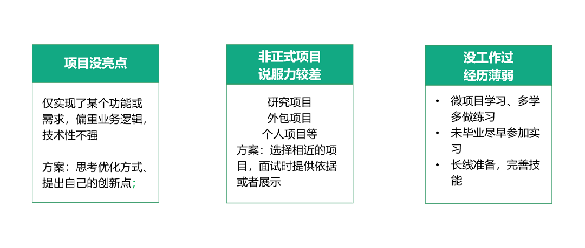

# 技术简历应该怎么写，怎么投

这节课主要来讲简历的正确写法。建议你拿好一支笔，打开自己的简历。

准备好了吗？那我们开始了。

一份简历1-2张纸，有的人内容太多放不下；又或者网上找来了很好看的模版，字写多了都串行了，为了挤满一页，又是调字体大小又是调页边距，这都是错误的做法。

接下来我们就来说简历到底要放什么，要删什么。

第一点，先从头到尾大概扫一下你的简历，我知道很多人简历头部的位置多少都会有这些内容，先自查一下，有左边这些信息都可以拿笔划掉：身份证号（现在不会有人放这个吧）、身高体重、籍贯老家、年龄和出生年月二选一、性别、婚否、政治面貌、在教育背景里填了至少两行的大学主修课名称。

左侧的优化方案是：增加现居地或者求职目标城市，以及一张出自照相馆专业师傅拍的一寸彩照。另外注意自己留的手机号、邮箱是否正确，有没有欠费停机、能不能收到邮件，有很多人因为这些失误错失良机。

再看到右边，还记得我前面说过，不要用“精通”、“熟练”作为开头语，列一堆语言、技术之类的。你只需要提炼出：你最专业或者与投递方向相关的技能就可以了；
如果你的工作经历只有一句话，请至少增加到三行以上，以关键词开头，后面用1-2句话描述；

有的同学会在简历较后位置，放一些培训经历，但是过于强调技能培训学校之类的经历，会让人觉得你基础不太好。作为替换，我比较鼓励这种：比如学习过某一线大厂大咖的分享，听过得到或者混沌大学哪位名师的分享，以及务必加上你的领悟或者学习收获是什么。

我举一个反面例子：我曾经面试过一个这样的求职者，他在简历中提到学习过某个比较知名平台的产品经理课程，作为面试官我会觉得这是个好事情，说明他平时还有学习的习惯，所以我就这个话题想稍微展开一下，我问他学习了什么，有没有运用到知识，结果不知道为什么这位求职者突然紧张起来，说话声音都开始打颤，完全说不出个所以然来，这让我很失望，也没有心情再深挖他的能力。

所以你要记住，只要是你在简历里放出来的内容，无论哪一点都有可能会被面试官盘问，对于心里没有底的东西不要放。

还有的大学生或者刚毕业1-2年的同学，会在简历里放一些社团经历。那么现在思考一下，如果要放的话，尽量放一些和体现工作能力挂钩的。比如求职市场方向工作的同学会放外联部、宣传部等办过活动、拉过赞助的经历；有些同学会放创业大赛、辩论赛的经历；求职技术方向有同学会放实验室项目经历、参加过天池、蓝桥等参赛经历，这些都非常好，只要是对你进入职场有帮助的能体现专业能力，你都可以放。不过像唱歌跳舞之类的，如果不是面试文艺类公司或者工作还是不用放了。

我还看到过有些刚毕业的同学喜欢在简历最后放一些个人3年5年规划，或者理想抱负一类的。职场不是纸上谈兵，你的梦想可以收在心里，往大目标上努力，写在简历里只会让面试官觉得你太嫩。

最后是兴趣爱好，我上一节课里提到了像爬山、游泳、ktv、画画等一些私人的兴趣爱好可以拿笔划掉了。

好，到这里我们先通篇快速诊断了一些不必要的内容，接下来我们看需要丰富什么。

有什么内容的简历，才能吸引面试官呢？

以一份技术简历来说，与投递岗位有关的项目经验、技术经验、语言能力是公司最关心的。这里有个学历的问题，我研究过很多程序员的心理，如果一份好工作摆在面前，他会自己给自己设限，找借口说人家要找硕士，我够不上。在简历里，如果你毕业于一本以上的大学，你可以放心大胆的把学历写上。如果不幸是二本以下的学历，你也要写，不过可以放在工作和项目经验之后，让面试官先看到你的能力，如果能力足够好，毕业于哪个学校也就没有那么重要了。特别是工作了3-5年以上的朋友要注意这点。

看到这里的两份建议，如果你已经工作1-3年了，注意在简历里丰富这些内容：做过什么、会什么、思考优化过什么、学过什么、能不能教（分享）什么；

应届生的简历要按照贴靠投递岗位的方法，多放实习、实验室项目、获奖的经历。这里啰嗦一句大学生一定要尽早多参加实习，实习的时候不要在乎拿多少钱，加不加班，你现在处在海绵吸水的积累阶段。

有了上面的内容，可能通过HR初筛的几率就大了很多，这个时候简历会被传递给要招人的团队leader看。

这个时候你还需要丰富一些工作经历和项目经历，尽量选择和投递岗位相关性较大的来写。让面试官一看就觉得：这就是我需要的人！

举一个反面例子，比如某公司要找一个java程序员，而你的简历里写了很多之前在外包公司做的零散项目，或者创业卖奶茶的经历，没有提到多少你会java，或者表明你java很厉害的信息，那么换位思考一下，这家公司的面试官也没有必要发面试邀约。

那么在简历里，要挑有什么特点的项目来写呢？

- 首先是公司级项目，这意味着核心业务、影响了海量用户数据；
- 第二是存在一定技术难度的项目，可以表现你的能力；
- 最后才是工作量大的项目，互联网公司注重结果导向，如何又快又好的完成项目才是公司看重的。
- 如果你平时没有公司级的项目来做，也可以写一些自己的项目，开源的普通的都可以，方便来丰富你的简历，对于学生来说，实验室的项目或者参赛经历可以做为备选。

通过稍微修改一下你的工作经历描述方式、选择一些匹配的项目，你的简历看上去已经开始符合面试官的口味了，不过万一经验少，没有项目经验怎么办呢？

这里我为这3种情况，提供一些解决思路。
曾经做过的项目没有亮点怎么办？比如项目只实现了某个功能或者需求，技术性不够强。在简历里只能写类似经历的情况下，补上自己的思考，有没有优化的可能，有没有可以创新的地方，不一定要真的实现出来，面试官要看到你的发散性思维；
不是很正式的项目，没有说服力。比如大学实验室的项目，有的时候选题很偏，或者是外包项目，这里先按第一原则选与投递岗位要求贴近的，其次可以在简历稍微提到技术原理，使用了哪些技术，如果有机会面试，可以带着作品展示。
没类似的工作经历怎么办？那就自己创造机会呗！谁规定工作用不到，回家还不能自己试试的？在你明确了求职方向之后，想要摆脱瓶颈，打破增删改查的噩梦只能靠自己。所以平时有机会就多去github看看代码，多学习大神的经验和思路，多去学习技术知识，拓展技术深度和广度。
如果是大学生，还是那句话，多参加实习，长线来完善自己的技能。

好了，这节课差不多就讲到这里，我们来总结一下写简历的要点：

- 删除无效又占篇幅的信息、根据不同的目标岗位来准备简历内容；
- 简历中的工作经历、项目经历要多体现技术优势，与投递岗位高度匹配；
- 选择好写哪些经历之后，注意书面表达方式，可以参考star法则的几个要点来写，具体方法我会在第6课详细讲；
- 多准备几份简历，对于不同的岗位方向，投能力侧重点不一样的简历；
- 同一家公司不建议多次投递，俗话说：忠臣不事二主，如果你的左右摇摆被用人团队发现就比较尴尬了。

最后友情提示，简历写完之后可以让3个朋友帮你看看，提出一些优化建议；

简历是一张篇幅有限的名片，尽量多放能展现自己工作能力的内容。这里留第二个彩蛋，我给你准备了一份拉勾认证的优秀简历模版，照着准备就不会出错啦！扫码加我助手的微信，可以获取。
